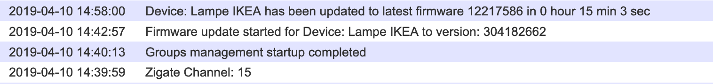

Require to be updated accoridngly to the Web GUI interface for Group Management

# Firmware update Over-The-Air

Ikea is providing a lift of Firmware for their Tradfri devices. A copy of those firmware have been made available for you.

The OTA upgrade process implemented in the plugin is pretty basic

```
for each available Firmware
    Do
         For each Device matching the Firmware brand
             Do
                  Propose the firmware to the device
                  if the firmware is accepted for upgrade then
                     Do
                        Transfert the firmware to the device
                        Upgrade
                     Done
             Done
    Done
```  

## How to enable the OTA update

If you have Ikea/Tradfri main powered devices (for now), you might check if some of your devices are eligeable for Firmware update.
By enable this feature, the plugin will propose to each devices the available firmware version for update. If eligeable the upgrade will be triggered.

1. Edit the file `Conf/PluginConf-xx.txt`

  ```
  'allowOTA':'1',
  'waitingOTA':'3600',
  ```

  * allowOTA set to 1, will enable the OTA upgrade feature in the plugin.
  * waitingOTA is the amount of time (in seconds) the plugin will wait from start before starting the process. Please do consider carefully seting a low value here, as the process can load the Zigate in terms of Traffic, so try to avoid value lower than 300 ( 5 minutes ).

## Tracking Upgrade

The plugin is pushing information via the admin Zigate Widget

Here after is a screenshot of the Notification Text widget showing the starting time of the OTA process and its completion.



## Upgrade of Battery powered devices

This is a bit more tricky here, as the devices usally doesn't accept communication from the Zigate. In order to allow such in-comming communication you need :

- For Ikea Tradfri Remote : Press all of the time the central Button ( ON/OFF ) until the firmware transfert start.


### Modus Operandi

1. Identify the Network Short address of the device
1. Configure the plugin some OTA upgrade is enabled.
   Here after is an exemple of the OTA parameters ( PluginConf-xx.txt )set for OTA and battery device upgrade.

    ```
    'allowOTA':'1',        # Enable OTA upgrade
    'batteryOTA':'1',      # Enable to enroll battery powered devices
    'waitingOTA':'60',     # Start the OTA upgrade process 60s after plugin start
    ```

1. Start Domoticz and switch to the Log output in order to see when the device will get notified of the update
1. When you see the Short address of your Device (in exemple here after 77d4 ), press the ON/OFF button of the Device

```
OTA heartbeat - [12] Type: None out of   1 remaining Images, Device: None, out of   ? remaining devices
OTA heartbeat - [13] Type: None out of   1 remaining Images, Device: None, out of   2 remaining devices
OTA heartbeat - Image: 4545 from file: 159699-TRADFRI-remote-control-1.2.214.ota.ota
OTA heartbeat - [14] Type: 4545 out of   1 remaining Images, Device: None, out of   2 remaining devices
UpdateDevice - (     Lampe IKEA) 1:100
OTA heartbeat - [15] Type: 4545 out of   1 remaining Images, Device: ecaf, out of   1 remaining devices
UpdateDevice - (     Lampe IKEA) 0:Off
OTA heartbeat - [16] Type: 4545 out of   1 remaining Images, Device: ecaf, out of   1 remaining devices
OTA heartbeat - [17] Type: 4545 out of   1 remaining Images, Device: ecaf, out of   1 remaining devices
OTA heartbeat - [18] Type: 4545 out of   1 remaining Images, Device: ecaf, out of   1 remaining devices
OTA heartbeat - [19] Type: 4545 out of   1 remaining Images, Device: None, out of   1 remaining devices
UpdateDevice - (     Lampe IKEA) 1:On
OTA heartbeat - [20] Type: 4545 out of   1 remaining Images, Device: 77d4, out of   0 remaining devices
OTA heartbeat - [21] Type: 4545 out of   1 remaining Images, Device: 77d4,
Status: (Zigate-DEV) Starting firmware process on 77d4/01
Firmware transfert for 77d4/01 - Progress:  0.0 %
```

PS/
* In order to speedup the process, you can keep in the OTAFirmware folder only the 'remote' firmware. So only this Firmware will be presented to the device
* In case there is no firmware transfert started, this is most-likely because your device is already on the latest version.


## Warnings

* The Transfer process over the Zigbee network takes time. For an Ikea Tradfri WhiteColor bulb it took me about 15 minutes to get the transfer completed.
* In case the plugin doesn't find any firmware to transfer, then it will hibernate, and be reactivated at the next Plugin start.
* In the case the transfer failed or abort, the plugin will re-try during the next cycle. There is a full cycle every 6 hours

## Files location

All Firmwares are available under the `OTAFirmware` folder

## Tehnical documentation

| Filename                                             | Image Type | Image version | Applicable Device |
| --------                                             | ---------- | ------------- | ----------------- |
| 159699-TRADFRI-remote-control-1.2.214.ota.ota        | 4545       |  1.2.214 572   | Tradfri Remote 5 buttons |
| 10005777-3.1-TRADFRI-control-outlet-2.0.019.ota.ota  | 4353       |  2.0.019 623   | Tradfri outlet / Plug    |
| 10035514-TRADFRI-bulb-ws-1.2.221.ota.ota             | 8705       |  1.2.221 572   |                          |
| 10035534-TRADFRI-bulb-ws-gu10-1.2.221.ota.ota        | 8707       |  1.2.221 572   |                          |           
| 1004764-TRADFRI-bulb-cws-1.3.009.ota.ota             | 10241      |  1.3.009 572   | LED1624G9 Color 600ml 8.6 W |
| 159695-TRADFRI-bulb-ws-1000lm-1.2.217.ota.ota        | 8706       |  1.2.217 572   | LED1546G12 White spectrum  950lm 12W |
| 159696-TRADFRI-bulb-w-1000lm-1.2.214.ota.ota         | 8449       |  1.2.214 572   | LED1623G12 White 1000lm 12.5W 2700K  |
| 159700-TRADFRI-motion-sensor-1.2.214.ota.ota         | 4548       |  1.2.214 572   |                          |
| 159701-TRADFRI-wireless-dimmer-1.2.248.ota.ota       | 4546       |  1.2.248 572   |                          |


References:
- [Latest firmware in IKEA Trådfri](https://www.reddit.com/r/tradfri/comments/8c29rm/latest_firmware_in_ikea_tr%C3%A5dfri/ )
- [IKEA Trådfri Release notes](https://ww8.ikea.com/ikeahomesmart/releasenotes/releasenotes.html)
