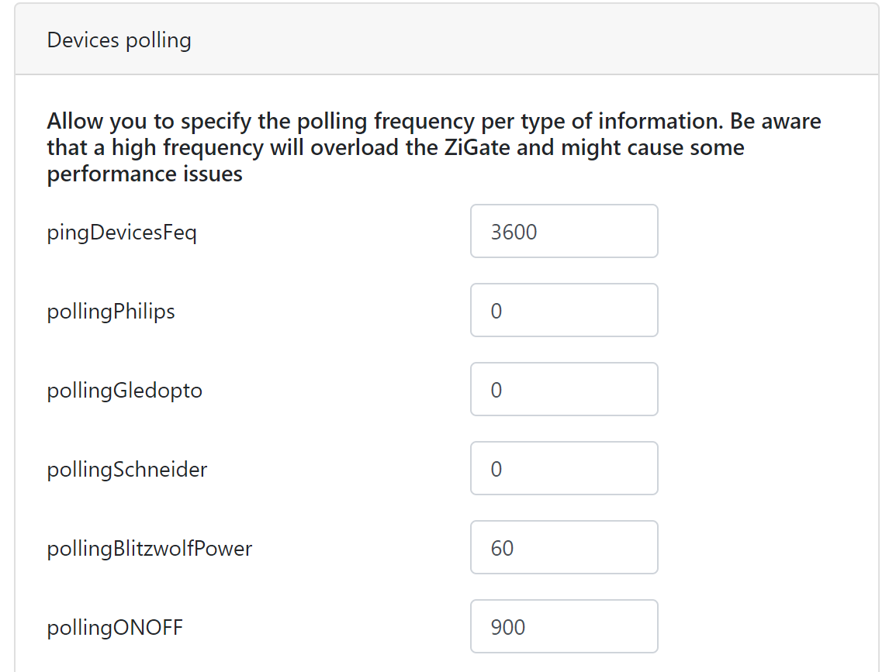

# Blitzwolf corner

## Known devices

* [Contact sensor (BW-IS2)](https://zigbee.blakadder.com/BlitzWolf_BW-IS2.html)
* [Electricity Metering 16A EU Plug (BW-SHP13)](https://zigbee.blakadder.com/BlitzWolf_BW-SHP13.html)
* [Rechargeable PIR Motion Sensor(BW-IS3)](https://zigbee.blakadder.com/BlitzWolf_BW-IS3.html)
* [Temperature & Humidity Sensor with Display(BW-IS4)](https://zigbee.blakadder.com/BlitzWolf_BW-IS4.html)
* [Water Leak Sensor (BW-IS5)](https://zigbee.blakadder.com/BlitzWolf_BW-IS5.html)

Currently, only the Plug was tested but all those products are Tuya based and should work.
The Temperature & Humidity Sensor share the same model name as [generic one](https://zigbee.blakadder.com/Tuya_TS0201.html).

## Electricity Metering 16A EU Plug (BW-SHP13)

It's generic name is TS0121.

To pair the device, press the power button for 5s, a blue light will flash till the pairing process is complete.
Five devices are created:

* Plug (On/Off)
* Voltage
* Power (General kWh and a P1Meter)
* Ampere

You can remove one on the unused power device. The cumulated consumption is updated each 0.01 kWh.

The power device can also indicate the actual power consumption but you have to activate the polling for this brand.
On the dashboard, in the settings menu, activate advanced settings and choose the refresh frequency:

I choose 120s for a washer, it's enough to know when the machine starts and finishes.

## Bonus

Cluster On/Off (0x0006) contains two specific Attributes:

* 0x8001: It's an Enum type (0x30), Mode 1 (0x01) turns off the red light on the button, Mode 2 (0x02) turns it on.
* 0x8002: Unknown
