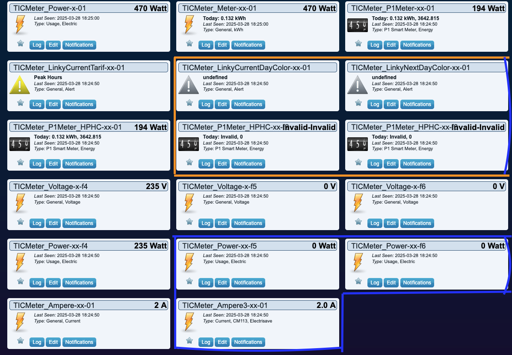

# GammaTroniques TICMeter Integration

## Overview

Purpose is to describe the integration of the GamaTroniques's TICMeter which allows to retreive the Linky "tele-info"

## Integration status

The general approach has been to be as generic as possible to handle all TIC and Electrical modes (Historique, Standard, Mono, Tri). The result will be that after pairing a TICMeter you'll get a quiet extensive number of widgets created in Domoticz.
Depending on your Linky setup, some will work, and some others won't.

| Widget Name             | Information reported              | Linky Historique | Linky Standard | Mono-Phase | Tri-phase |
| ----------------------- | --------------------------------- | ---------------- | -------------- | ---------- | --------- |
| Ampere_01               | Intensité                         |      Yes         |     Yes        |            |           |
| Ampere3_01              | Intensité Phase 1, 2,3            |      Yes         |     Yes        |   Yes      |   Yes     |
| Power_01                | Puissance apparente               |      Yes         |     Yes        |            |           |
| Meter_01                | Index Total + Puissance apparente |      Yes         |     Yes        |            |           |
| P1Meter_HPHC_01         | Index HC/HP + Puissance apparente |      Yes         |     Yes        |            |           |
| LinkyCurrentTarif_01    | Current Tarif                     |      Yes         |     Yes        |            |           |
| LinkyCurrentDayColor_01 | Current Color                     |    Tempo         |     Tempo      |            |           |
| LinkyNextDayColor_01    | Next Day Color                    |    Tempo         |     Tempo      |            |           |
| P1Meter_HPHC_f2         | Index HC/HP Bleu                  |    Tempo         |     Tempo      |            |           |
| P1Meter_HPHC_f3         | Index HC/HP Rouge                 |    Tempo         |     Tempo      |            |           |
| Voltage_f4              | Tension Mono ou L1                |      No          |     Yes        |    Yes     |   Yes     |
| Power_f4                | Puissance soutirée  L1            |     No           |     Yes        |   No       |  Yes      |
| Voltage_f5              | Tension L2                        |      No          |     Yes        |            |           |
| Power_f5                | Puissance soutirée  L2            |     No           |     Yes        |   No       |  Yes      |
| Voltage_f6              | Tension L3                        |      No          |     Yes        |            |           |
| Power_f6                | Puissance soutirée  L3            |     No           |     Yes        |   No       |  Yes      |

For now, in Tri-Phase mode, Power_f4 is not updated, as there is a miss-match in the reporting an Power L1 (SINSTS1) seems to be reported as General Power (SINSTS)



In Orange, theses Widgets are relevant to the Tempo or EJP contract
In Blue the Widgets are relevant to Tri-phase setup

* In Tempo or EJP contract widgets highlighted ORANGE are used. If you are not in this contract, you can remove them.
* If your installation is tri-phases, then the BLUE widgets will be used in addition

## TIC attributes not available via Widget

All Labels are also stored in the plugin database.  For now, you can get them from teh JSNON API of the plugin `http://<your-domoticz-ip-address>:9440/rest-z4d/1/gamma-troniques-ticmeter` and key parameters are also highlited

```json
    "Nwkid": "19fd",
    "ZDeviceName": "TICMeter",
    "Identifiant": "3________2",
    "TICMode": "standard",
    "Mode Electrique": "Monophasé",
    "Type de contrat": "HCHP 22h-6h",
    "Période tarifaire en cours": "HEURES PLEINES",
    "Puissance Max contrat": 9,
    "UpTime": "0d 08:27:59",
```
