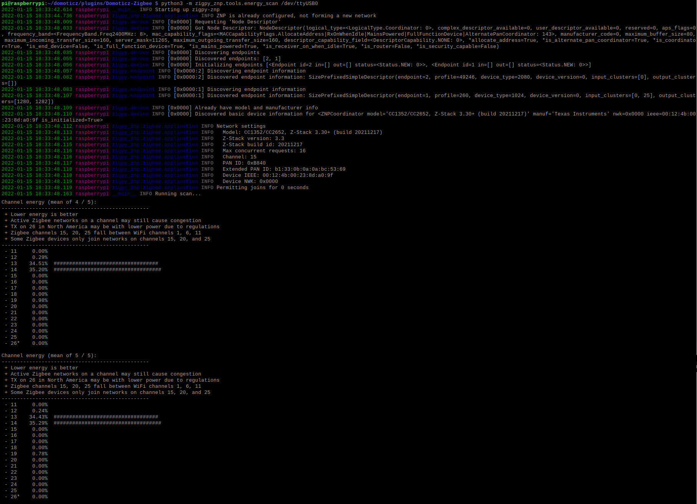

# ZigBee For DomoticZ FAQ


------------
## 1. Where can I get support

Welcome to Zigbee for Domoticz.
The first source of support is the Wiki

* [English Wiki](https://zigbeefordomoticz.github.io/wiki/en-eng/)
* [French Wiki](https://zigbeefordomoticz.github.io/wiki/fr-fr/)
* [Dutch Wiki](https://zigbeefordomoticz.github.io/wiki/nl-dut/) ( _Unfortunatly outdated. Please contact us if you are willing to contribute in the udpate of this wiki_)

You can also get support and ask questions :

* The [English Forum](https://www.domoticz.com/forum/viewforum.php?f=68)
* The [French Forum](https://easydomoticz.com/forum/viewforum.php?f=28)
* The [Keybase English channel](https://keybase.io/team/zigateforum)
* The [Keybase French channel](https://keybase.io/team/zigate)


------------
## 2. I'm using a SONOFF Zigbee USB Dongle Plus, but it is not working

I can see in the log file ( domoticz/plugins/Domoticz-Zigbee/Logs/PluginZigbee-xx.log ) some messages like that

```log
2022-02-25 00:19:41,006 INFO    : [       MainThread] Zigate plugin beta6-6.0.114 started
2022-02-25 00:19:41,384 INFO    : [       MainThread] Plugin Database: DeviceList-2.txt
2022-02-25 00:19:41,466 INFO    : [       MainThread] DeviceConf loaded - 23 confs loaded
2022-02-25 00:19:43,858 INFO    : [       MainThread] DeviceConf loaded - 329 confs loaded
2022-02-25 00:19:43,875 INFO    : [       MainThread] load ListOfDevice
2022-02-25 00:19:43,955 INFO    : [       MainThread] Transport mode: ZigpyZNP
2022-02-25 00:20:45,074 ERROR   : [       MainThread] [ 61] I have hard time to get Coordinator Version. Mostlikly there is a communication issue
2022-02-25 00:20:45,084 ERROR   : [       MainThread] [   ] Stop the plugin and check the Coordinator connectivity.

```

This indicate a miss communication between the plugin and the dongle. you need to cross-check the following pieces in the Domoticz Hardware menu:

* ensure that the serial port is the right one.
* ensure that the Coordinator Model matchs your dongle (in that case it must be Texas Instrument ZNP (via zigpy)
* ensure that there is not an other process running on the port


------------
## 3. I cannot get my TI CCxxx dongle working with the plugin

In that case, we suggest that you try to test the TI CCxxx dongle without Domoticz and the plugin.

1. make sure that the plugin is stopped
2. Installed missing python modules if requires `sudo pip3 install jsonschema coloredlogs`
3. from the plugin home folder `domoticz/plugins/Domoticz-Zigbee`, run `python3 -m zigpy_znp.tools.energy_scan /dev/ttyUSB0`where /dev/ttyUSB0 is the serial port to the USB dongle

This should provide you a scan of all Zigbee channels and reports the level of noise



If you do not succeed here, this mean that something is wrong between the system and the USB dongle


------------
## 4. Pairing issues - Not able to pair a device, the pairing works, but the device doesn't work or doesn't behave as expected

Please check [here](https://zigbeefordomoticz.github.io/wiki/en-eng/Problem_Dealing-with-none-certified-device.html)


------------
## 5. I want to debug myself and get more logs

Please check [here](https://zigbeefordomoticz.github.io/wiki/en-eng/Problem_Debuging-mode.html)


------------
## 6. While running , I see some `Decode8000`errors in the log file

if you see error logs like here after, this is most-likely an issue with the ZiGate hardware.

```log
2022-02-22 18:03:11.851 Error: ZiGate: Decode8000 - PacketType: 0030 TypeSqn: 02 sqn_app: 00 sqn_aps: 22 Status: [ZigBee Error Code Unknown code : 80]
2022-02-22 18:06:23.656 Error: ZiGate: Decode8000 - PacketType: 0030 TypeSqn: 02 sqn_app: 00 sqn_aps: 4d Status: [ZigBee Error Code Unknown code : 80]
2022-02-22 18:06:30.282 Error: ZiGate: Decode8000 - PacketType: 0030 TypeSqn: 02 sqn_app: 00 sqn_aps: 51 Status: [ZigBee Error Code Unknown code : 80]
2022-02-22 18:06:30.499 Error: ZiGate: Decode8000 - PacketType: 0030 TypeSqn: 02 sqn_app: 00 sqn_aps: 52 Status: [ZigBee Error Code Unknown code : 80]

```

* make sure that you don't have the old __blue__ USB-TTL module (it must be a red one )
* try to power off the ZiGate by stopping the plugin, removing ZiGate, wait for 1 minute, plug-in back and restart the plugin

cc: [Issue reported on ZiGate](https://github.com/fairecasoimeme/ZiGate/issues/394)


------------
## 7. Where can I find the list of supported Coordinators and Devices

Please check the  [Zigbee Device Compatibility Repository](https://zigbee.blakadder.com/z4d.html)


------------
## 8. Can I use several dongles in the same Domoticz

We have currently a limitation of the nimber of instances using Zigpy layer, which prevent having several instances of zigpy based communication.

If you use ZiGate hardware, you can run as many plugin instances ( one instance per ZiGate ) as you wish.
If you use non-ZiGate hardware, like TI CCxxxx or Silicon Labs, you can run only one instance of those 2, but still can mix with as many ZiGate as you want.


------------
## 9. Where can I find the coordinator firmwares

* For Texas Instrument we recommend to use the Z-Stack firmware from @Koenkk available [here](https://github.com/Koenkk/Z-Stack-firmware/tree/master/coordinator). we do not recommend to use _develop_ branch and rely on the _master_
* For ZiGate, the firmware are available [here for Zigate V1](https://github.com/fairecasoimeme/ZiGate/releases) or [here for ZiGate+ V2](https://github.com/fairecasoimeme/ZiGateV2/releases)
* For EZNP (Silicon Labs) we recommend to follow the [zigpy recommendations](https://github.com/zigpy/zigpy/wiki/Coordinator-Firmware-Updates)

------------
## 10. _No transport, write directive to_ in the log

Time to time I see the following error message. Is that a big issue ? How can I get rid of it ?

```log
Apr 02 13:30:23 pi3 domoticz[1328]: 2022-04-02 13:30:23.327  Error: Zigate: No transport, write directive to '10.0.0.166:52348' ignored.
Apr 02 13:30:23 pi3 domoticz[1328]: 2022-04-02 13:30:23.327  Error: Zigate: No transport, write directive to '10.0.0.166:52346' ignored.
```

This error is coming from Domoticz and is related to the fact that you had the WebUI page opened and which timeout, at the time you tried to refresh this page, Domoticz detected that they were no transport/communication anymore.
You shouldn't worry much of this message.


------------
## 11. How to manage several USB key and make sure that the coordinator is awlays using the same port

This is more an OS issue, but here are few hints

* [Assign fixed device name to USB port](https://www.domoticz.com/wiki/Assign_fixed_device_name_to_USB_port)
* [Persistent USB Devices](https://www.domoticz.com/wiki/PersistentUSBDevices)


------------
## 12. How to commission/pair a new device

1. Make sure you authorized new hardware in DomoticZ
1. Set the Permit Join to 120 ( 120 seconds )
1. Start the Plugin
1. Trigger the pairing process from the device


------------
## 13. I don't get the device updated in DomoticZ when interacting via a remote control or manualy

For example : If you power off an Ikea bulb (with the physical switch) and then switch it on again, the status of the bulb is not updated in DomoticZ. And having the same issue with a remote controller which also doesn't update it's current state to DomoticZ.

If you encounter problems like the above example, it is most likely the automatic reporting is not configured correctly from the device end. Please follow below steps to fix this issue:

1. Open the PluginConf.txt file
1. Please check if the parameter "AllowRebindingClusters" is set to 1.
    If it is not, set it to "1"
1. Switch off the Ikea bulb with the physical switch, wait for 10 seconds, then turn it on again.
The rebinding process will start itself, the status problems should now be fixed.


------------
## 14. I'm getting 'Error: (Zigate) Communication error when transmiting a previous command to 9d58 ieee 90fd9ffffe31f150'

Here after is an exemple of errors found in the log file.

```log
Apr 24 11:47:47 pi3 domoticz[23926]: 2019-04-24 11:47:47.697  Error: (Zigate) Communication error when transmiting a previous command to 9d58 ieee 90fd9ffffe31f150
Apr 24 11:47:47 pi3 domoticz[23926]: 2019-04-24 11:47:47.697  Error: (Zigate) Decode8702 - SQN: bc AddrMode: 02 DestAddr: 9d58 SrcEP: 01 DestEP: 01 Status: d4 - Unicast frame does not have a route available but it is buffered for automatic resend

```

This indicates that device ```90fd9ffffe31f150```is not reachable or - Zigate get a communication problem wit it -
