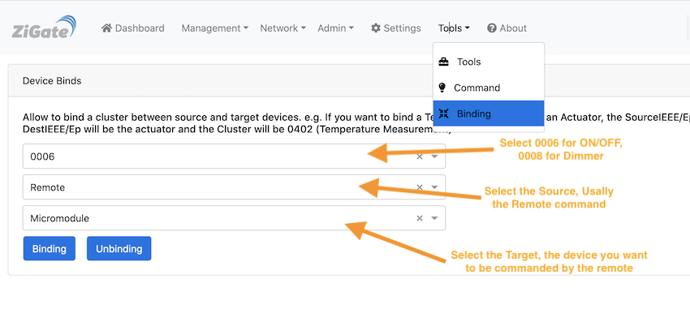

<a href="Home.md"></a>

# How to Bind Legrand-Netatmo Remote with a Micromodule

</br>

The HowTo is validated for a ZiGate.
We don not have any informations for the other coordinators.

## Overview

Purpose of this page is to document how to bind a "Double gangs remote switch_Legrand" with a "Micromodule".

This will be applicable for most of the devices as soon as they support binding between 2 end devices.

ATTENTION: it will required to have the ZiGate up and running to have the binding operationnal. Do not expect to have binding working while the Zigate is Off.

While it is possible to use the Double bang remote switch to bind , the 'Remote Shutter' seems not to accept any bindings.

## Step 1 : Pairing

1. Put the ZiGate in Pairing mode
1. Pair the "Micromodule" with Zigate, and check after pairing that you can command the Micromodule from DomoticZ
1. Pair the "Double gangs remote" with Zigate, and check that any actions on the remote is seen on DomoticZ

At that stage you should have :

1. One widget for the Micromodule
1. 2 widgets for the Double Gange Remote ( one widget for the left gang and one widget for the right gang)

You can easily check which widget is the left and the right,

Here after is an exemple of the 2 widgets created. Notices the '-01' and '-02'

```
DIN Zigate - Double gangs remote switch_LegrandSelector-000474000082702a-01
DIN Zigate - Double gangs remote switch_LegrandSelector-000474000082702a-02
```

Here after is an example of the widget created.

```
DIN Zigate - Micromodule switch_Switch-00047400001f09a4-01
```


## Step 2: Bindings

We advice you to give a Friendly name to each of your device , in order to smooth the binding device selection.
For that you have to go the Device Management section and give a Friendly Name to each devices.

We are going to bind the On/Off cluster ( 0x0006 ) between the Double gangs remote switch (Left or Right) with the Micromodule.
For such, we are going to use the Web Admin page :




### What to bind

#### Cluster
* Cluster: 0x0006  ( ON and OFF )
* Cluster: 0x0008  ( Dimmer and Level Control )

It is also possible to to bind several cluster, in that case, you have to do several binding. One with one cluster and then and othe one with the other cluster.

#### Source

This is basically the device which is going to __trigger__ the action define in the __Cluster selection__.
In case like the Double Bang remote Legrand where you have 2 actioners, you have to select the correct one. Usally in that case, you have what ZigBee called different EndPoints (EP), this is the 01 or 02 that you can see at the end of the Widget name at provisionning time.

#### Target

This is the device you want to action. Most likely it will be a main powered device.
