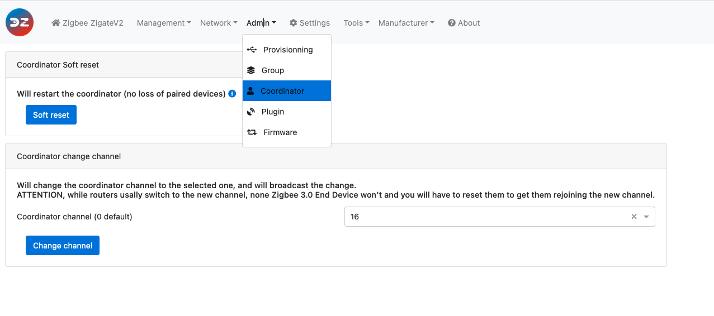

# Setting Coordinator Channel

## Introduction

By default, at initialisation, the coordinator will look for the best possible channel, based on level of interferences around.
However you might want to fix the Channel, because some devices would required a specific one.

* Konke requires channel 15
* Livolo requires channel 26
* Legrand requires channel 11

## Method 1, live channel change

In this approach __the most appropriate one__ you will change the coordinator channel, and at the same time you will inform all routers of the channel change. This should allow to have your all network equipments moving to this new channel.
That is a ZigBee 3.0 feature, and that is quiet important for End Devices (battery based), as they won't be notified of such change. If they are ZB 3.0 compliant the next time they wake up they should detect the new channel and change. If that is not happening you'll have to re-pair them.

1. Go in the Admin > Coordinator section
1. In the "Coordinator change channel" menu, select the targeted channel
1. Click Change channel to apply

## Method 2, via channel setting

__That is valid for ZiGate Coordinator only__ If you have a Texas Instrument, Silicon Labs you need to use the first method

### Step 1: Set the channel

Set the channel you want.

### Step 2: Apply the changes to the coordinator

In order to get the coordinator taking into account this new channel, you need to use the `restart` mecanishm.

And voila! The coordinator should be on the right channel.

### Step 3: Check the coordinator channel

1. Go to Tools -> and select `Infos zigate (json)`

    

1. You'll find the coordinator Information, and the Channel.
    The Channel value is expressed here in Hexa, so 0x0b means 11
