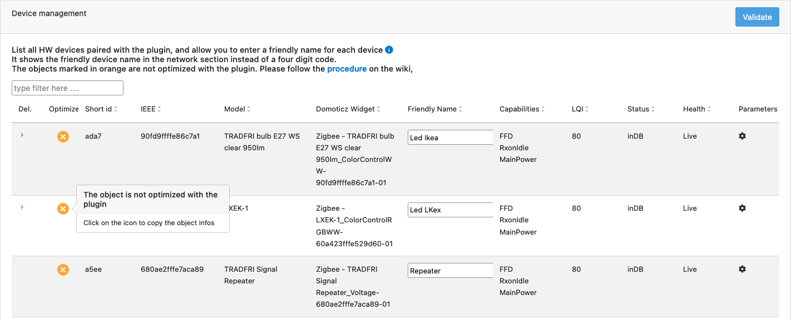
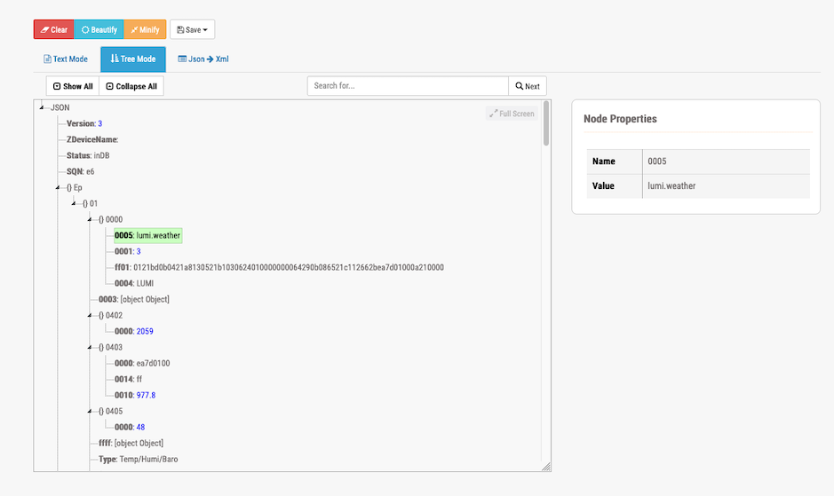
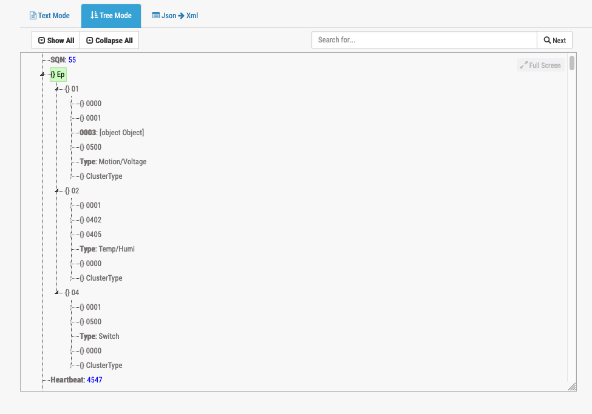

# How-To get devices well integrated with the plugin

## Overview

It might happen that your device is well paired with the coordinator and the plugin, but do not behave has expected.
The plugin is providing a way to overwrite the Zigbee standard behaviour by adding specifics to the device plugin configuration.

Since plugin version 6.4.4xx, the device config files have moved out of the plugin core engine to a specific python module ( z4d-certified-devices ). This will allow to have more regular update of config files without touching the plugin core engine.

The source code of the [z4d-certified-devices](https://github.com/zigbeefordomoticz/z4d-certified-devices/tree/main/z4d_certified_devices/Certified) can be used as reference or examples.

## Properties

| Level      | Object Name              | default | Description |
| -----      | -----------              | ------- | ----------- |
| main       | ClusterId                |         |  Cluster ID defined in this json file |
| main       | Description              |         |  Description of the Cluster ID |
| main       | Version                  |         |  Version number of this cluster definition |
| main       | Enabled                  |         |  Is this Cluster definition is enabled or not |
| main       | Attributes               |         |  list of Attribute and their definition |
| attribute  | xxxx                     |         |  Object describing attribute xxxx of ClusterId |
| attribute  | Enabled                  |         |  Is this attribute definition enabled or nor |
| attribute  | Name                     |         |  Name of the attribute |
| attribute  | DataType                 |         |  Attribute data type in hexa |
| attribute  | Range                    |         |  Attribute value ranges in hexa |
| attribute  | Acc                      |         |  Attribute access right ( RP: Reporting, R: read, W, write |
| attribute  | Default                  |         |  Attribute default value |
| attribute  | Mandatory                |         |  Attribute mandatory flag. |
| attribute  | DomoClusterType          |         |  Plugin ClusterType info ( Lux, Switch, Motion, ...) |
| attribute  | EvalExp                  |  value  |  string containing a forumla to compute the attribute value. Based on python3 eval() function|
| attribute  | EvalFunc                 |         |  Function name define in a module in the DevicesModules (see Devices modules for more info.) |
| attribute  | ActionList               |         |  List of action(s) to be triggered
| attribute  | DecodedValueList         |         |  List of values with a decoded value in string |
| attribute  | SpecialValues            |         |  List of special values |
| attribute  | ValidValuesDomoDevices  | True    | Evaluation which should return True or False, and which will condition the MajDomoDevice call |
| attribute  | DomoDeviceFormat        | result of eval |  format on how the value should be formated before sent to majDomoDevice ( str, float, int ) |
| attribute  | UpdDomoDeviceWithCluster |         |  Force to do the majDomoDevice on a specified Cluster , despite the current clsuter |
| attribute  | UpdDomoDeviceWithAttribute| none    |  Force to do the majDomoDevice on a specific attribute |
| attribute  | ValueOverwrite           |         |  Overwrite the value, by the one given here |
| attribute  | EvalExpCustomVariables   |         |  list of variables to be retreived in the device.  {"yyy": { "Cluster": "0403", "Attribute": "0014"}} |
| evalInputs | yyyy                     |         |  variable name to be used in the eval string |
| evalInputs | ClusterId                |         |  cluster from which the variable value should be retreived |
| evalInputs | AttributeId              |         |  attribute from which the variable should be retreived |
| attribute  | ManufRawData             |         | Use in conjonction with **ManufSpecificFunc** and indicates that we must use the raw value and not the decoded one|
| attribute  | ManufSpecificFunc        |         | Define a function from the device module to be called |
| attribute  | SpecifStoragelvl1        |         | Use in conjonction of the action **store_specif_attribute** and define the Name of the corresponding level in the data structure |
| attribute  | SpecifStoragelvl2        |         | Use in conjonction of the action **store_specif_attribute** and define the Name of the corresponding level in the data structure |
| attribute  | SpecifStoragelvl3        |         | Use in conjonction of the action **store_specif_attribute** and define the Name of the corresponding level in the data structure |

## ActionList

| name                    | function |
| ----                    | -------- |
| check_store_value       | store the value to the corresponding Ep, Cluster,Attribute |
| upd_domo_device         | request an update of the corresponding ClusterType for this value of Cluster |
| store_specif_attribute  | request to store the value under the hierarchie SpecifStoragelvl1:SpecifStoragelvl2:SpecifStoragelvl3 |
| basic_model_name        | reserved to handle the attribute 0005 of Basic cluster |

## evaluation

* _value_ is a special variable which contained the zigbee device value

1. Transform a centi-degree _value_ into degree

    ``` "eval": "round(int(value) / 100, 1)", ```

2. transform the received data ( _value_ ) into the Atmo Pressure as per the Zigbee standard

    ``` "eval": "round(int(value) * pow( 10, scale), 1)", ```

3. transform the Scaled Pressure measurement.

   1. retreive the _scale_ in attribute 0x0014 of cluster 0x0403
   2. evaluate the the formula with the retreived _scale_ information

    ```json
    {
     "evalInputs": {"scale": { "Cluster": "0403", "Attribute": "0014"}},
     "eval": "round(int(value) * pow( 10, scale), 1)",
    }
     ```

## Device module

### overview

instead of using eval which is limited to simple expression, you can implement a full python function to handle the value as an input and return the result.
If returning None, no action will be taken

### How-to

1. Create your python3 module file in the  `DevicesModules`folder
1. Code your custom function in the \<manufacturer\>.py module

    * The function can take only 2 parameters `self` and `value`
    * The function must return something

    ```python
    def custom_<manufactuer>_function(self, value):

        return value
    ```

1. Integrate the function in the flow
    1. Edit the file `DevicesModules/__init__.py`, just follow the same as what has already been done
       * import your module
       * link the function to the stanza you will put in the conf file

    ```python3
    FUNCTION_WITH_ACTIONS_MODULE = {
        # Lumi 0xfcc
        "Lumi_fcc0": lumi_private_cluster,

        # ZLinky
        "zlinky_clusters": zlinky_clusters

    }
    FUNCTION_MODULE = {
        # 0702 helper
        "compute_metering_conso": compute_metering_conso,

        # 0b04 helper
        "compute_electrical_measurement_conso": compute_electrical_measurement_conso,

        # Konke Switch
        "konke_onoff": konke_onoff,
    }

    ```

### Optimize a non-yet optimized device

It is likely that your device - if fully Zigbee 3.0 compliant - works well with the plugin. It means that you have paired the device, and automatically the plugin made a descovery of the device features and created the corresponding domoticz widgets.

In that case, it might be efficient to get the plugin fully aware of what the device is and is not capable.

To do so, you have to create a 'config' file under the `Local-Devices` folder.

1. First you need to extract raw device informations from the plugin.

   1. open the WebUI and go to the Device Management section

    

   1. as shown on the here above screenshot you'll see a list of device, and the one with the yellow icon refer to devices for which there is no associated config file for the plugin and their behaviour might not be optimum.

   1. Click on the yellow icon, it will copy immediately the necessary information to the Clipboard. You can then paste in the Json viewer ( like that one [JsonViewer](https://countwordsfree.com/jsonviewer). You will see a resultat like this one

    

1. Create the configuration file for this device

    1. You have to create the file under the `Conf/Certified/00Local` folder
    1. You have to create the file with a specific name. The name is based on the Zigbee Model identifier you can get in the json file, look at attribute `Model`, and create the file as _modelname_.json.

    for exemple if we look after the Json file above, the Zigbee model identifier is **lumi.weather**, so you will create a file name **Conf/Certified/00Local/lumi.weather.json**

    you can initialize the file with the following content, that we will show how to update in the next steps

    ```json

    {
        "_comment": "",
        "_blakadder": "",
        "_version": "",
        "Ep": {
            "01": {
                "0000": "",
                "Type": ""
            }
        },
        "Type": "",
        
        ,
        "ConfigureReporting": {
        },
        "ReadAttributes": {
        },
        "Param": {
        },
    }

    ```

1. Update the attributes

    * __"\_comment":__  _put what ever comment you would like. We are recommending to put at least the Device Product Name and manufacturer_
    * __"\_blakadder":__  _you can add here the link to the [blakadder](https://zigbee.blakadder.com/) web site, where your device is referenced. If the device is not yet referenced, we strongly recommend you to request to get it in._
    * __"\_version":__ _this is a version number you can put._

1. Update the "Ep" section

    Here we have to declare what are the Endpoint (EP) the device has and what are the Clusters available on each of the EP. for more information on Ep and Clusters I suggest you to look after the [Zigbee technical presentation](https://csa-iot.org/wp-content/uploads/2021/12/zigbee-technical-presentation.zip)

    During pairing, the plugin started a discovery process and interviewed the device for the list of endpoints, and the supported clusters for each of the endpoint. This information will be found on the Json.

    In the here after exemple you can see a somehow complex device which has 3 endpoints.

    

    We can see :

    3 Endpoints : 0x01, 0x02 and 0x04 and we see for each of the ep the associated cluster.

    This will result in the following config file where fo each Endpoint we have listed the available cluster and we have also define what are the associated Domoticz Widgets.

    ```json
    {
        "Ep": {
            "01": {
                "0000": "",
                "0001": "",
                "0003": "",
                "0500": "",
                "Type": "Motion/Voltage"
            },
            "02": {
                "0001": "",
                "0402": "",
                "0405": "",
                "Type": "Temp/Humi"
            },
            "04": {
                "0001": "",
                "0500": "",
                "Type": "Switch"
            }
        },
        "Type": "",
    ```

    | Ep | Widget | Cluster source of information |
    | -- | ------ | ----------------------------- |
    | 01 | Motion | The motion detection will come from the Cluster 0x0500 ( IAS ), Domoticz will switch the Motion widget from On to Off depending on the notification |
    |    | Voltage| The device will send voltage information via the cluster 0x0001 ( Power ), and domoticz will displayed thge voltage value |
    | 02 | Temperature | The device will send Temperature information via cluster 0x0402 |
    |    | Humidity | Humidity info will be provided from cluster 0x0405 |
    | 04 | Switch | The device offer the possibility to detect vibration on cluster 04 and the cluster 0500 will be used for |

    if you look to the Json you could say that there is less clusters than  the reallity discovered by the plugin.
    Indeed, cluster 0x0000 is mentioned only one on the Ep 01, which we consider suffisant and there is no need to get the same information accross several Ep.

    In summary **Type** is corresponding to the Domoticz Widget to be created and used to display sensor information as well as handling actions

    More information on the [Cluster -> Widget](Technical/Clusters_Widget.md)

1. Update the ClusterToBind section

    A **Binding** is the creation of a unidirectional logical link between a source endpoint/cluster identifier pair and a destination endpoint.

    It might be needed to established a binding between the device and the coordinator in order to receive automatic report such as sensor information.

    In `"ClusterToBind": [ ]` you will be able to list the clusters to be bound with the coordinator. By default , the plugin is looking after the Endpoint list (Ep) and will established a bind for each of the Ep/Cluster existing.

    In case you have a multiple Ep device which serve same cluster, you might want to restrict the binding to only a specific Ep. In such case you can use `"bindEp": [ ]`

    If we follow the **CMS323**  device, we need to bind 01/0001, 02/0001, 04/001, 02/0402, 04/0405

    ```json

    "ClusterToBind": [ "0001", "0402", "0405" ],

    ```

1. Update the ConfigureReporting section

    The Configure Reporting command is used to configure the reporting mechanism for one or more of the attributes of a cluster.
    Usally in order to put in place a Configure Reporting command, a corresponding binding needs to be done as well

    ```json

    "ConfigureReporting": {
        "0001": { "Attributes": { "0021": { "DataType": "20", "MinInterval": "0E10", "MaxInterval": "A8C0", "TimeOut": "0000", "Change": "01" } }},
        "0402": { "Attributes": { "0000": { "DataType": "29", "MinInterval": "003C", "MaxInterval": "0384", "TimeOut": "0000", "Change": "0032" } } },
        "0405": { "Attributes": { "0000": { "DataType": "21", "MinInterval": "003C", "MaxInterval": "0384", "TimeOut": "0000", "Change": "0032" } } }
    },

    ````

1. Update the ReadAttributes section

    The Read Attribute command is used to query the device on attributes.
    In this section we are going to indicate to the plugin which Cluster/Attributes are valid and can be queried.

    ```json
    
    "ReadAttributes": {
        "0000": ["0004","0005","0006","0007"],
        "0001": [ "0020" ],
        "0003": [],
        "0402": [ "0000" ],
        "0405": [ "0000" ],
        "0500": [ "0000", "0001", "0002", "0010", "0011" ]
    },
    
    ```

1. Additional parameters

    | Parameter                   | Description |
    | ---------                   | ----------- |
    | ActivePowerDivisor          | Divisor to be used when receiving Active Power via Cluster 0x0b04 and Attribute 0x050b |
    | BatteryDevice               | specify that the device is a battery based device and must be treated as such |
    | BatteryPercentageConverter  | the value will be used to device the value send byt the device. eg. if we receive 156, and we set `BatteryPercentageConverter = 2`, this will convert into 78% |
    | BatteryPoweredDevice        | Used to indicate despite what the device tell, it is a Battery powered device |
    | CreateWidgetDomoticz        | |
    | IgnoreWindowsCoverringValue50 | |
    | MainPoweredDevice           | Used to indicate despite what the device tell, it is a Main powered device |
    | MaxBatteryVoltage           | define the max battery voltage, which has to be expressed with the same unit as the coming info |
    | MeteringUnit                | Unit of measure on the Metering cluster `kW` (means that we have to x 1000 to send to Domoticz, `Unitless` (means that we have Watts and we can send it like that) |
    | MinBatteryVoltage           | define the min battery voltage, which has to be expressed with the same unit as the coming info |
    | PowerMeteringDivisor        | Divisor to be used when receiving Instant Power via Cluster 0x0702 and Attribute 0x0400 |
    | PowerMeteringMultiplier     | Multiplier to be used when receiving Instant Power via Cluster 0x0702 and Attribute 0x0400 |
    | PowerOnOffStateAttribute8002 | |
    | RMSCurrentDivisor           | Divisor to be used when receiving RMS Current via Cluster 0x0b04 and Attribute 0x0508 |
    | RMSVoltageDivisor           | Divisor to be used when receiving RMS Voltage via Cluster 0x0b04 and Attribute 0x0505, 0x0905, 0x0a05 |
    | SummationMeteringDivisor    | Divisor to be used when receiving Summation Power via Cluster 0x0702 and Attribute 0x0000 |
    | SummationMeteringMultiplier | Multiplier to be used when receiving Summation Power via Cluster 0x0702 and Attribute 0x0000 |
    | TUYA_REGISTRATION           | |
    | TUYA_REMOTE                 | |
    | VoltageConverter            | the value will be used to device the value send byt the device. eg. if we receive 22450, and we put `VoltageCOnvert = 100`, this will convert into 224.5 Volts |
    | WindowsCoverringInverted    | |

## A concreate exemple: lumi Weather

```json
{
    "Ep": {
        "01": {
            "0000": { 
                "Attributes": {
                    "fff0": { "Enabled": true, "Name": "Aqara_0000_fff0", "DataType": "42" , "ManufRawData": true, "ManufSpecificFunc": "Lumi_fcc0", "ActionList": [ "check_store_value"]},
                    "ff01": { "Enabled": true, "Name": "Aqara_0000_ff01", "DataType": "42" , "ManufRawData": true, "ManufSpecificFunc": "Lumi_fcc0", "ActionList": [ "check_store_value"]},
                    "ff02": { "Enabled": true, "Name": "Aqara_0000_ff02", "DataType": "42" , "ManufRawData": true, "ManufSpecificFunc": "Lumi_fcc0", "ActionList": [ "check_store_value"]}  
                }
            },
            "0003": "",
            "0402": "",
            "0403": {
                "Attributes": {
                    "0000": { "Enabled": true, "Name": "Aqara MeasuredValue","DataType": "29" , "DomoClusterType": "Baro","ActionList": [ "check_store_value"]},
                    "0010": { "Enabled": true, "Name": "Aqara ScaledValue", "DataType": "29" , "EvalExp": "round(int(value) / 10, 1)", "ActionList": [ "check_store_value", "upd_domo_device"]},
                    "0014": { "Enabled": true, "Name": "Aqara Scale", "DataType": "28", "ActionList": [ "check_store_value"] }
                }
            },
            "0405": "",
            "ffff": "",
            "Type": "Temp/Humi/Baro"
        }
    },
    "Type": "",
    "ClusterToBind": [],
    "ConfigureReporting": {},
    "ReadAttributes": {
        "0000": [ "0004", "0005" ],
        "0402": [],
        "0403": [],
        "0405": []
    }
}
```

In this exemple we can note in addition to what was explain before:

* For attributes 0xfff0, 0xff01, 0xff02 of Cluster 0x0000 we are delegating the handling to a specific function `Lumi_fcc0`.
    The reason is that Lumi is using those attributs to pass various informations like Battery level, On/Off state for Door sensor and plenty of other infos.

* For attribute 0x0000 of 0x0403 we are just storing the received info. Usally this attribut is used to provide the Pressure, but in case of Lumi, we are using attribut 0x0010.

* For attribute 0x0010 of 0x0403, we are going to send this value to domoticz via the `upd_domo_device`call. But prior to that we are performing a calculation `round(int(value) / 10, 1)``

## Special case of the Tuya TS0601 model name

Tuya has implemented a manufacturer private cluster documented [Tuya Zigbee Generic Interfaces](https://developer.tuya.com/en/docs/iot/tuya-zigbee-universal-docking-access-standard?id=K9ik6zvofpzql)

For that you need to identify the DataPoint which correspond to the Snensor informations. Based with the Dp, you can create the mapping between Widgets and Actions

1. Sensor type ( mapping to Domoticz widgets)
    | sensor_type | description |
    | ----------- | ----------- |
    | motion | |
    | illuminance | |
    | temperature | |
    | setpoint | |
    | humidity | |
    | distance | |
    | battery | |
    | batteryState | |
    | tamper | |
    | switch | |
    | door | |
    | lvl_percentage | |
    | co2 | |
    | voc | |
    | ch20 | |
    | mp25 | |
    | current | |
    | metering | |
    | power | |
    | voltage | |
    | heatingstatus | |
    | valveposition | |
    | calibration | |
    | windowsopened | |
    | TRV6SystemMode | |
    | TRV7SystemMode | |
    | TuyaAlarmDuration | |
    | TuyaAlarmMelody | |
    | TuyaAlarmLevel | |
    | TuyaAlarmSwitch | |
    | smoke_state | |
    | smoke_ppm | |
    | water_consumption | |

1. Action type ( when an action needs to be sent to the device )

    | action_type | description |
    | ----------- | ----------- |
    | switch | |
    | setpoint | |
    | calibration | |
    | TRV6SystemMode | |
    | TRV7SystemMode | |
    | TuyaAlarmSwitch | |

1. Concreate case : ** Tuya TS0601 Radar Presence

    in the here example you'll see only the specific things.

    ```json
    {
        "TS0601_DP": {
            "01": { "sensor_type": "motion", "DomoDeviceFormat": "str"},
            "09": { "sensor_type": "distance", "EvalExp": "int((value//10)*10)"}, 
            "68": { "sensor_type": "illuminance"},
            "02": { "store_tuya_attribute": "sensitivity"},
            "03": { "store_tuya_attribute": "radar_min_range"},
            "04": { "store_tuya_attribute": "radar_max_range"},
            "65": { "store_tuya_attribute": "radar_detection_delay"},
            "66": { "store_tuya_attribute": "radar_fading_time"}

        },
        "TUYA_REGISTRATION": 13,
        ...
    }
    ```

    * **TS0601_DP** is the attribute which allow to define the TS0601 properties

        * **0x01** (1) is the DataPoint (DP) reporting Motion/Presence detection. By defining "sensor_type": "motion", the plugin will report this value to the _Motion_ widget in Domoticz. "DomoDeviceFormat": "str" will force to convert the value in string.
        * **0x09** (9) is the DP reporting the distance . By defining "sensor_type": "distance", the plugin will report this value to the _Distance_ Widget in Domoticz. "EvalExp": "int((value//10)*10)" will round the value to the tenth value.
        * **0x68** (104) is the DP reporting the illuminance/Lux. By defining "sensor_type": "illuminance", the plugin will report this value to the _Lux_ widget in Domoticz
