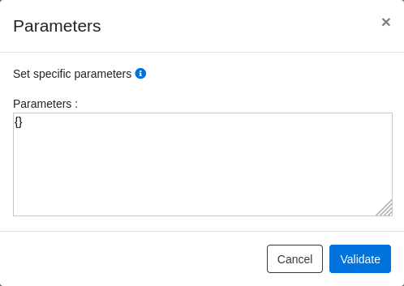

# How To : Device Parameter

A number of parameters are available inside the plugin to customize the behavior of the plugin or the behavior of the device.

By default, a Certified device get default parameters already initialized. If you want to customize, you have to go to the plugin Web Admin page,
then go to Management -> Device Management and you will find for each device a Parameters icon ( right column ) > a popup will open :

You can edit this field, by adding, removing or updating attributes. Please make sure to follow the syntax:

{ 'parameter1': value, 'parameter2': value .... }

> **Note:** the parameter names below must be used exactly as written, including the few that are misspelled in the engine (e.g. `KeybadLockout`, `ZG204Z_MotionSensivity`, `TS011F_overCurrentBreeaker`, `SonOffTRVWindowDectection`). Using the corrected spelling would have no effect.

## On/Off and power-cycle behaviour

| Parameter | Description / valid values | Applicable devices |
| --------- | -------------------------- | ------------------ |
| PowerOnAfterOffOn | If managed by the device, the device goes to a desired state after an electrical Off/On. 0 = stay Off, 1 = switch On, 255 = previous state (special handling for Philips, Enki, Tuya relays) | Ikea, ENki, BlitzWolf plug, Legrand, Philips (may require a firmware update of the end device) |
| OnOffOnTimeDelay | On/Off "on time" delay; equivalent to `OnOffOffWaitTime` (handled the same way) | Devices exposing the On/Off cluster |
| OnOffOffWaitTime | Off "wait time" delay written to the On/Off cluster | Devices exposing the On/Off cluster |
| Countdown | When switching On or Off, wait *n* seconds before actually switching (workaround for Tuya DIN energy switches) | Tuya energy / multi-gang switches |

## Light dimming / colour transitions

| Parameter | Description / valid values | Applicable devices |
| --------- | -------------------------- | ------------------ |
| fadingOff | Transition when powering the light off. [0] default fade to off in 0.8s, [1] 50% dim down in 0.8s then fade to off in 12s, [2] 20% dim up in 0.5s then fade to off in 1s, [255] no fade | All dimming LED |
| moveToHueSatu | Transition time in tenths of a second (10 = 1s) to change Hue/Saturation from current to target level | All dimming LED (colour mode) |
| moveToColourTemp | Transition time in tenths of a second (10 = 1s) to change White colour temperature from current to target level | All dimming LED (colour temp) |
| moveToColourRGB | Transition time in tenths of a second (10 = 1s) to change RGB colour from current to target level | All dimming LED (RGB) |
| moveToLevel | Transition time in tenths of a second (10 = 1s) to dim the LED from current to target level | All dimming LED / dimmers |
| MoveWithOnOff | If set, level commands are sent as Move-to-Level-with-OnOff (changes the on/off state with the level), otherwise plain Move-to-Level | Dimmable lights, level-control devices |
| MinDimmerPercentage | Minimum brightness floor; brightness is clamped with max(MinDimmerPercentage, Level). 0-100 (%) | Dimmable lights |
| FORCE_COLOR_COMMAND | Forces a specific Tuya colour command instead of the standard colour command | Tuya colour-control lights |
| TUYAColorControlRgbMode | Selects the Tuya RGB colour-handling mode instead of Hue/Saturation mode | Tuya colour-control lights |
| RWL021_Dimmer_step | Dimming step per button press (default 1) | Philips RWL021 dimmer switch |

## Ballast (light output limits)

| Parameter | Description / valid values | Applicable devices |
| --------- | -------------------------- | ------------------ |
| BallastMaxLevel | Maximum light output level of the ballast (per the dimming curve). uint8 | Devices exposing the Ballast Configuration cluster |
| BallastMinLevel | Minimum light output level of the ballast (per the dimming curve). uint8 | Devices exposing the Ballast Configuration cluster |

## Occupancy / motion (generic)

| Parameter | Description / valid values | Applicable devices |
| --------- | -------------------------- | ------------------ |
| PIROccupiedToUnoccupiedDelay | Time delay, in seconds, before the PIR sensor returns to its unoccupied state after the last detected movement. uint16 (seconds) | Tested with Philips SML001 |
| PIRoccupancySensibility | PIR sensitivity level: 0 default, 1 High, 2 Max | Occupancy sensors exposing this attribute |
| occupancySensibility | Sensitivity of the Philips Hue Motion Sensor: 0 default, 1 High, 2 Max (alias of `PIRoccupancySensibility`, same handler) | Philips Hue SML001, SML002 |
| UltrasonicOccupiedToUnoccupiedDelay | Time delay, in seconds, before an ultrasonic sensor returns to its unoccupied state. uint16 (seconds) | Ultrasonic occupancy sensors |
| UltrasonicOccupancySensibility | Ultrasonic sensitivity level: 0 default, 1 High, 2 Max | Ultrasonic occupancy sensors |
| resetMotiondelay | When the device's OnOff delay cannot be configured, overrides the default 30-second auto-reset (On->Off) delay. Value in seconds | Aqara and other motion devices |
| resetSwitchSelectorPushButton | For a Switch-Selector used as a push button, time before it returns to the Off position. Value in seconds (e.g. 30 = 30 seconds) | Scene controllers / push-button selectors |

## IAS Zone / sirens (generic)

| Parameter | Description / valid values | Applicable devices |
| --------- | -------------------------- | ------------------ |
| CurrentZoneSensitivityLevel | IAS Zone sensitivity level. uint8 (0 = device default; other values device-dependent) | IAS Zone devices |
| IASsensitivity | Alias of `CurrentZoneSensitivityLevel` (same handler). uint8 | IAS Zone devices |
| SireneMaxAlarmDuration | Maximum siren alarm duration. uint16 (seconds) | IAS WD / siren devices |
| alarmDuration | Number of seconds the alarm will last | Heiman IAS Siren |
| alarmSirenCode | Override the default code for the Siren (IAS Warning) command | All Sirens/Alarms using IAS Warning |
| alarmStrobeCode | Override the default code for the Strobe (IAS Warning) command | All Sirens/Alarms using IAS Warning |
| sirenLevel | Siren sound level used in the IAS Warning command | IAS WD / siren devices |
| strobeLevel | Strobe level used in the IAS Warning command | IAS WD / siren devices |
| strobeDutyCycle | Strobe duty-cycle used in the IAS Warning command | IAS WD / siren devices |
| ForceIASRegistrationEp | Forces IAS CIE registration on the given endpoint (string, e.g. '01'); the parameter is removed after first use | IAS devices needing forced CIE registration (e.g. Lidl PIR) |
| ARM_EXIT_DELAY | Exit delay (seconds) for IAS ACE keypad arm commands. 0-255 (default 255 if unset) | IAS ACE keypads (e.g. Develco KEYZB-110) |

## Thermostat (generic)

| Parameter | Description / valid values | Applicable devices |
| --------- | -------------------------- | ------------------ |
| MaxHeatingSetpoint | Maximum heating setpoint (written in 1/100 °C) | Thermostats exposing this attribute |
| MinHeatingSetpoint | Minimum heating setpoint (written in 1/100 °C) | Thermostats exposing this attribute |
| KeybadLockout | Thermostat UI keypad lockout / access level. uint8 (the engine key is spelled "KeybadLockout") | Thermostats with a UI Configuration cluster |

## Polling / heartbeat

| Parameter | Description / valid values | Applicable devices |
| --------- | -------------------------- | ------------------ |
| OnOffPollingFreq | Polling frequency for On/Off (and Level) status | Gledopto LED, Philips LED |
| PowerPollingFreq | Polling frequency for instant power | BlitzWolf and Lumi (maeu01) plugs |
| AC201Polling | Polling of AC201 / CAC201 status | OWON AC201 and Casaia CAC201 only |
| BatteryPollingFreq | Polling frequency for Battery level | Needed for Schneider Wiser Thermostat RTS |
| TempPollingFreq | Polling frequency for the Temperature cluster | Temperature sensors / thermostats |
| HumiPollingFreq | Polling frequency for the Humidity cluster | Humidity sensors |
| MeterPollingFreq | Polling frequency for the Metering cluster | Energy / power meters |
| InletTempPolling | Polling of the inlet-temperature metering attribute | Metering devices reporting inlet temperature |
| CustomPolling | Custom per-device polling definition (dict with EPin, EPout, Frequency, optional ManufCode, ClusterAttributesList). Frequency 0 disables | Devices needing custom cluster/attribute polling (e.g. Chameleon TIC) |
| ZLinkyPollingGlobal | ZLinky polling of the main metering clusters. Frequency value (or a HH:MM scheduled time) | ZLinky |
| ZLinkyPollingLinkyMode | ZLinky polling of the Linky-mode attribute. Frequency value (or a HH:MM scheduled time) | ZLinky |
| ZLinkyPollingPTEC | ZLinky polling of period-tariff / colour-of-day attributes. Frequency value (or a HH:MM scheduled time) | ZLinky |
| PollingEnabled | Forces continuous polling of an end-device even when it is battery-powered. 0/1 | Battery-powered end devices |
| DisableOnOffPolling | If set, skips reading the On/Off cluster (0x0006) attribute 0x0000 during polling | Lights, switches, relays |
| DisableLevelControlPolling | If set, skips reading the Level Control cluster (0x0008) attribute 0x0000 during polling | Dimmable / level-control devices |
| forcePollingAfterAction | Poll the device status immediately after sending it a command. 0/1 (per-device override of the global default) | All devices |
| pingBlackListed | If enabled (1), the device is never pinged | All routers |
| TuyaPing | If enabled (1), simulates the Tuya ping done every ~5s by the Tuya gateway | Tuya routers |

## Cluster / transport tuning

| Parameter | Description / valid values | Applicable devices |
| --------- | -------------------------- | ------------------ |
| ConfigurationReportChunk | Per-device override of the number of attributes per Configure Reporting request (global default 3) | Devices supporting Configure Reporting |
| ReadAttributeChunk | Per-device override of the number of attributes per Read Attributes request (default 3; IKEA 3, Tuya 6) | All devices |
| BindingTableRequest | If set to 0, skip requesting the device's binding table | Devices supporting binding |
| disableBinaryInputCluster | If set, the plugin ignores Binary Input cluster (0x000f) data | Devices exposing a Binary Input cluster |
| AcquisitionFrequency | Minimum interval (seconds) between successive attribute updates to avoid flooding the DB; 0/absent disables throttling | Frequently-reporting Tuya devices (e.g. air-quality sensors) |

## Sensor calibration / compensation

| Parameter | Description / valid values | Applicable devices |
| --------- | -------------------------- | ------------------ |
| Calibration | Temperature calibration offset (°C). For Schneider stored x10, for Tuya eTRV5 further scaled to deci-degrees | Tuya eTRV, Schneider VACT/iTRV, Danfoss eTRV, Eurotronic SPZB0001 |
| humi_calibration | Humidity calibration offset added to the reported value (%RH) | Humidity sensors |
| tempCompensation | Temperature offset added to the reported value | Tuya TS0601 temperature sensors |
| ph7Compensation | pH calibration offset (around the pH 7 reference) added to the reading | Tuya TS0601 pH meters |
| orpCompensation | ORP (oxidation-reduction potential) offset added to the reading (mV) | Tuya TS0601 pool sensors |
| ecCompensation | Electrical-conductivity offset added to the reading | Tuya TS0601 pool sensors |

## Alarms / Tuya Siren (TS0601)

| Parameter | Description / valid values | Applicable devices |
| --------- | -------------------------- | ------------------ |
| Alarm1 | Configuration of Alarm1; specify Duration, Volume, Melody | Tuya Siren TS0601 |
| Alarm2 | Configuration of Alarm2; specify Duration, Volume, Melody | Tuya Siren TS0601 |
| Alarm3 | Configuration of Alarm3; specify Duration, Volume, Melody | Tuya Siren TS0601 |
| Alarm4 | Configuration of Alarm4; specify Duration, Volume, Melody | Tuya Siren TS0601 |
| Alarm5 | Configuration of Alarm5; specify Duration, Volume, Melody | Tuya Siren TS0601 |
| Duration | (Used only inside an Alarm definition) duration of the alarm in seconds | Tuya Siren TS0601 |
| Volume | (Used only inside an Alarm definition) volume of the alarm: 0,1,2 (High, Medium, Low) | Tuya Siren TS0601 |
| Melody | (Used only inside an Alarm definition) melody 0-14: 0 doorbell, 1 fur elise, 2 big ben, 3 ring ring, 4 lone ranger, 5 turkish march, 6 high pitch siren, 7 red alert, 8 cricket, 9 beep beep, 10 dogs, 11 police, 12 grandfather clock, 13 phone ring, 14 firetruck | Tuya Siren TS0601 |
| HumidityMinAlarm | Minimum humidity threshold for alarm (%) | Tuya Siren TS0601 |
| HumidityMaxAlarm | Maximum humidity threshold for alarm (%) | Tuya Siren TS0601 |
| TemperatureMinAlarm | Minimum temperature threshold for alarm (°C) | Tuya Siren TS0601 |
| TemperatureMaxAlarm | Maximum temperature threshold for alarm (°C) | Tuya Siren TS0601 |

## Tuya Siren2 / TS0224

| Parameter | Description / valid values | Applicable devices |
| --------- | -------------------------- | ------------------ |
| TuyaAlarmLevel | Alarm volume: 0 Low (~70 dB), 1 Medium (~80 dB), 2 High (~95 dB) | Tuya Siren2 TS0601 (\_TZE200_t1blo2bj) |
| TuyaAlarmDuration | Alarm duration in seconds. uint32 | Tuya Siren2 TS0601 |
| TuyaAlarmMelody | Alarm melody/tone number: 0-17 | Tuya Siren2 TS0601 |
| TuyaTS0224AlarmVolume | Siren volume: 0 Mute, 10 Low, 30 Medium, 50 High (auto-rounded to the nearest) | Tuya TS0224 siren |

## Legrand / Netatmo

| Parameter | Description / valid values | Applicable devices |
| --------- | -------------------------- | ------------------ |
| netatmoLedIfOn | Enable the LED when On. 0/1 | Legrand-Netatmo outlet, switch, micromodule |
| netatmoLedInDark | Enable the LED when Off (visible in the dark). 0/1 | Legrand-Netatmo outlet, switch, micromodule |
| netatmoLedShutter | Enable the LED on a shutter switch. 0/1 | Legrand-Netatmo shutter switch |
| netatmoEnableDimmer | Enable dimming mode. 0/1 | Legrand-Netatmo "Dimmer switch w/o neutral" |
| netatmoInvertShutter | Invert the shutter switch direction. 0/1 | Legrand-Netatmo shutter |
| netatmoReleaseButton | Release-button behaviour (selector holds while pressed, releases on release) | Legrand-Netatmo remote/selector |

## Philips Hue

| Parameter | Description / valid values | Applicable devices |
| --------- | -------------------------- | ------------------ |
| HueLedIndication | Enable/disable the Hue LED indication. 0/1 | Philips Hue devices |

## Xiaomi / Aqara (Lumi)

| Parameter | Description / valid values | Applicable devices |
| --------- | -------------------------- | ------------------ |
| vibrationAqarasensitivity | Vibration sensitivity: low, medium, high | Aqara vibration sensors |
| AqaraOpple_switch_power_outage_memory | Recover the state after a power loss. 0 Off, 1 On | Aqara Opple switches |
| AqaraOpple_led_disabled_night | Disable the LED at night. 0/1 | Aqara Opple switches |
| AqaraOpple_flip_indicator_light | Indicator light. 0 Off, 1 On | Aqara Opple switches |
| AqaraOpple_switch_operation_mode_opple | Operation mode (all lines): 0 Decoupled, 1 Control relay | Aqara Opple multi-line switches |
| AqaraOpple_switch_operation_mode_opple_l1 | Operation mode line 1: 0 Decoupled, 1 Control relay | Aqara Opple switches |
| AqaraOpple_switch_operation_mode_opple_l2 | Operation mode line 2: 0 Decoupled, 1 Control relay | Aqara Opple switches |
| AqaraOpple_aqara_switch_mode_switch | Switch mode: 4 Anti-flicker, 1 Quick mode | Aqara wireless switches |
| AqaraOppleMode | Enable Aqara Opple mode. 1 = enabled | Aqara remotes/bulbs |
| AqaraDetectionInterval | Motion detection interval. uint8 | Aqara motion sensors (AC01/AC02) |
| AqaraMultiClick | Click mode: 1 Fast (single), 2 Multi (default) | Aqara wireless switches |
| RTCZCGQ11LMMotionSensibility | FP1 motion sensitivity: 1 low, 2 mid, 3 high | Presence detector FP1 RTCZCGQ11LM |
| RTCZCGQ11LMApproachDistance | FP1 approach distance: 0 far, 1 mid, 2 close | Presence detector FP1 RTCZCGQ11LM |
| RTCZCGQ11LMMonitoringMode | FP1 monitoring mode: 0 undirected, 1 left/right | Presence detector FP1 RTCZCGQ11LM |
| RTCGQ14LMTriggerIndicator | Trigger indicator setting. uint8 | RTCGQ14LM motion sensor |

## Tuya (switches, covers, motion, IR…)

| Parameter | Description / valid values | Applicable devices |
| --------- | -------------------------- | ------------------ |
| TuyaColorGradiantOnTime | Colour gradient transition "on" time (seconds) | Tuya colour-capable devices |
| TuyaColorGradiantOffTime | Colour gradient transition "off" time (seconds) | Tuya colour-capable devices |
| LightIndicator | Indicator-light mode: 0 Off, 1 On when On, 2 On when Off | Tuya TS0601 switches (1/2/3 gang) |
| TuyaEnergyChildLock | Child lock on a Tuya DIN energy switch: 0 unlock, 1 lock | Tuya DIN energy switch |
| TuyaMotoReversal | Motor direction: 0 standard (UP=open / DOWN=close), 1 reversed | Tuya TS130F \_TZ3000_ltiqubue curtain switch |
| TuyaBackLight | Backlight control on a curtain smart switch: 0 active-button lighting, 1 no backlight | Tuya TS130F \_TZ3000_ltiqubue |
| TuyaCurtainMode | Tuya curtain operation mode *(value mapping to be confirmed)* | Tuya curtain devices |
| TuyaMotorMode | Tuya motor operation mode *(value mapping to be confirmed)* | Tuya motorized covers |
| TuyaCalibrationTime | Motor calibration duration; uint16 in 1/100 s (e.g. 600 = 6s); 0 to skip | Tuya / MOES window coverings |
| TuyaCalibrationTime_Ep_01 | As `TuyaCalibrationTime`, endpoint 01 | Tuya multi-endpoint covers |
| TuyaCalibrationTime_Ep_02 | As `TuyaCalibrationTime`, endpoint 02 | Tuya multi-endpoint covers |
| moesCalibrationTime | Motor activation duration; value in 1/10 s (10 = 1s) | Tuya TS130F \_TZ3000_ltiqubue / MOES covers |
| TS004FMode | TS004F controller mode: 0 Dimmer, 1 Scene | Tuya TS004F controllers |
| TuyaGarageOpenerRunTime | Garage door run time *(value mapping to be confirmed)* | Tuya garage openers |
| TuyaSwitchMode | External switch mode *(value mapping to be confirmed)* | Tuya switches |
| SmartSwitchBackLight | Smart-switch backlight control *(value mapping to be confirmed)* | Tuya TS0004 smart switches |
| SmartSwitchIndicateLight | Smart-switch indicator light *(value mapping to be confirmed)* | Tuya TS0004 smart switches |
| SmartRelayStatus01 / 02 / 03 / 04 | Per-relay power-on status *(value mapping to be confirmed)* | Tuya multi-relay devices |
| TuyaPIRKeepTime | PIR keep/hold time *(value mapping to be confirmed)* | Tuya PIR motion sensors |
| ZG204Z_MotionSensivity | Motion sensitivity: 0 low, 1 medium, 2 high (engine key spelled "Sensivity") | Tuya PIR ZG-204Z |
| ZG204Z_MotionOccupancyTime | Occupancy keep time: 0 10s, 1 30s, 2 60s, 3 120s | Tuya PIR ZG-204Z |
| RadarMotionSensitivity | 0 to 9 (0 deactivates motion) | TS0601-radar ZY-M100 \_TZE204_ztc6ggyl |
| RadarMotionMinRange | 60 to 950 (cm) | TS0601-radar ZY-M100 \_TZE204_ztc6ggyl |
| RadarMotionMaxRange | 60 to 950 (cm) | TS0601-radar ZY-M100 \_TZE204_ztc6ggyl |
| RadarMotionDelay | 0 to 10 (seconds) | TS0601-radar ZY-M100 \_TZE204_ztc6ggyl |
| RadarMotionFading | 0 to 1500 (seconds) | TS0601-radar ZY-M100 \_TZE204_ztc6ggyl |
| TS110ELightType | TS110E light type *(value mapping to be confirmed)* | Tuya TS110E |
| TS110ESwitch01Type | TS110E switch 1 type *(value mapping to be confirmed)* | Tuya TS110E |
| TS110ESwitch02Type | TS110E switch 2 type *(value mapping to be confirmed)* | Tuya TS110E |
| TimerMode | Switch behaviour between Timer mode and On/Off mode | Tuya TS0601 Parkside watering timer |
| IRCode | Dictionary of base64 IR codes keyed by level | IR senders (Zosung E004, Casaia AC201/AC211) |
| SensorMode | Which temperature sensor to use: 0 IN, 1 ALL, 2 OUT | Tuya Thermostat / TRV TS0601 |

## Tuya TS011F (smart-plug protection)

| Parameter | Description / valid values | Applicable devices |
| --------- | -------------------------- | ------------------ |
| TS011F_overTemperatureBreaker | Enable the over-temperature breaker (used with `TS011F_overTemperatureThreshold`) | Tuya TS011F plugs |
| TS011F_overTemperatureThreshold | Over-temperature threshold (°C) | Tuya TS011F plugs |
| TS011F_overPowerBreaker | Enable the over-power breaker (used with `TS011F_overPowerThreshold`) | Tuya TS011F plugs |
| TS011F_overPowerThreshold | Over-power threshold (W) | Tuya TS011F plugs |
| TS011F_overCurrentBreeaker | Enable the over-current breaker (engine key spelled "Breeaker"; used with `TS011F_overCurrentThreshold`) | Tuya TS011F plugs |
| TS011F_overCurrentThreshold | Over-current threshold (A) | Tuya TS011F plugs |
| TS011F_overVoltageBreaker | Enable the over-voltage breaker (used with `TS011F_overVoltageThreshold`) | Tuya TS011F plugs |
| TS011F_overVoltageThreshold | Over-voltage threshold (V) | Tuya TS011F plugs |
| TS011F_underVoltageBreaker | Enable the under-voltage breaker (used with `TS011F_underVoltageThreshold`) | Tuya TS011F plugs |
| TS011F_underVoltageThreshold | Under-voltage threshold (V) | Tuya TS011F plugs |

## Tuya TRV (thermostatic radiator valves)

| Parameter | Description / valid values | Applicable devices |
| --------- | -------------------------- | ------------------ |
| ValveDetection | Enable valve detection: 0 disabled, 1 enabled | Tuya eTRV (TS0601-eTRV2/eTRV3) |
| WindowDetection | Enable open-window detection: 0 disabled, 1 enabled | Tuya eTRV (TS0601-eTRV2/eTRV3) |
| ChildLock | Child lock: 0 unlocked, 1 locked | Tuya eTRV / thermostat (TS0601) |
| BRT100WindowsDetection | Window detection: 0 disabled, 1 enabled | Tuya BRT-100 TRV |
| BRT100ChildLock | Child lock: 0 unlock, 1 lock | Tuya BRT-100 TRV |
| BRT100BoostDuration | Boost duration (minutes) | Tuya BRT-100 TRV |
| BRT100Calibration | Temperature calibration offset | Tuya BRT-100 TRV |
| BRT100SetpointEco | Eco setpoint | Tuya BRT-100 TRV |
| BRT100MaxSetpoint | Maximum setpoint | Tuya BRT-100 TRV |
| BRT100MinSetpoint | Minimum setpoint | Tuya BRT-100 TRV |
| TuyaTRV5_ChildLock | Child lock: 0 unlock, 1 lock | Tuya TRV5 |
| TuyaTRV5_EcoTemp | Eco temperature setpoint | Tuya TRV5 |
| TuyaTRV5_ConfortTemp | Comfort temperature setpoint | Tuya TRV5 |
| TuyaTRV5_OpenedWindowTemp | Setpoint applied when a window is detected open | Tuya TRV5 |
| TuyaTRV5_BoostTime | Boost duration (minutes) | Tuya TRV5 |
| TuyaTRV5_Calibration | Temperature calibration offset | Tuya TRV5 |
| TuyaTRV5_HolidaySetPoint | Holiday-mode setpoint | Tuya TRV5 |

## Sonoff

| Parameter | Description / valid values | Applicable devices |
| --------- | -------------------------- | ------------------ |
| SonOffTRVChildLock | Child lock: 0 disabled, 1 enabled | Sonoff TRV |
| SonOffTRVWindowDectection | Window detection: 0 disabled, 1 enabled (engine key spelled "Dectection") | Sonoff TRV |
| SONOFF_TEMP_MAX | Maximum temperature threshold | Sonoff SNZB-02LD |
| SONOFF_TEMP_MIN | Minimum temperature threshold | Sonoff SNZB-02LD |
| SONOFF_HUMI_MAX | Maximum humidity threshold (%) | Sonoff SNZB-02LD |
| SONOFF_HUMI_MIN | Minimum humidity threshold (%) | Sonoff SNZB-02LD |
| SONOFF_TEMP_CALIBRATION | Temperature calibration offset (1/100 °C, range -50..50) | Sonoff SNZB-02LD |
| SONOFF_TEMP_UNIT | Temperature unit: 0 Celsius, 1 Fahrenheit | Sonoff SNZB-02LD |
| SONOFF_REALTIME_IRRIGATION_DURATION | Real-time irrigation duration (seconds, uint32) | Sonoff SWV smart valve |
| SONOFF_REALTIME_IRRIGATION_VOLUME | Real-time irrigation volume (litres, uint32) | Sonoff SWV smart valve |
| SONOFF_DAILY_IRRIGATION_VOLUME | Daily irrigation volume (litres, uint32) | Sonoff SWV smart valve |
| SONOFF_SWV_WATER_CLOSE_VALVE_TIMEOUT | Auto-close timeout on water shortage (minutes, uint16) | Sonoff SWV smart valve |
| SONOFF_ZBMICRO_RADIO_POWER_TURBO_MODE | Radio power mode: "Normal" (0x09) or "Turbo" (0x14) | Sonoff ZBMicro |

## Sunricher

| Parameter | Description / valid values | Applicable devices |
| --------- | -------------------------- | ------------------ |
| Sunricher_PIR_SENSITIVITY | PIR sensitivity. uint8 | Sunricher PIR motion sensor |
| Sunricher_MOTION_BLIND_TIME | Motion blind/lockout time (seconds). uint8 | Sunricher PIR motion sensor |
| Sunricher_MOTION_PULSE_COUNTER | Motion pulse counter. uint8 | Sunricher PIR motion sensor |
| Sunricher_PIR_TRIGGER_TIME_INTERVAL | PIR trigger time interval (seconds). uint8 | Sunricher PIR motion sensor |
| Sunricher_Temperature_Compensation | Temperature compensation offset. int8 (-128..127) | Sunricher temperature sensor |
| Sunricher_Humidity_Compensation | Humidity compensation offset. int8 (-128..127) | Sunricher humidity sensor |

## Schneider Wiser

| Parameter | Description / valid values | Applicable devices |
| --------- | -------------------------- | ------------------ |
| WiserLockThermostat | Lock the thermostat from user changes: 0 unlock, 1 lock | Wiser2-Thermostat, iTRV, EH-ZB-RTS |
| WiseriTrvWindowOpen | Open-window detection: 0 disabled, 1 enabled | Schneider iTRV |
| WiserShutterDuration | Shutter movement duration *(value mapping to be confirmed)* | Schneider shutter devices |
| WiserRoomNumber | Room number per Wiser thermostat; actionners and the thermostat sharing a room use the same number so heating demand is monitored together | Wiser thermostat and any actionners |
| OverrideTempInDegree | Temperature offset applied during a setpoint override/boost (°C; clamped 7-30 °C) | Schneider Wiser thermostats |
| OverrideDurationInMinutes | Duration of a setpoint override/boost (minutes) | Schneider Wiser thermostats |
| SimulateThermostat6400 | Temperature value reported to simulate a Thermostat-6400 binding (sent every 5 min) | Schneider CCTFR6700 |

## Danfoss

| Parameter | Description / valid values | Applicable devices |
| --------- | -------------------------- | ------------------ |
| eTRVExerciseDay | Day to do weekly valve exercising: 0-6 (Sun-Sat) | Danfoss eTRV thermostat |
| eTRVExerciseTime | Minutes after midnight for weekly valve exercising (0-1439; 0xFFFF undefined) | Danfoss eTRV thermostat |
| DanfossCovered | 'T' = radiator covered (puts the thermostat into Room-Sensor mode), 'F' = not covered | Danfoss eTRV thermostat |
| DanfossTRVOrientation | 'H' (horizontal) or 'V' (vertical) thermostat orientation | Danfoss eTRV thermostat |
| DanfossViewDirection | LCD viewing direction: 1 or 2 | Danfoss eTRV thermostat |
| DanfossSetPointType | Setpoint command type: 0 standard, 1 aggressive, 2 display-only (only 1/2 trigger the special command) | Danfoss eTRV thermostat |
| DanfossRoom | Room number linking an eTRV with an external temperature sensor in the same plugin instance | Danfoss eTRV thermostat + any temperature sensor |
| DanfossRoomFreq | Polling frequency (seconds) for refreshing the external temperature; 0 disables. Recommended 1800-10800 in Auto-Offset mode, 300-1800 in Room-Sensor mode | Danfoss eTRV thermostat |

## GammaTroniques (TIC meter)

| Parameter | Description / valid values | Applicable devices |
| --------- | -------------------------- | ------------------ |
| TICMeterRefresh | TIC meter attribute refresh rate (seconds, uint16) | GammaTroniques TIC meter |

## Profalux

| Parameter | Description / valid values | Applicable devices |
| --------- | -------------------------- | ------------------ |
| profaluxOrientBSO | Default tilt for the BSO slat orientation (0-100, default 45) | Profalux BSO |
