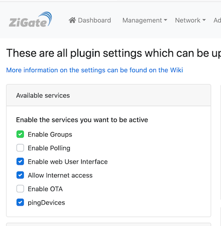
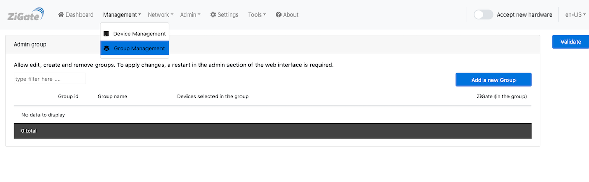
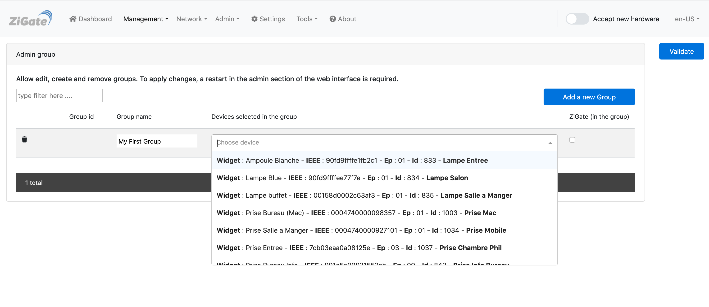
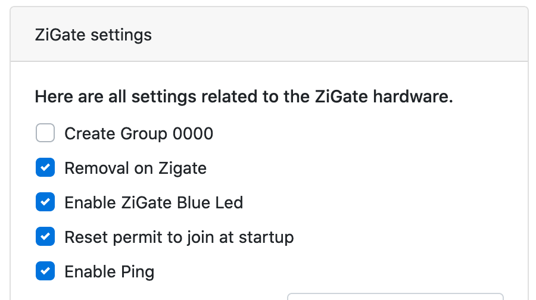

# How To : Group management

## 1. Purpose
The purpose is to offer the possibility to use the ZigBee group functionality.
Starting Plugin 4.7 and the Plugin Web Admin Interface, the group management is much user friendly, but still need further development to reach a nice User Experience.
With Plugin 4.9, we have made a great move by removing the "batch" mode.

## 2. Pre-requisites

* Firmware above 3.0f
* Plugin above 4.
* DomoticZ above 4.10901 (in order to have the Web Admin interface enabled)

## 2. Approach
The group will be managed through DomoticZ Device widgets (not in the group section, but in the switch). Basically for each ZigBee group, you will be creating you will have a corresponding DomoticZ Switch.

## How to proceed

### 4.1. How to enable it

Enable the Group Management feature (which is disabled by default)

You need to restart the plugin after enabling Group Management.

### 4.2 Group Initialisation

After the first activation of Group Management, it is import to query each device for group membership.
To do so you can go to the Admin Group sub menu and then request a Full scan.

This will consist in quering each main powered devices for the group membership.

### 4.3 Creating a Group

You can specify the Name of the group, and then you can select from the list the devices you want to get into that group.

You have also the possibility to add the coordinator to that group. This is required for instance if you want to retrieve the status of an Ikea Remote.

Save the work and the group membership request will be sent to each device listed. This could takes few seconds, so in case you don't see it, just do a refresh of the page.

### 4.4 Updating a Group

Just use the Group Management and add / remove devices from that group.

Save the work, and the update will be triggered and will be visible after a while.

### 4.5 Remove a Group

You can either remove the group from DomoticZ by removing the corresponding widget, or use the Group Management and remove the group you want to.

Save the work, it will trigger to request group membership removal to the corresponding devices.

## 5 Special cases ( IKEA REMOTES)

## 5.1. Using a Remote Controller (Pairing a remote control)

In order to use an IKEA/Tradfri:
1. Pair/Commission each single object to the coordinator (including the remote controller)
1. Pair the Remote Control with each Bulb you want to be part of such group
1. Request a Scan from Admin -> Group and select the Bulb you have paired the remote with
1. The group created will be then visible under the Group Management

### 5.2. Retrieving Remote command events

From that stage, you can eventually add the coordinator to this group. It will make each remote controller event seen in the plugin.

Additionally, you can also enable the Left/Right commands of the Tradfri 5 buttons remote controller.

For that you need to edit the Group and add the Tradfri 5 buttons to that group.

### 5.3. Creating Group 0000

If you need to have the group '0000' created, you can enable it via the Settings Advanced.

## 6 Warning

* Make sure that all devices which belongs to the group are up and running.
