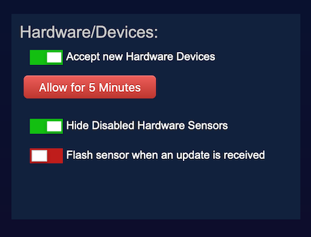
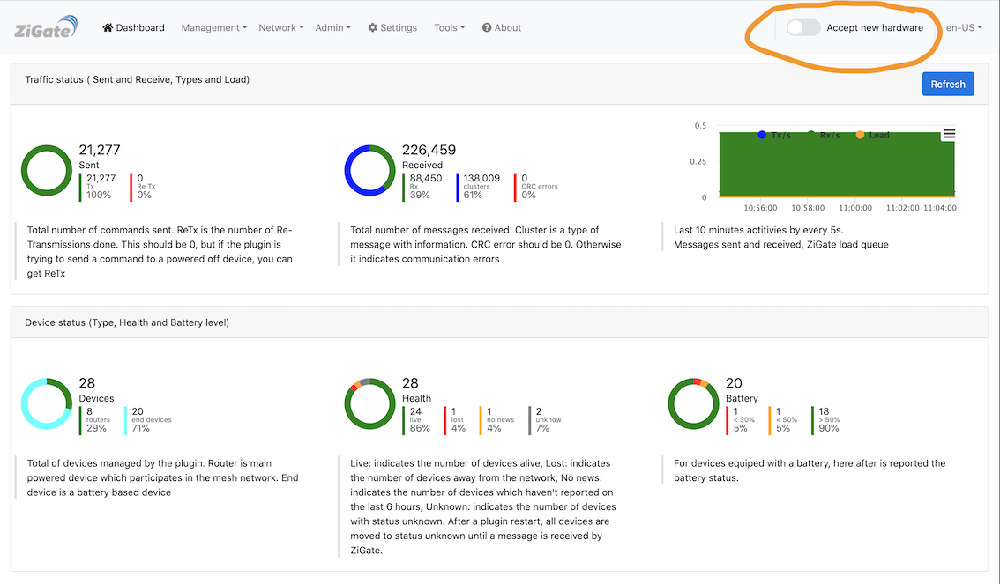
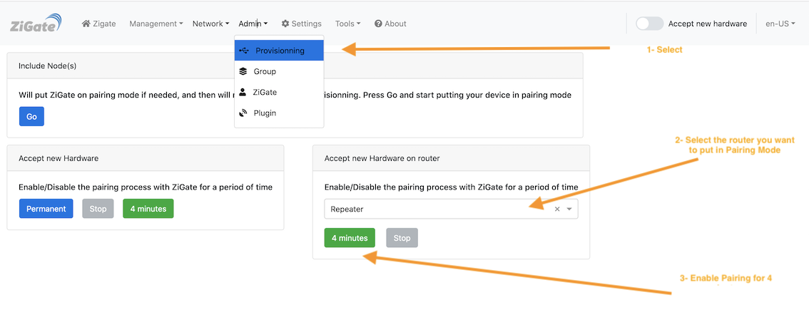

# Pairing a Zigbee device with Zigate

## Introduction

Purpose is to explain the step process to pair a new device and get it into Domoticz

## Step1: Put Domoticz in 'Add New Hardware mode'

1. Check that Domoticz accept new Hardware Devices
   * Go in the Domoticz Setting menu, and check that Accept new Hardware Devices is enabled, as on the picture here after

   

## Step2: Pairing and Provisioning in Domoticz

1. Assited Provisioning

   1. Go to the Admin -> Provisioning menu

      

      from here you have 4 choices

      1. Use the Assisted Provisioning mode
      1. Accept new Hardware for a period of 4 minutes (same as section 2 but for a limited period of time)
      1. Accept new Hardware in a permanent maner (same as section 2)
      1. Stop accepting new Hardware

   1. Go for "Assisted Provisioning" ( This will enable pairing for 4 minutes )

      

   1. Check that the Zigate Led is flashing Blue

   1. Reset your Device to trigger the pairing

      

   1. If after a while ( 2 minutes ) nothing happen

      1. Check Domoticz Log to se if there is no error
      1. Restart the plugin and try the pairing once more time

1. Advanced provisioning

Here we will more rely on the Logs to see that the Provisioning is happening. The Domoticz logs are available via the Domoticz User Interface.
You can eventually add a filter to get only the related logs

  1. You can check if the Accept new hardware`

  

  You can easily switch it On, and the Zigate blue Led, must start flashing.

  1. reset the Device to trgger the pairing

  1. Watch the Domoticz log to see what is happening

  # Pairing from a specific Router

  ## Introduction

  You might want to force the pairing of a specific end device to a dedicated router instead of leaving the Controler to decided.
  Despite the fact that the pairing will be done to a specific router, the system can then later decide to change the route and
  you/we don't have any control to that.

  ## What to do

  1. Make sure the Zigate is not in pairing mode, if yes, Stop it

  1. From the Plugin Web User Interface

  

  1. Click on the __Provisionning__ menu
  1. In the _Accept new Hardware on router__ select from the List the router you want to use
  1. Enable the Pairing for 4 minutes

  __Attention__

  It may happen that after pairing a device the all routers switches to pairing mode. If you want to continue pairing only from that specific device, you need to redo the all cycle
