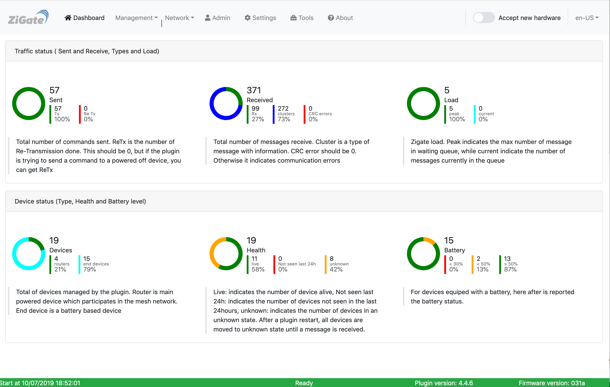

# How to flash a new firmware toward ZiGZate

## Overview

Here is described the process to flash a new firmware for ZiGate

## Where to find the latest Firmware

Usually the latest compatible firmware for ZiGate which is supported with the plugin is available under the plugin directory `Zigate-Firmware`

```
[domoticz@rasp Zigate-Firmware]$ ls -l
total 788
-rw-rw-r-- 1 domoticz domoticz 203388 Nov 12 22:38 ZiGate_Coordinator_v3.0f.bin
-rw-rw-r-- 1 domoticz domoticz 206728 Nov 12 22:38 ZiGate_Coordinator_v3.1a.bin
-rw-rw-r-- 1 domoticz domoticz 207256 Jan 22 17:33 ZiGate_Coordinator_v3.1c.bin
-rw-rw-r-- 1 domoticz domoticz 182352 Nov 12 22:38 ZiGate_Pluzzy_HA1.2v2100.bin
```

## How do I know the firmware version running actually on ZiGate

This is available on the Web Admin page . On the hereafter exemple , you can see the status bar (footer) :

Plugin Version is __4.8.008__
Firmware Version is __031d__



## How to Upgrade the firmware of ZiGate

1. Documentation on [zigate.fr](https://zigate.fr)
   * [ZiGate DIN](https://zigate.fr/documentation/mise-a-jour-de-la-zigate-din/)
   * [ZiGate USB](https://zigate.fr/documentation/mise-a-jour-de-la-zigate/)


The plugin provides all necessary tools to flash ZiGate.

__ASSUMPTIONS__

* The Serial port to access the ZiGate is /dev/ttyUSB0 (you need to change to your setup)
* All commands start from the plugin directory `Domoticz-Zigbee`


1. Prepare the tools

   ```
   cd Tools
   ./build-Jennic.sh
   ```

   This will build/compile the program to flash ZiGate, here after is an exemple of output produced by the command before.

   ```
   [domoticz@rasp Tools]$ ./build-Jennic.sh
   cc  -I. -Wall -O2 -I../Source/ -DDBG_ENABLE -DVERSION="\"56124\"" -c ../Source/uart.c
   cc  -I. -Wall -O2 -I../Source/ -DDBG_ENABLE -DVERSION="\"56124\"" -c ../Source/JN51xx_BootLoader.c
   ../Source/JN51xx_BootLoader.c:1182:12: warning: ‘iBL_WriteRAM’ defined but not used [-Wunused-function]
   1182 | static int iBL_WriteRAM(int iUartFd, uint32_t u32Address, uint8_t u8Length, uint8_t *pu8Buffer)
        |            ^~~~~~~~~~~~
   ../Source/JN51xx_BootLoader.c:1104:12: warning: ‘iBL_RunRAM’ defined but not used [-Wunused-function]
   1104 | static int iBL_RunRAM(int iUartFd, uint32_t u32Address)
        |            ^~~~~~~~~~
   cc  -I. -Wall -O2 -I../Source/ -DDBG_ENABLE -DVERSION="\"56124\"" -c ../Source/Firmware.c
   cc  -I. -Wall -O2 -I../Source/ -DDBG_ENABLE -DVERSION="\"56124\"" -c ../Source/main.c
   ../Source/main.c: In function ‘main’:
   ../Source/main.c:114:9: warning: variable ‘iVerify’ set but not used [-Wunused-but-set-variable]
   114 |     int iVerify = 0;
       |         ^~~~~~~
   cc  uart.o JN51xx_BootLoader.o Firmware.o main.o   -o JennicModuleProgrammer

   ```

   From now we have the binary to flash the firmware available on `Tools/JennicModuleProgrammer/Build/JennicModuleProgrammer`


1. case: Zigate USB

   1. Stop the plugin (or DomoticZ)
   1. Unplug the ZiGate
   1. Plug the ZiGate __while__ pressing the button. When ZiGate is plug in, then the blue led should be very light
   1. Run the following command:

   If you are on the plugin directory:

   ```
   cd Tools
   sudo ./JennicModuleProgrammer/Build/JennicModuleProgrammer -V 6 -P 115200 -f ../Zigate-Firmware/ZiGate_Coordinator_v3.1c.bin -s /dev/ttyUSB0
   ```

   1. Finally unplug/plug the ZiGate once more to switch back to normal mode.
S
1. case: ZiGate DIN

   1. Stop the plugin (or Domoticz)
   1. Run the following command

   ```
   cd Tools
   sudo python3 ./flash_ZiGate-DIN -V 6 -P 115200 -f ../Zigate-Firmware/ZiGate_Coordinator_v3.1c.bin -s /dev/ttyUSB0
   ```


1. case: ZiGate Pi

   1. Stop the plugin (or Domoticz)
   1. Switch the PiZiGate to flash mode

   ```
   cd Tools
   sudo python3 ./flash_PiZiGate.py -V 6 -P 115200 -f ../Zigate-Firmware/ZiGate_Coordinator_v3.1c.bin -s /dev/ttyUSB0
   ```
