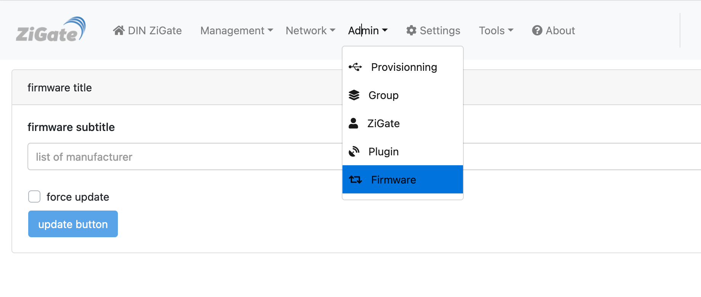

# Updating the firmware of a Zigbee device (OTA)

## Overview

The plugin can update the firmware of a Zigbee device over the air (OTA), for any
manufacturer that follows the Zigbee OTA Upgrade cluster.

The important thing to understand first: **the plugin is an OTA server, not a
pusher.** It never interrupts a device. A device asks, on its own schedule, whether a
newer image exists, and the plugin answers with what it has. That schedule belongs to
the device's firmware and is typically hours, sometimes a day or more. So an update
you start in the WebUI does not begin immediately — it begins the next time the device
asks.

You also have to obtain the firmware yourself. Some manufacturers publish their
images, many do not, and the plugin never downloads an image for you.

## How an update actually happens

1. The device sends a *Query Next Image Request* carrying its manufacturer code, its
   image type and its current version.
2. The plugin looks through the images it loaded **at startup** for one matching that
   **manufacturer code and image type**. The brand name and the folder play no part in
   this match — both come from the image's own header.
3. If it has a matching, newer image *and* you authorised the update, it serves the
   image block by block until the device reports *Upgrade End*.
4. If it has no matching image, it can look the device up in an online firmware index
   and tell you in the log that an update exists and where to put it.

Step 4 is usually how you find out an update is available at all.

## Step 1 — Find out that a firmware exists

With `checkFirmwareAgainstZigbeeOTARepository` enabled (it is, by default), the plugin
checks devices against published firmware indexes and reports what it finds:

```
Z4D detects a potential new firmware for device Kitchen bulb [1a2b]
   current version: 419499589
     firmware type: 432
    newest version: 423638661
     firmware type: 432
   URL to download: https://raw.githubusercontent.com/Koenkk/zigbee-OTA/master/images/...
   Folder to store: INNR
```

That last line is the one to act on: it names the folder the image belongs in.

The indexes consulted are the [Koenkk zigbee-OTA
index](https://github.com/Koenkk/zigbee-OTA), IKEA's own firmware feed and Sonoff's
firmware feed. All three are configurable — see [Settings](#settings).

If instead of a folder you see this:

```
   to get this Manufacturer supported: 4454
   provide those informations: {...}
```

then the plugin has no entry for that manufacturer — see
[When your manufacturer is not supported](#when-your-manufacturer-is-not-supported).

## Step 2 — Put the firmware in the right folder

Download the image and save it under the plugin's `OTAFirmware/` directory, in the
folder matching the manufacturer:

| Brand (as shown in the WebUI) | Manufacturer code | Firmware folder(s) |
| --- | --- | --- |
| Danfoss | `0x1246` | `OTAFirmware/DANFOSS/` |
| devbis | `0xDB15` | `OTAFirmware/XIAOMI/` |
| Develco-frient | `0x1015` | `OTAFirmware/GENERIC-1015/`<br>`OTAFirmware/DEVELCO/` |
| EcoDim | `0x126A` | `OTAFirmware/ECO-DIM/` |
| Eurotronic-LiXee-Lumi | `0x1037` | `OTAFirmware/GENERIC-1037/`<br>`OTAFirmware/EUROTRONICS/`<br>`OTAFirmware/LIXEE/`<br>`OTAFirmware/LUMI/` |
| Ikea | `0x117C` | `OTAFirmware/IKEA-TRADFRI/` |
| Innr | `0x1166` | `OTAFirmware/INNR/` |
| Ledvance | `0x1189` | `OTAFirmware/LEDVANCE/` |
| Legrand | `0x1021` | `OTAFirmware/LEGRAND/` |
| Namron | `0x1224` | `OTAFirmware/NAMRON/` |
| Nodon | `0x128B` | `OTAFirmware/NODON/` |
| Osram1 | `0xBBAA` | `OTAFirmware/OSRAM/` |
| Osram2 | `0x110C` | `OTAFirmware/LEDVANCE/` |
| Philips | `0x100B` | `OTAFirmware/PHILIPS/` |
| Salus | `0x1078` | `OTAFirmware/SALUS/` |
| Schneider | `0x105E` | `OTAFirmware/SCHNEIDER-WISER/` |
| SonOff | `0x1286` | `OTAFirmware/SONOFF/` |
| Xiaomi | `0x115F` | `OTAFirmware/XIAOMI/` |
| z03mmc | `0x0084` | `OTAFirmware/XIAOMI/` |

Each folder contains a `README.md` naming where that manufacturer publishes its
firmware.

A few things worth knowing:

- **The file name does not matter.** The plugin reads the manufacturer code, image
  type and version out of the image header, so you can rename files freely. Keep only
  `README.md` and firmware images in these folders.
- **Several brands can share a folder**, and that is fine — `Xiaomi`, `devbis` and
  `z03mmc` all read from `OTAFirmware/XIAOMI/`.
- **The root is configurable.** `pluginOTAFirmware` (an advanced setting) can point
  the whole tree somewhere else, for instance to keep large images off an SD card.

### Why some folders are named `GENERIC-<code>`

A Zigbee manufacturer code is not unique to a company. `0x1037` is used by Eurotronic,
LiXee **and** Lumi; `0x1015` by Develco and frient. Since an image is matched on its
manufacturer code and image type, there is no way — and no need — to tell those
vendors apart.

Those codes therefore have a single entry covering all of their vendors, with a
`GENERIC-<code>` folder as the place to put new images. The former per-vendor folders
(`EUROTRONICS/`, `LIXEE/`, `LUMI/`, `DEVELCO/`) are still read, so firmware you
already put there keeps working and nothing needs moving.

## Step 3 — Restart the plugin and check the image was loaded

**Firmware folders are read once, when the plugin starts.** Dropping a file in while
the plugin is running has no effect until you restart it.

After the restart, the log lists everything it loaded:

```
Z4D loads the firmware images
 --> Brand: Innr Image File: 1166-01b0-19403685-rb282c-1.9.64.ota
```

If your file is not listed, see [Troubleshooting](#troubleshooting).

## Step 4 — Run the update

Go to **Admin → Firmware** in the WebUI:



Select:

* the **brand**, as spelled in the table above
* the **firmware image** to use
* the **devices** to send it to

`force update` lets the image be served to a device that is not on an older version —
use it to re-flash or to go back to an earlier version. Without it, a device is only
offered an image strictly newer than what it runs.

Then wait. The transfer starts when the device next asks, and progress is reported in
the log and in the WebUI. A large image over a weak link can take a long while; this
is normal.

### Updating without picking devices by hand

Enabling `autoServeOTA` makes the plugin serve any matching image to any device that
asks for one, without going through the Firmware page. Convenient if you keep a
curated set of images; be aware it will update every device matching an image you have
placed in the folders.

## Settings

All under **Settings → OTA** in the WebUI.

| Setting | Default | What it does |
| --- | --- | --- |
| `autoServeOTA` | off | Serve a matching image to any device that asks, without selecting it in the WebUI |
| `checkFirmwareAgainstZigbeeOTARepository` | on | Look devices up in the online indexes and report available firmware in the log |
| `EnableOTATracing` | off | Verbose OTA transfer tracing (advanced; useful when reporting a problem) |
| `ZigbeeOTA_Repository` | Koenkk `index.json` | URL of the main firmware index (advanced) |
| `IkeaTradfri_Repository` | IKEA feed | URL of the IKEA firmware feed (advanced) |
| `Sonoff_Repository` | Sonoff feed | URL of the Sonoff firmware feed (advanced) |

> OTA support is enabled by default and no longer has a visible on/off switch. Older
> versions of this page described an "Enable OTA" checkbox under *Available services*;
> that setting is now internal, and there is nothing to turn on.

## When your manufacturer is not supported

If the log prints a bare manufacturer code instead of a folder:

```
   to get this Manufacturer supported: 4454
   provide those informations: {'fileName': '...', 'manufacturerCode': 4454, ...}
```

the plugin recognises that a firmware exists but has nowhere to file it, and it will
not read the image even if you download it. Adding a manufacturer is a small change —
please [open an
issue](https://github.com/zigbeefordomoticz/Domoticz-Zigbee/issues/new/choose) and
paste those two lines in full. The `provide those informations` line carries
everything needed.

## IKEA: downloading the whole catalogue

For IKEA TRÅDFRI a helper script fetches every published image:

```bash
cd Domoticz-Zigbee/OTAFirmware/IKEA-TRADFRI
../../Tools/ikea-ota-download.py
```

That pulls a lot of files. If you only want to update, say, the signal repeater or the
control outlet, keep the images whose names contain `TRADFRI-signal-repeater` or
`TRADFRI-control-outlet` and delete the rest — fewer images means a faster startup
scan.

## Troubleshooting

**The image is not listed at startup.**
Check in order: it is in a folder from the table above; the plugin was restarted after
you put it there; the file is a real `.ota`/`.zigbee` image rather than an HTML error
page saved under the wrong name; and the folder contains nothing but `README.md` and
images.

**`another firmware with the same ImageType and another brand is already loaded`.**
Two images declare the same image type. Only one can be kept; remove the one you do
not need.

**The device never starts the transfer.**
Expected for a while — it starts when the device next asks, which can be hours. Battery
devices ask far less often than mains-powered ones. Check the device is awake and
reachable, and that the update is still listed as pending in the WebUI.

**The transfer starts and stalls.**
Usually a mesh problem: move the device closer to a router, or retry when the network
is quieter. The plugin keeps per-manufacturer timing settings (block size, delay,
retries); if a particular manufacturer stalls consistently, report it with
`EnableOTATracing` turned on so the timing can be adjusted.

**The device reports a version that does not change after a successful update.**
Some devices only report the new version after a power cycle.

## See also

* [Device OTA firmware list and sources](Info_Firmware-list.md)
* [Retrieving Legrand firmware](Corner_Retreiving-Legrand-Firmware.md)
* [Updating the ZiGate coordinator firmware](HowTo_Update-ZiGate-firmware.md) — a
  different procedure, for the coordinator rather than a device

## References

* [Koenkk zigbee-OTA — image repository and index](https://github.com/Koenkk/zigbee-OTA)
* [deCONZ OTA image types and firmware versions](https://github.com/dresden-elektronik/deconz-rest-plugin/wiki/OTA-Image-Types---Firmware-versions)
* [Older IKEA-specific procedure (archived)](Archives/IKEA-OTA-Upgrade-old.md)
