# Tutorial - Installation with Docker on Synology (DSM 7.x)

This tutorial explains how to install Domoticz with the embedded Docker application on a Synology NAS.

These are the first steps before [Installing the plugin on Synology](Plugin_Installation.md#3---installation-running-on-synology-nas)
* 1 - [DomoticZ installation](#DomoticZ-installation)
* 2 - [USB drivers installation](#USB-drivers-installation)

# Foreword
You first need the docker application installed (Application center)

If it's a migration from another system, first do a [backup](Plugin_Backup.md).


# DomoticZ installation

Launch Docker, you should have the Overview.
Select Registry :
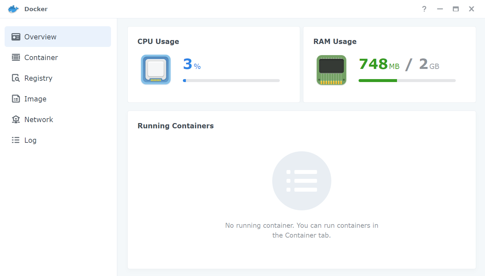


Look for DomoticZ in the search bar (top right):
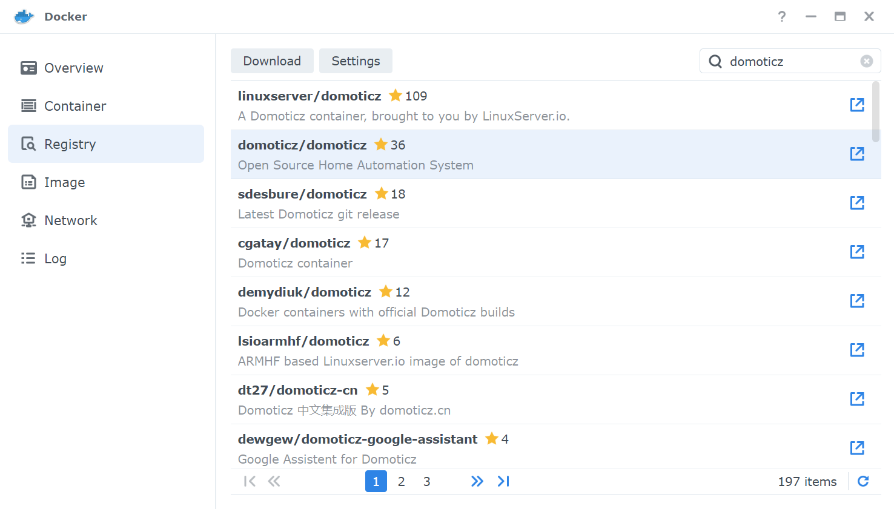


Double click on the official image (domoticz/domoticz) and choose for which version you need. Stable or beta allows to be on the last corresponding version.
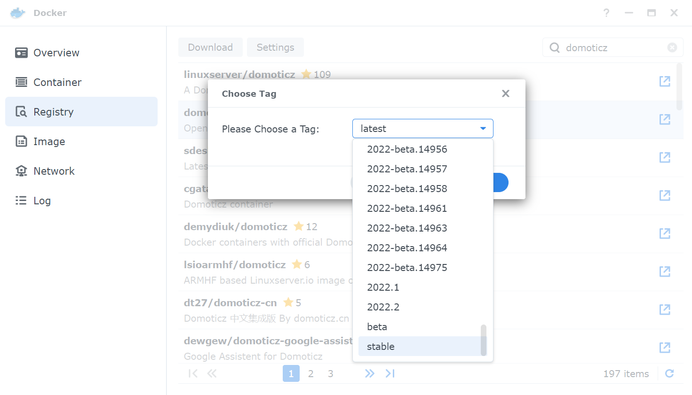


Next, wait for the download and go in Image:
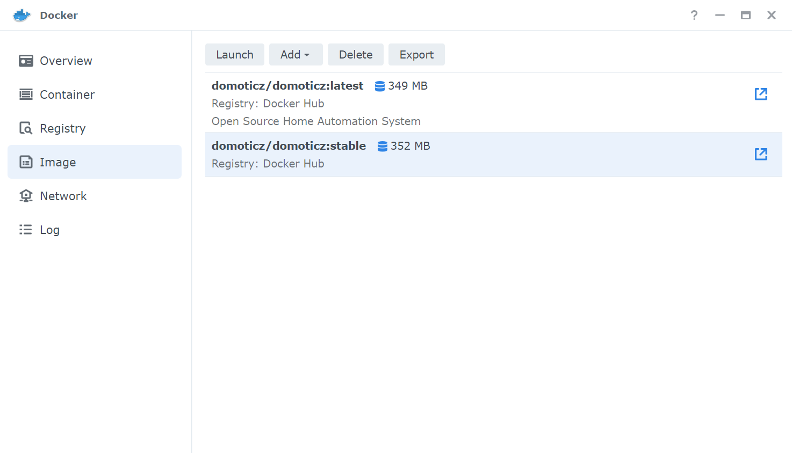


Double click on the DomoticZ image. A new window open with the necessary parameters for the container creation. First step, network interface, select the default one:


Choose a name and check "Execute container using high privilege" and "Enable auto-restart", then validate with "Next".
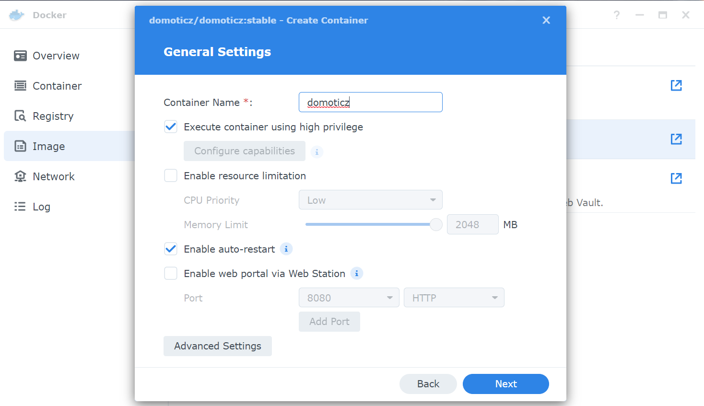

You need to choose port numbers and modify the 'Auto' by the wanted one, the auto option will generate new port numbers at restart and you'll need to open docker to take notice.
The SSL port 443 is currently used by DSM, you need to choose another one (or let Auto if you don't plan to use it):
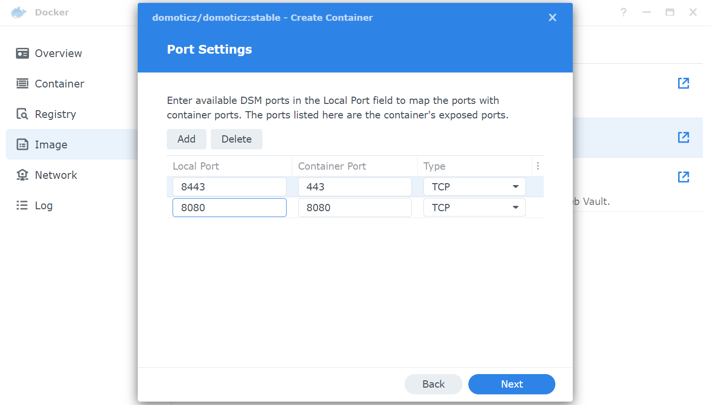

This part is quite important as it allows to keep outside docker the userdatas (database, plugins, scripts...) and gain access with DSM interface (file station). You need to select "Add Folder":
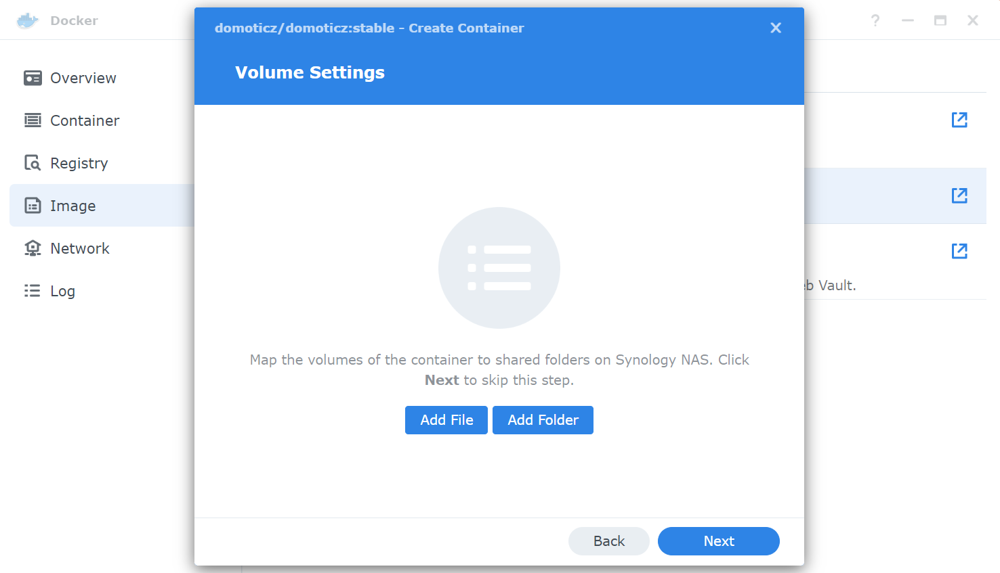


Select docker then "Create folder" and name it domoticz.
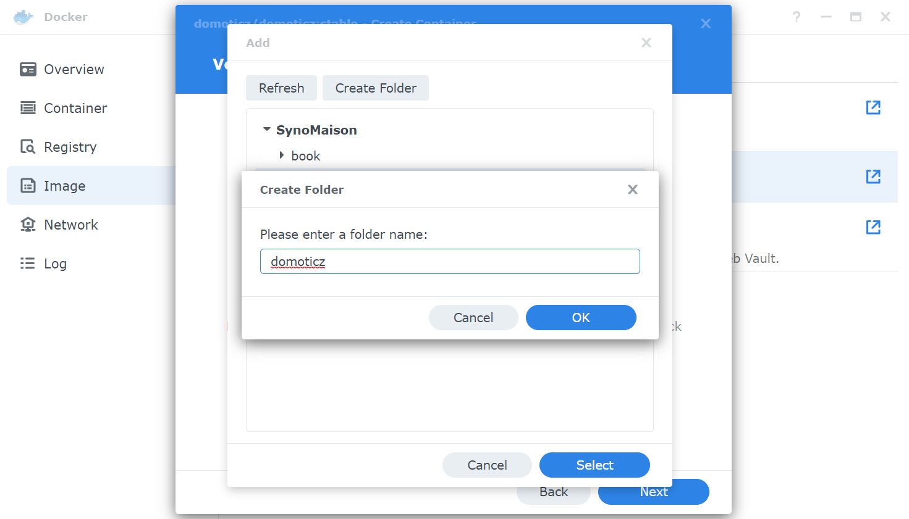


Once the folder has been created, you must indicate the access path: `/opt/domoticz/userdata`
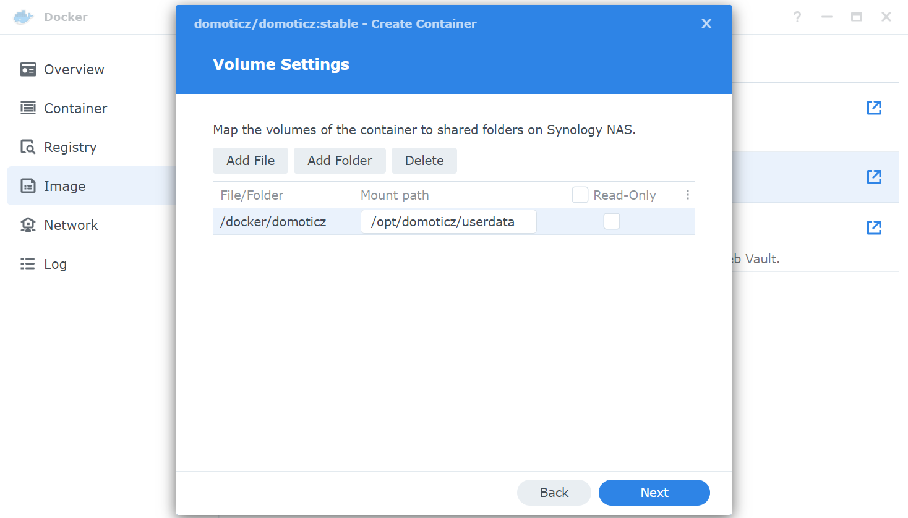


And that's it, the configuration is done, apply and do next.
The last screen offers a summary before the container is created:
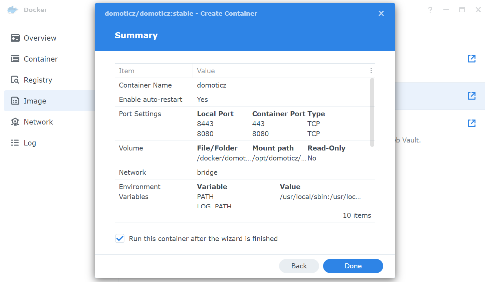

Go to the Container tab, our new container is created:
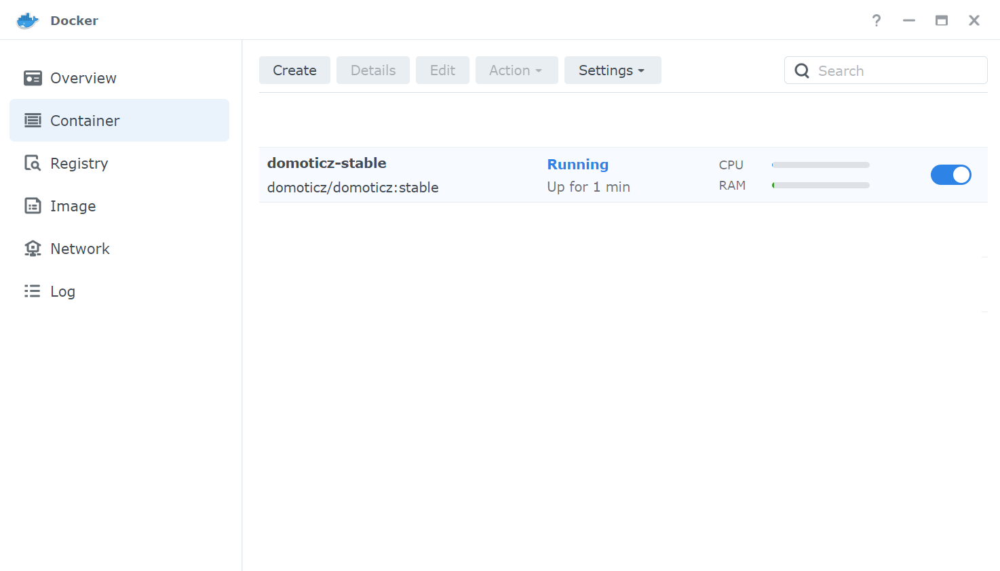


Double click on it to access the details:
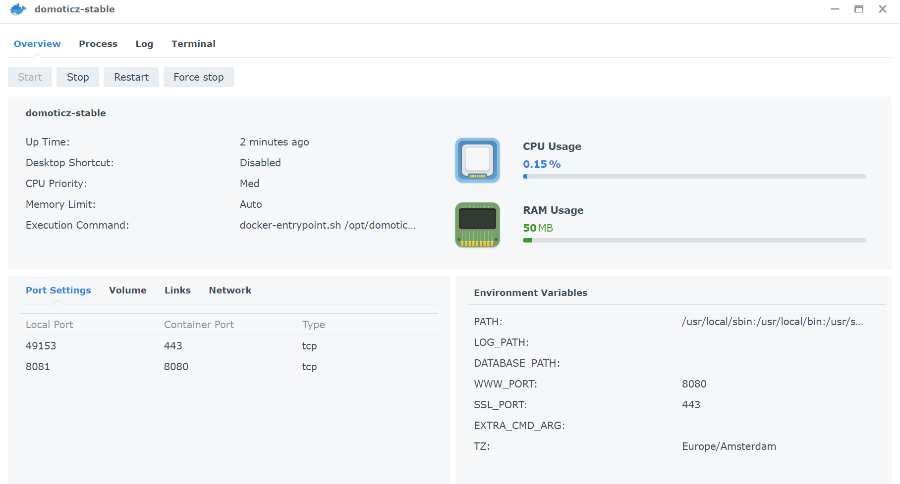


DomoticZ is now operational and you can access it.
A plugins folder is created in the directory __docker/domoticz__.


You can continue the installation of the Plugin by following:  [Installing the plugin on Synology](Plugin_Installation.md#3---installation-running-on-synology-nas)


# USB drivers installation
Following the coordinator model, the USB drivers differ:
* For the first zigate version, the Elelabs dongle, the SonOff dongle version P, you need the driver __cp210x.ko__, you can find it on this [github](https://github.com/robertklep/dsm7-usb-serial-drivers). To choose the right file, you need to know the CPU name of your [Synology NAS](https://kb.synology.com/fr-fr/DSM/tutorial/What_kind_of_CPU_does_my_NAS_have).
* For the zigate v2 or the conbee 2, you need the file __ftdi_sio.ko__. From DSM7.0, it's already existing in modules folder.
* For the conbee 2 or the SonOff dongle version E (Silabs chipset), you also need to load __cdc-acm.ko__ (also existing).
* For the Electrolama Zzh, you need the driver __ch341.ko__ available on the [github](https://github.com/robertklep/dsm7-usb-serial-drivers) with the same method as for cp210x.ko.

## Automatic loading at startup
This solution uses the task scheduler (Conftrol pannel) by creating a Triggered Task.
This task will copy the needed drivers in /lib/modules and load them in the kernel. I advise the copy as the drivers are removed on DSM upgrade.

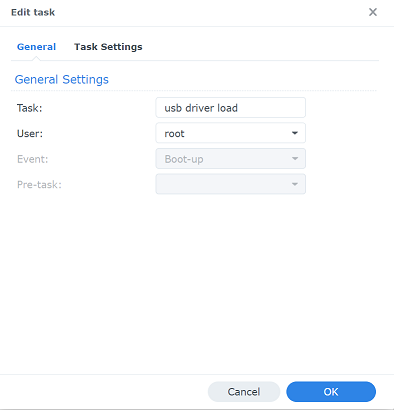

I choose to let the drivers in my home, replace the directory by yours:

```
cd /var/services/homes/xxx
cp *.ko /lib/modules/
insmod /lib/modules/usbserial.ko > /dev/null 2>&1
insmod /lib/modules/cp210x.ko > /dev/null 2>&1
insmod /lib/modules/ftdi_sio.ko > /dev/null 2>&1
insmod /lib/modules/cdc-acm.ko > /dev/null 2>&1
insmod /lib/modules/ch341.ko > /dev/null 2>&1
```

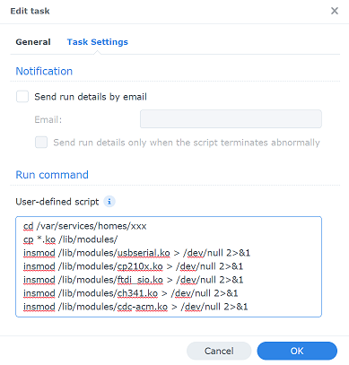

All that remains is to restart DSM.


## Manual load (Advanced user)
To load the drivers, connect to the NAS with ssh and run the following commands, choose only the needed drivers after copy them:

```
cp *.ko /lib/modules/

sudo insmod /lib/modules/usbserial.ko

sudo insmod /lib/modules/cp210x.ko
OR
sudo insmod /lib/modules/ftdi_sio.ko
OR/AND
sudo insmod /lib/modules/cdc-acm.ko
OR
sudo insmod /lib/modules/ch341.ko
````

If you want to load them automatically, you can use the Task scheduler (see above) or use a script run at startup:

Add a file start-usb-drivers.sh in the folder /usr/local/etc/rc.d/start-usb-drivers.sh

```
#!/bin/sh
case $1 in
  start)
    insmod /lib/modules/usbserial.ko > /dev/null 2>&1
    insmod /lib/modules/cp210x.ko > /dev/null 2>&1
    insmod /lib/modules/ftdi_sio.ko > /dev/null 2>&1
    insmod /lib/modules/cdc-acm.ko > /dev/null 2>&1
    insmod /lib/modules/ch341.ko > /dev/null 2>&1
    ;;
  stop)
    exit 0
    ;;
  *)
    exit 1
    ;;
esac
```

Make it runnable:
```
chmod +x /usr/local/etc/rc.d/start-usb-drivers.sh
```
