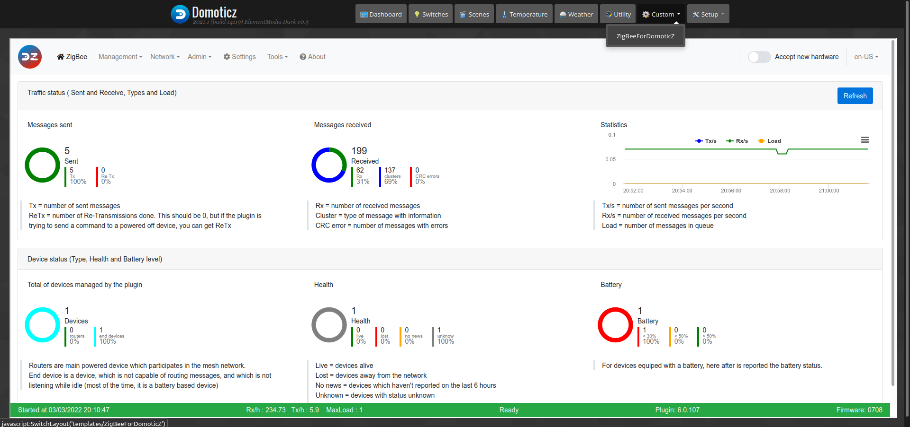
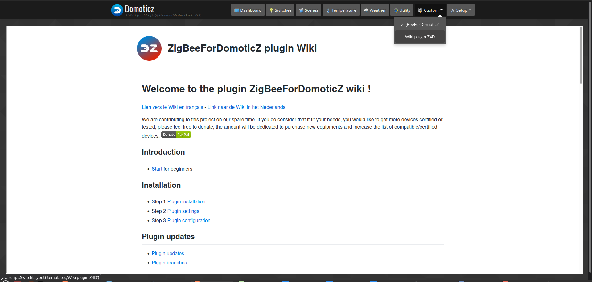

# Integration of the plugin in DomoticZ

The plugin administration interface (WebUI) is accessible at http://IP_DomoticZ:9400 (with 9440 by default), but it is also possible to integrate the WebUI directly into DomoticZ and access it via a link in the Custom Menu.


*This image is likely to have evolved since writing this documentation.*


## Add a menu for the WebUI

1. Go to the folder __domoticz/www/templates__

2. Create a file __ZigBeeForDomoticZ.html__ The file name will be used as the menu name.

3. Put the following line in the html file :

```
<IFRAME SRC="http://IP_DomoticZ:9440/" height="800" width="100%"></IFRAME>
```

__Note :__ Do not use 127.0.0.1 or localhost if you connect to DomoticZ from a remote machine. Put the IP you use to connect to the machine hosting DomoticZ. 192.168.1.X for example.


## Bonus : Add a menu for the Wiki

Since the release of version 6, the new Wiki format as a web page (WikiUI) is also embeddable in DomoticZ as the WebUI.


1. Go to the folder __domoticz/www/templates__

2. Create a file __Wiki plugin Z4D.html__ The file name will be used as the menu name.

3. Put the following line in the html file :

```
<IFRAME SRC="https://zigbeefordomoticz.github.io/Wiki/en-eng" height="800" width="100%"></IFRAME>
```

You will have access to the EN page of the wiki directly from DomoticZ :


*This image is likely to have evolved since writing this documentation.*

Thanks to __waltervl__ for sharing this [info](https://www.domoticz.com/forum/viewtopic.php?t=38114) with us.
