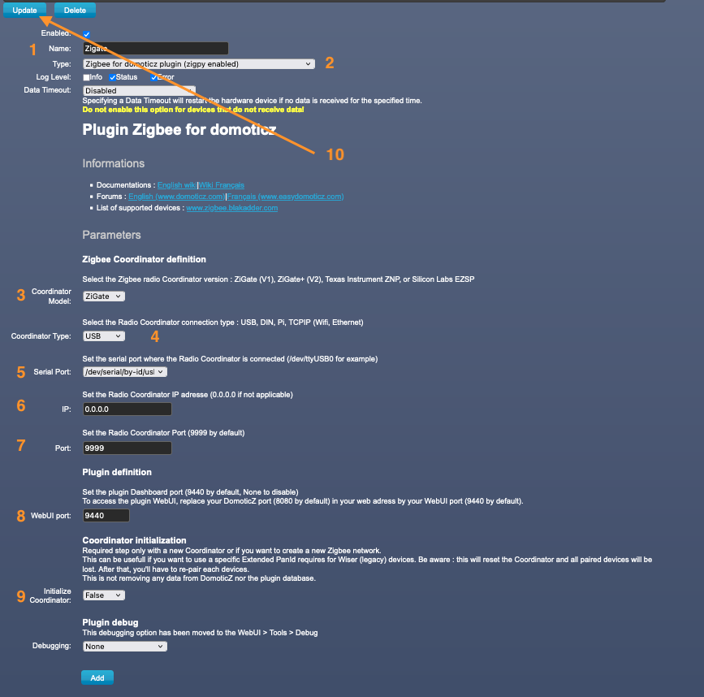

# DomoticZ Plugin Menu Description

## Overview

Explain all parameters and options which can be found on the DomoticZ Hardware menu for the plugin.

## Description

In Domoticz, go in Setup&gt;Hardware, in Type select &quot;Zigbee for domoticz plugin (zigpy enabled)&quot;.

| Id | Short Description | Full Description |
| -- | ----------------- | ---------------- |
| 1  | Plugin Name       | This is the name you want to set for the instance of the plugin. In case you run several Zigate, you'll have several instance of this Plugin Hardware and so the name will help you to distinguish each of them|
| 2  | Plugin Type       | Zigbee for domoticz plugin (zigpy enabled) |
| 3  | Coordinator Model | You have to choose in regards to the coordinator you are going to use
| 4  | Coordinator Type  | You can select the connectivity ( USB, DIN, PI, TCP/IP) |
| 5  | Serial Port       | Used for USB, DIN, this is the Serial Port to access the Coordinator |
| 6  | IP                | Only needed if you use the TCP/IP model and in that case you put the IP address |
| 7  | IP Port           | Only needed if you use the TCP/IP model and in conjuction of the IP address, you will specify the Port number (9999 is default) |
| 8  | Port for Web Admin| Port number to reach the plugin Web Admin page (default 9440), you must change it of you run several instance of the plugin |
| 9  | Initialize Coordinator | This will initialize the coordinator with the plugin and will create a new Zigbee network. After that, all existing devices need to be re-paired. Make sure after the initialisation to check that the flag has switch it back to False, otherwise you would re-initialize again at the next restart |
| 10  | Update            | You will activate the new values of this page, and it will restart the plugin |

### Coordinator Models

* ZiGate : First generation of ZiGate from the Kickstarted up to mid-2021
* ZiGate+ : New generation of ZiGate after mid-2021
* Texas Instrument ZNP (via zigpy): All Texas Instrument CCxxxx like ZZH, SONOFF Dongle .....
* Silicon Lab EZSP (via zigpy) : All Silicon Labs EZSP based like Elelabs

## 1.1 Status Widget

The plugin is providing 2 widgets for administration purposes. Those Widgets are created by the plugin itself at startup phase

In domoticz you will find a Widget name 'Zigbee Status xx' (in the Measurement dashboard) where 'xx is the HardwareID of the plugin
This status widget will give you information on the current state of the plugin. You can even see in the Log of the widget what have been the different states in the past

1. Off (Red)
The plugin set the status to Off when it is going Off, or there is a communication problem identified

1. Startup (grey)
The plugin set the status to Startup, when starting up

1. Ready (green)
This is a normal state, where the plug-in is ready to handle messages and commands

1. Enrolment (amber)
The plugin switch to this mode, when an object is currently in pairing/enrolment process.

1. Busy (amber)
The plugin switch to this mode, when the number of commands to Coordinator is exceeding a certain threshold. In that state, you can experiment delays.

## 1.2 Text Widget

Here is a non-exhaustive list of notifications:

* Enrolment Success
* Enrolment not successful
* Leave notification from an object
* Network Topology (LQI) report available
* Network Scan (Interferences) report available
* Network down
* Zigbee Channel

Here is an example of the Notifications Widget Logs

