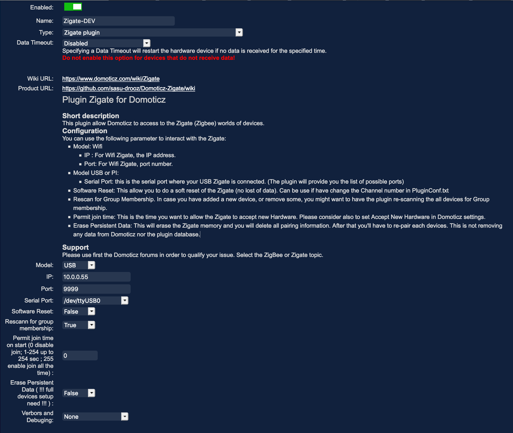

# DomoticZ Plugin Menu Description

## Overview

Explain all parameters and options which can be found on the DomoticZ Hardware menu for the plugin.

## Description

| Id | Short Description | Full Description |
| -- | ----------------- | ---------------- |
| 1  | Plugin Name       | This is the name you want to set for the instance of the plugin. In case you run several Zigate, you'll have several instance of this Plugin Hardware and so the name will help you to distinguish each of them|
| 2  | Hardware Type     | `Zigate plugin` is the name of the Hardware Type |
| 3  | Zigate Model      | You can select between several model of Zigate ( USB, DIN, PI, WifI |
| 4  | IP                | Only needed if you use the WifI model and in that case you put the IP address of the Wifi ZIgate |
| 5  | Port              | Only needed if you use the Wifi model and in conjuction of the IP address, you will specify the Port number (9999 is default) |
| 6  | Serial Port       | Used for USB, DIN and PiZigate, this is the Serial Port to access the Zigate |
| 7  | Initialize ZiGate (Erase Memory) `Erase PDM` | Will initialize ZiGate with the plugin parameters. This is a __MUST__ when using ZiGate the first time (or after an Erase EEPROMO). __ATTENTION:__ Will Erase all pairing information on the Zigate. In such case put it to True and restart the plugin |
| 8  | Port for Web Admin| Port number to reach the plugin Web Admin page (default 9440), you must change it of you run several instance of the plugin |
| 9  | Update            | You will activate the new values of this page, and it will restart the plugin |

In Domoticz, go in Setup&gt;Hardware, in Type select &quot;Zigate plugin&quot;.

* Name: Select a name for your hardware (here it's zigate)
* Type: Zigate plugin
* Data Timeout: Disabled
* Select your model (USB or Wifi or PI)
** if Wifi enter IP of your Zigate, keep port to 9999 (not possible to change this on the zigate yet)
** if USB, select your device port (always /dev/ttyUSBx under linux, COMx for Windows)
* Software Reset: False ( If you want to do a Software reset of the Zigate at startup, you can set to True
* Rescan Group Membership: By default the plugin do not scan for group membership, it relys on the what was done before. So If you have remove/add new devices , you can set this flag to True to force the Membership scan. In such case, **make sure that all devices are powered on** otherwise you might face some difficulties.
* Set Permit join time, between 0 and 255 to Permit join devices on plugin or Domoticz start
** O stands for do nothing
** 1 to 254 is the time in seconds for which the Zigate will be open for commissioning
** 255 is for all the time open for commissioning new devices (in the case where you have set the Permit to Join to 255 and now you want to disable it, you need a 2 steps approach. (1) you set the value to 1 and you start the plugin, then you set the value to 0 and you can restart it.
* Set Erase Persistent Data to true if you want to clean Zigate memory (devices know list in zigate)
* Set Verbors and Debugging: By default to None.

The plugin is providing 2 widgets for administration purposes. Those Widgets are created by the plugin itself at startup phase

## 1.1 Status Widget

In domoticz you will find a Widget name 'Zigate Status xx' (in the Measurement dashboard) where 'xx is the HardwareID of the plugin
This status widget will give you information on the current state of the plugin. You can even see in the Log of the widget what have been the different states in the past
1. Off (Red)
The plugin set the status to Off when it is going Off, or there is a communication problem identified

1. Startup (grey)
The plugin set the status to Startup, when starting up

1. Ready (green)
This is a normal state, where the plug-in is ready to handle messages and commands

1. Enrolment (amber)
The plugin switch to this mode, when an object is currently in pairing/enrolment process.

1. Busy (amber)
The plugin switch to this mode, when the number of commands to Zigate is exceeding a certain threshold. In that state, you can experiment delays.

## 1.2 Text Widget

Here is a non-exhaustive list of notifications:
* Enrolment Success
* Enrolment not successful
* Leave notification from an object
* Network Topology (LQI) report available
* Network Scan (Interferences) report available
* Network down
* Zigate Channel

Here is an example of the Notifications Widget Logs

