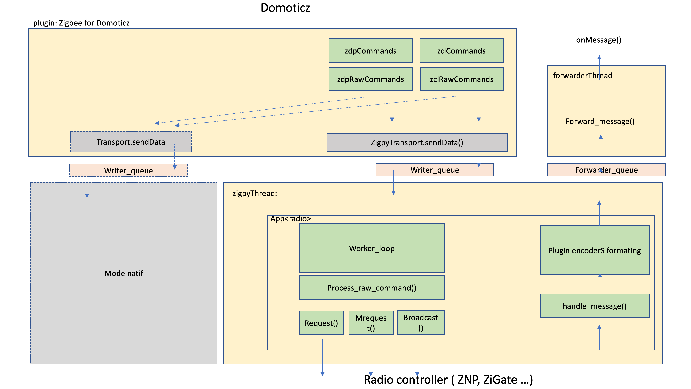

# Plugin Technical infos

* [Plugin directory structure](Plugin-directory-structure.md)
* [Enrolement process](Enrolment-process.md)
* [Manufacturer codes](Manufacturer-codes.md)
* [Aqara Cube decoding](Aqara-Cube-decoding.md)
* [Device Configuration_file](Device_Configuration_file.md)
* [NXP ZFCG Zigate](NXP-ZFCG-Zigate.md)
* [Orvibo](Orvibo.md)
* [Plugin ListOfDevices](Plugin_ListOfDevices.md)
* [REST-API](REST-API.md)
* [Salus corner](Salus_corner.md)
* [Structure of ListOfDevices](Structure-of-ListOfDevices.md)
* [Tuya 0xEF00](Tuya-0xEF00.md)
* [Tuya TS061 eTRV](Tuya-TS061-eTRV.md)
* [Wiser Thermostat](Wiser-Thermostat.md)
* [Xiaomi Corner](Xiaomi-Corner.md)
* [Xiaomi Smart Plug](Xiaomi-Smart-Plug.md)
* [ZiGate PDMonHost](ZiGate-PDMonHost.md)
* [zlinky integration](zlinky-integration.md)
* [ProfileID ZDeviceID](ProfileID---ZDeviceID.md)
* [Transport](Transport.pptx)
* [Plugin Architecture Diagram](Plugin Architecture Diagram.pptx)

