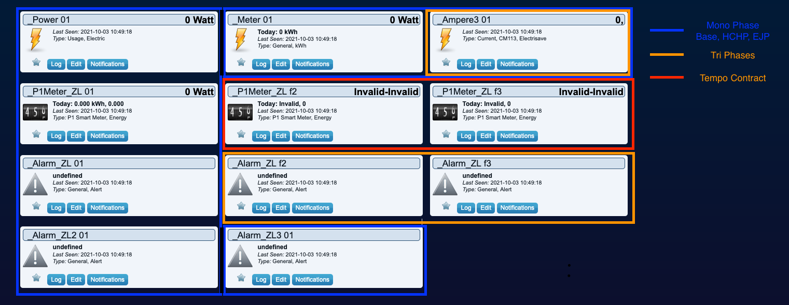

# Zlinky TIC Integration

## Overview

Purpose is to describe the integration of the ZLinky_TIC module in the plugin and Domoticz

## Domoticz Widgets after ZLinky pairing

## Domoticz Widgets : mapping to TIC attributes

| Widget Name     | Widget Type | Mono | Tri | Base | HCHP | EJP | TEMPO | TIC Attributes                                           |  Details                                 |
| -----------     | ----------- | ---- | --- | ---- | ---- | --- | ----  | -------------------------------------------------------- | ---------------------------------------- |
| Power           | Power       |   X  |  X  |   X  |  X   |  X  |  X    | PAPP                                                     | Power in VA ( not Watts)                 |
| Meter           | Meter       |   X  |  X  |   X  |  X   |  X  |  X    | PAPP                                                     | Power in VA ( not Watts)                 |
| _P1Meter_ZL 01  | P1Meter     |   X  |     |   X  |  X   |  X  |  X    | BASE, HCHP, HCHC, EJPHN, EJPHPM, BBRHCJB, BBRHPJB, PAPP  | 1st: Power in VA, 2nd: Consumption in Wh |
| _P1Meter_ZL f2  | P1Meter     |      |     |      |      |     |  X    | BBRHCJW, BBRHPJW                                         | 1st: Power in VA, 2nd: Consumption in Wh |
| _P1Meter_ZL f3  | P1Meter     |      |     |      |      |     |  X    | BBRHCJR, BBRHPJR                                         | 1st: Power in VA, 2nd: Consumption in Wh |
| _Ampere3        | Current     |   X  |  X  |      |      |     |       | IINST, IINST1, IINST2, IINST3                            | Current in A                             |
| _Alarm_ZL 01 *  | Alarm       |   X  |  X  |      |      |     |       | ADPS, ADIR1                                              | 80% - 01, 90% 02 , 98 03, Over 05        |
| _Alarm_ZL f2 *  | Alarm       |      |  X  |      |      |     |       | ADIR2                                                    | 80% - 01, 90% 02 , 98 03, Over 05        |
| _Alarm_ZL F3 *  | Alarm       |      |  X  |      |      |     |       | ADIR3                                                    | 80% - 01, 90% 02 , 98 03, Over 05        |
| _Alarm_ZL2      | Alarm       |      |     |      |      |  X  |  X    | DEMAIN (For Tempo), EJP (for EJP)                        | Next day color ( Blue, White, Red)       |
| _Alarm_ZL3      | Alarm       |      |     |      |      |     |  X    | PTEC                                                     | Current Tarif HN, HC, HP, B,W,R ...      |
| _EJP            | Alarm       |      |     |      |      |  X  |       | PEJP                                                     | prior notice EJP ( 30min)                |

* ADPS, ADIR1, ADIR2, ADIR3 triger Critical Alarm only when over the subscribe intensity. The plugin is checking against the subscription to triger 80%, 90% or 98%

## TIC attributes not available via Widget

This attributes are store if received , and can be check via the Tools

|Commande TIC|CLUSTER|Attribut |Droit |data type |unit   |designation                           |valeur par defaut|
|------------|-------|-------- |----- | -------  |-------|----                                  |-----------      |
|ADC0        |0x0702 | 0x0308  | RO   | String   |-      | Serial Number                        | NULL            |
|OPTARIF     |0xFF66 | 0x0000  | RO   | String   |-      | Option tarifaire                     | BASE            |
|ISOUSC      |0x0B01 | 0x000D  |RO    | Uint16   |A      | Intensité souscrite                  | 0               |
|IMAX        |0x0B04 | 0x050A  |RO    | Uint16   |A      | Intensité maximale                   | 0xFFFF          |
|IMAX1       |0x0B04 | 0x050A  |RO    | Uint16   |A      | Intensité maximale phase 1           | 0xFFFF          |
|IMAX2       |0x0B04 | 0x090A  |RO    | Uint16   |A      | Intensité maximale phase 2           | 0xFFFF          |
|IMAX3       |0x0B04 | 0x0A0A  |RO    | Uint16   |A      | Intensité maximale phase 3           | 0xFFFF          |
|PMAX        |0x0B04 | 0x050D  |RO    | Uint16   |W      | Puissance maximale triphasée atteinte| 0x8000          |
|PTEC        |0x0702 | 0x0020  |RO    | String   |-      | Periode tarifaire en cours           | NULL            |
|DEMAIN      |0xFF66 | 0x0001  |RP    | String   |-      | Couleur du lendemain                 | NULL            |
|HHPHC       |0xFF66 | 0x0002  |RO    | Uint8    |-      | Horaire Heure Pleines Heures Creuses | 0               |
|PPOT        |0xFF66 | 0x0003  |RO    | Uint8    |-      | Présence des potentiels              | 0               |

## References

* <http://www.enedis.fr/sites/default/files/Enedis-NOI-CPT_54E.pdf>
* <https://github.com/fairecasoimeme/Zlinky_TIC/blob/master/README.md>
