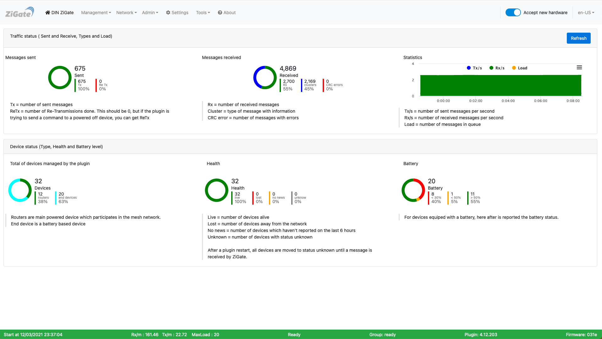

# The Web interface - Dashboard page

 

Please refer to STEP 3 [Plugin Configuration](Plugin_Configuration.md) to get access to the Web interface administration.

Here is the __Dashboard__ page of the plugin Web interface :

*This picture may have have changed since this documentation was written.*

### Contents

#### The 3 top graphics

They shaw the traffic state :
* Outging
* Incomming
* Type and load

#### The 3 bottom graphics

They shaw the device state :
* Type
* Health
* Battery level

------------------------------------------------
Look at the other pages of the [plugin Web interface](Home.md#plugins-web-interface).

This is a Plugin Dashboard from which you can in a short time if anything else is going wrong on the coordinator environment.
This is some how self explanatory and you have comments for each section.
In the header where you have the navigation tabs, you have also a switch which allow you to move coordinator and plugin into Pairing Mode (In case coordinator is already in pairing mode, the switch will automatically enabled).

In the footer (here in Green) you have some quick overview of :
* when the plugin has been started
* a quick plugin status "Ready" here
* the Plugin Version
* the Firmware version on coordinator

* Tx (Total Transmission) is the total number of transmissions (from other networks) detected during the scan
* Failure (Transmission Failure) is the number of failed transmissions detected during the scan
* Energy-Level measurement reports energy-level measurements (the value 255 indicates there is too much interferences on the channel).

In short, higher the value is , indicates a high interferences, worst it is. Better to select an other channel with lower level.
