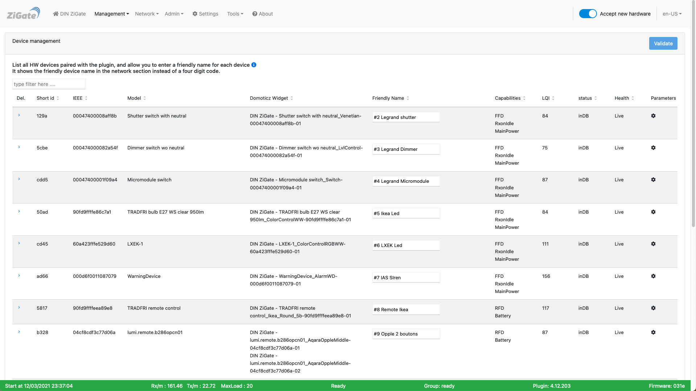
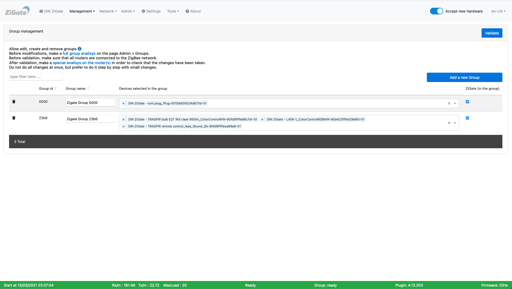

# The Web interface - Management section

Please refer to STEP 3 [Plugin Configuration](Plugin_Configuration.md) to get access to the Web interface administration.

The section __Management__ contents the pages :

* [Device Management](#device-management)
* [Groupe Management](#group-management)

------------------------------------------------
## Device Management

Here is the __Device management__ page of the plugin Web interface :

*This picture may have have changed since this documentation was written.*

### How to use

Use this page to manage your devices.

You can :

* Add nicknames to your devices so it will be easier to identify them
* Get the ShortId (Network Address) and IEEE (Mac Address) of the device
* Get the Model Name
* Get the Domoticz Widget names attached to this device
* Get the Health status

## Group Management

Here is the __Group management__ page of the plugin Web interface :

*This picture may have have changed since this documentation was written.*

### How to use

Use this page to manage your groups.

Refer to the section [How to manage groups](HowTo_Group-management.md) for more informations.

------------------------------------------------
Look at the other pages of the [plugin Web interface](Readme.md#plugins-web-interface).
