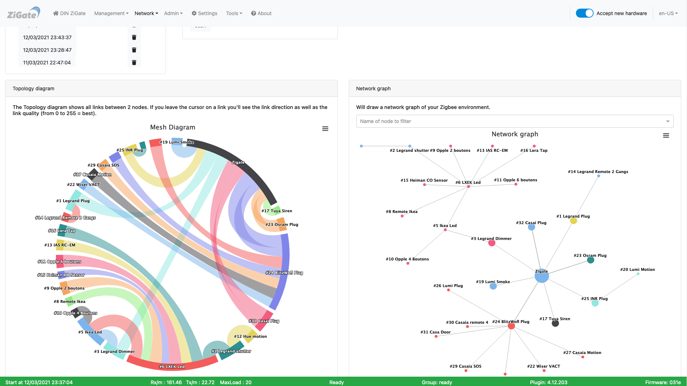
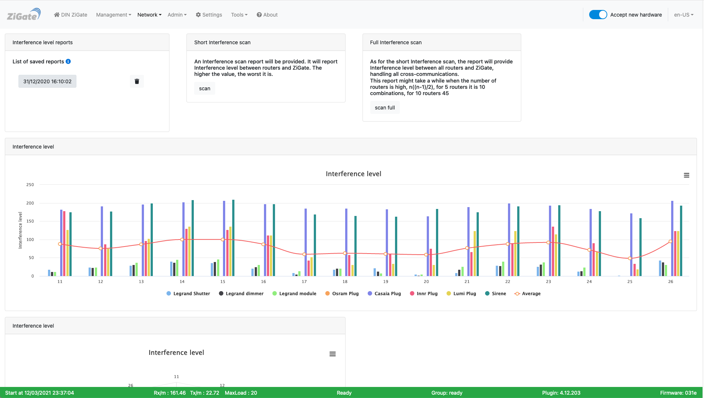

# The Web interface - Network section

Please refer to STEP 3 [Plugin Configuration](Plugin_Configuration.md) to get access to the Web interface administration.

The section __Network__ contents the pages :

* [Topology](#topology)
* [Interference levels](#interference-level)

------------------------------------------------

## Topology

Here is the __Topology__ page of the plugin Web interface :

*This picture may have have changed since this documentation was written.*

At plugin start a report is triggered. It could take up to 15' to get the report extracted.
You can after that manually trigger a scan

All available reports are available in the upper-left list, sorted by date. From the list you can either:

* delete a report
* display the report

There are 2 graphical representations of the report.

### Left: Topology wheel

Here are shown on a wheel, all links between 2 devices. If you leave the mouse on a link, you'll see the direction and a number which correspond to the Link Quality ( the worst is 0, the best is 255).

### Right: Topology graph

Here you can see more the hierarchical structure of your ZigBee network.

### Additional informations

Currently you can find some additional informatons in the Plugin log file when you visualize a particular report.
This report will show you the following informations extracted from the Neighbors table (and Routing table)

* Node1 (nwkid): current device and its network short address of the 1st node.
* Node2 (nwkid): neighbor device and its network short address of the 2nd node.
* LQI: The estimated link quality for RF transmissions from this device.
* Dev. Type: The type of the neighbor device: ZigBee coordinator, ZigBee router, ZigBee end device, Unknown.
* Relation: The relationship between the neighbor and the current device:
  * neighbor is the __parent__
  * neighbor is a __child__
  * neighbor is a __sibling__
* route Flag: the neighbor device is a __destination address__ of the current device

------------------------------------------------

## Interference level

Here is the __Interference level__ page of the plugin Web interface :

*This picture may have have changed since this documentation was written.*

Starting Plugin Version: > 4.4, the plugin queries the coordinator to get informations on the Energy level per channel.

In the 10 first minutes after plugin start, a Network Energy Level scan will be executed.

The Energy-Level measurement is a value from 0 to 255 given for all coordinator supported channels ( 11, 15, 19, 20, 25 and 26).
It is given in an arbitrary units (didn't find any more information in the NXP ZigBee documentation).

### Graphical presentation

You can get access to the Graphical presentation via the Web Admin Page in the Network Tab and Select Energy Level

The plugin allow to generate a Network Topology report based on the LQI ( Detected signal strength ).
It is important to know that the Packet filtering implemented is using the LQI value

| LQI range | Cost |
| ---------| -----|
| >= 51 | 1 |
| 46 - 50 | 2 |
| 41 - 45 | 3 |
| 39 - 40 | 4 |
| 36 - 38 | 5 |

Source: <https://www.nxp.com/docs/en/user-guide/JN-UG-3113.pdf>

A cost of 5 is used as the packet filtering threshold, which means that above that level packets might be discarded.

## Terminology

1. Neighbor Table:

    * The Neighbor Table maintains information about neighboring devices within the radio range of a Zigbee device.
    * It typically includes details such as the network address, IEEE address (unique identifier), and signal quality of neighboring devices.
    * The Neighbor Table helps in managing direct communication with nearby devices and is essential for forming and maintaining network connections.
    * This table aids in tasks such as device discovery, link quality estimation, and neighbor management.

1. Routing Table:

    * The Routing Table contains information about the network routes that a Zigbee device can use to reach other devices in the network.
    * It includes entries for various destination devices along with the next-hop device and the quality of the route.
    * The Routing Table is crucial for enabling multi-hop communication in Zigbee mesh networks. When a device wants to send a message to a destination that is not within its direct radio range, it uses the Routing Table to determine the best path through intermediate devices (routers) to reach the destination.
    * Zigbee devices use routing tables to make informed decisions about relaying messages within the mesh network, ensuring efficient and reliable communication across the network.

1. LQI stands for Link Quality Indicator.

    It is a metric used to estimate the quality of the wireless link between two neighboring devices. LQI values are reported in the Neighbor Table of Zigbee devices to provide insight into the reliability of communication with nearby devices. Here's a breakdown of LQI and its significance:

    * Definition: LQI is a value typically represented as a numerical score, ranging from 0 to 255 in Zigbee networks. It quantifies the quality of the link between a device and its neighboring device. Higher LQI values generally indicate better link quality, while lower values suggest poorer link quality.

    * Calculation: The LQI value is calculated based on various factors such as signal strength, signal-to-noise ratio, packet error rate, and other parameters related to the wireless communication channel. Zigbee devices continuously monitor these factors to assess the quality of their links with neighboring devices.

    * Interpretation: LQI values provide an indication of how reliable the communication link is between two devices. A high LQI value implies a strong and reliable link, with minimal interference or packet loss. Conversely, a low LQI value indicates a weaker link, which may be prone to interference or packet loss, potentially affecting the reliability of communication.

    * Usage: In the Neighbor Table, LQI values are reported alongside information about neighboring devices such as their network address, IEEE address, and other parameters. This information helps Zigbee devices make informed decisions regarding communication and neighbor management. Devices may use LQI values to prioritize communication with neighboring devices that offer better link quality, leading to more reliable data transmission.

    * Dynamic Nature: LQI values are dynamic and can fluctuate over time due to changes in environmental conditions, signal interference, device mobility, and other factors. Zigbee devices continuously update LQI values in the Neighbor Table to reflect the current state of their communication links with neighboring devices.

Sources:

* <https://www.nxp.com/docs/en/user-guide/JN-UG-3101.pdf> ( page 367 - Section 8.2.3.41 ZPS_tsAplZdpMgmtNwkUpdateNotify)
* <https://en.wikipedia.org/wiki/Received_signal_strength_indication> ( RSSI - Received Signal Strength Indication)

------------------------------------------------
Look at the other pages of the [plugin Web interface](Readme.md#plugins-web-interface).
