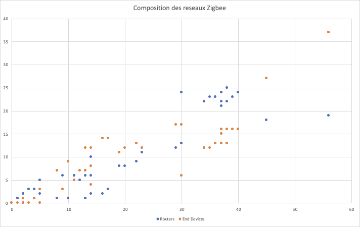

# The WebUI stastistics

Like most website operators, Zigbee for Domoticz WEBUi collects non-personally-identifying information of the sort that web browsers and servers typically make available, such as the browser type, language preference, referring site, and the date and time of each visitor request. We uses [Matomo](https://fr.matomo.org) (prevously Piwik) for this. Zigbee for Domoticz’s purpose in collecting non-personally identifying information is to better understand how Z4D plugin’s visitors use its website. From time to time, we may release non-personally-identifying information in the aggregate, e.g., by publishing a report on trends in the usage like:

* Coordinator type
* Plugin version
* Network size.

## cookies

As the WebUI is a mini website, we use the cookie functionality placed in your browser. When you first open the WebUI, a banner at the bottom asks for your permission to collect this data.

**At any time**, it is possible to change your choice to send us your data using the __PluginAnalytics__ setting in the WebUI settings page.

## Transparency

In addition to the traditional information collected on websites (browser, operating system, display resolution, etc...), we collect the following information :

* the coordinator model

* the coordinator's firmware version

* the version of the Plugin

* the size of the ZigBee network

## Example of network size

The network size statistics can be reported to us in graphical form:

The horizontal axis shows the total number of devices (routers + end devices). The vertical axis shows the number of routers (in blue) and end devices (in orange).

In the example, we see on the far right, a network with 56 deivces, including 19 routers and 37 end devices.

## Why ?

We are a small team of volunteers who share our time to develop this plugin.

With this little feedback, you allow us to know the use you make of it.

This way we can concentrate our efforts where it is most needed.

Thank you.
