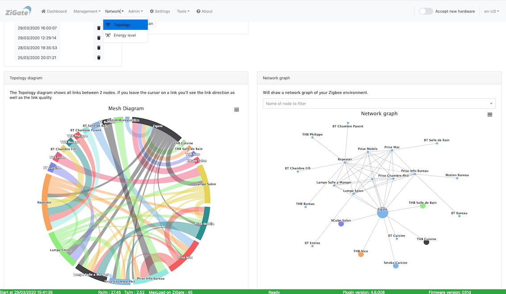

# Info - Topologie du réseau

 

 Le plugin permet de générer un rapport sur la topologie du réseau. Celui-ci est basé sur le LQI (la force du signal détecté).
__Important :__ Le filtrage des paquets implémenté utilise la valeur LQI

| LQI range | Coût |
| ---------| -----|
| >= 51 | 1 |
| 46 - 50 | 2 |
| 41 - 45 | 3 |
| 39 - 40 | 4 |
| 36 - 38 | 5 |

Source: https://www.nxp.com/docs/en/user-guide/JN-UG-3113.pdf

## Exemple de rapport

La création du rapport va prendre un certain temps en fonction de la taille du réseau (surtout du nombre de routeurs).
Lorsque le rapport est généré, le message suivant apparaît dans les logs de DomoticZ : `A raw format is also provided and is analysed via the Web UI.`

** Rapport graphique

** Rapport numérique

| Noeud | Child | Relation | Type | Rebond | LQY | Rx on Iddle |
| -----| ----- | ------------ | ---- | ------ | --- | ------------ |
|  0000 | 27a3 |   Child |  End Device |  1 |  86 | Rx-Off |
|  0000 | 9b5f |   Child |  End Device |  1 | 119 | Rx-Off |
|  0000 | 0000 |  Parent | Coordinator |  0 | 254 |  Rx-On |
|  0000 | 1d81 |    None |      Router | 15 | 254 |  Rx-On |
|  0000 | 1df8 |    None |      Router | 15 | 255 |  Rx-On |
|  a6e8 | 0000 |  Parent | Coordinator |  0 | 254 |  Rx-On |
|  a6e8 | 1a19 |    None |      Router | 15 | 255 |  Rx-On |
|  a6e8 | 1d81 |    None |      Router | 15 | 254 |  Rx-On |
|  b218 | 0000 |  Parent | Coordinator |  0 | 254 |  Rx-On |
|  b218 | 1a19 |    None |      Router | 15 | 253 |  Rx-On |
|  b218 | 1d81 |    None |      Router | 15 | 255 |  Rx-On |
|  1d81 | 0000 |    None | Coordinator |  0 | 254 |  Rx-On |
|  1d81 | 1a19 |    None |      Router | 15 |  46 |  Rx-On |
|  1d81 | 1df8 |    None |      Router | 15 | 254 |  Rx-On |
|  1d81 | 27a3 |   Child |  End Device |  1 |  86 | Rx-Off |
|  1d81 | 9b5f |   Child |  End Device |  1 | 119 | Rx-Off |
|  1a19 | 0000 |    None | Coordinator |  0 | 249 |  Rx-On |
|  1a19 | 1d81 |    None |      Router | 15 |  76 |  Rx-On |
|  1a19 | 1df8 |    None |      Router | 15 | 254 |  Rx-On |
|  2657 | 0000 |  Parent | Coordinator |  0 | 254 |  Rx-On |
|  2657 | 1a19 |    None |      Router | 15 | 254 |  Rx-On |
|  2657 | 1d81 |    None |      Router | 15 | 152 |  Rx-On |
|  e86c | 0000 |  Parent | Coordinator |  0 | 254 |  Rx-On |
|  e86c | 1d81 |    None |      Router | 15 | 252 |  Rx-On |
|  e86c | 1df8 |    None |      Router | 15 | 254 |  Rx-On |
|  550f | 0000 |    None | Coordinator |  0 | 254 |  Rx-On |
|  550f | 1d81 |  Parent |      Router | 15 | 255 |  Rx-On |
|  550f | 1df8 |    None |      Router | 15 | 254 |  Rx-On |
|  9ae9 | e86c | Sibling |      Router |  2 |  63 |  Rx-On |
|  9ae9 | b218 | Sibling |      Router |  2 | 156 |  Rx-On |
|  ee05 | 0000 | Sibling | Coordinator |  0 | 216 |  Rx-On |
|  ee05 | 1a19 | Sibling |      Router | 15 |  42 |  Rx-On |
|  ee05 | 1d81 | Sibling |      Router | 15 |  89 |  Rx-On |
|  0c1f | 0000 | Sibling | Coordinator |  0 | 255 |  Rx-On |
|  0c1f | 1a19 | Sibling |      Router | 15 |  46 |  Rx-On |
|  0c1f | 1d81 | Sibling |      Router | 15 |  52 |  Rx-On |
|  8bf6 | 27a3 |   Child |  End Device |  1 |  86 | Rx-Off |
|  8bf6 | 9b5f |   Child |  End Device |  1 | 119 | Rx-Off |
|  1df8 | 0000 |    None | Coordinator |  0 | 249 |  Rx-On |
|  1df8 | 1d81 |    None |      Router | 15 |  76 |  Rx-On |
|  1df8 | 1df8 |    None |      Router | 15 | 254 |  Rx-On |
|  1df8 | 1a19 | Sibling |      Router | 15 |  46 |  Rx-On |
|  06f8 | 0000 |    None | Coordinator |  0 | 254 |  Rx-On |
|  06f8 | 1df8 |    None |      Router | 15 | 252 |  Rx-On |
|  06f8 | 2657 |    None |      Router | 15 |  58 |  Rx-On |
|  27a3 | 27a3 |   Child |  End Device |  1 |  86 | Rx-Off |
|  27a3 | 9b5f |   Child |  End Device |  1 | 119 | Rx-Off |
|  9b5f | 0000 |    None | Coordinator |  0 | 249 |  Rx-On |
|  9b5f | 1d81 |    None |      Router | 15 |  76 |  Rx-On |
|  9b5f | 1df8 |    None |      Router | 15 | 254 |  Rx-On |
|  2c7f | 0000 |    None | Coordinator |  0 | 254 |  Rx-On |
|  2c7f | 1df8 |    None |      Router | 15 | 252 |  Rx-On |
|  2c7f | 2657 |    None |      Router | 15 |  57 |  Rx-On |

* Noeud : Le point de départ.
  * 0000 c'est le coordinateur.
* LQI : c'est la valeur estimative de la qualité de la transmission avec le noeud voisin.
* Rebond : C'est le nombre de niveau entre le noeud voisin et la ZiGate (rebond 0).
* Relation: c'est une valeur en 3 Bit représentant la relation avec les noeuds voisins :
  * 0 Parent : le voisin est un parent
  * 1 = Child : le voisin est un enfant
  * 2 = Sibling : le voisin a le même parent
