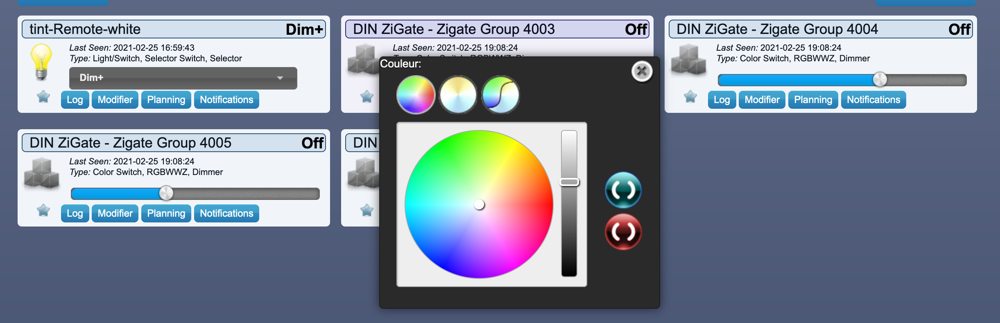

# Les objets de la marque Muller Licht

Certains objets de la marque Muller Licht ont besoin d'une configuration particulière pour fonctionner avec le plugin. Ils seront listés dans cette page.

** Cette page n'est pas une liste des objets compatibles.**

La liste des objets compatibles est sur le site [https://zigbee.blakadder.com/zigate.html](https://zigbee.blakadder.com/zigate.html).

## Sommaire

Les objets nécessitant une configuration particulière :

* [Télécommande Tint](Télécommande Tint (404022))

### Télécommande Tint (404022)

Cette télécommande permet de contrôler les ampoules avec un changement de blanc.

__Cette télécommande ne permet pas de contrôler des ampoules RGB (avec changement de couleur)__

Elle permet de contrôler 4 groupes différents : 4003, 4004, 4005, 4006.

Dans DomoticZ, il y aura 5 dispositifs :

* Un dispositif pour chaque groupe permettant la sélection de l'intensité (dimer) et le choix de la couleur de blanc (le RGB est affiché mais non fonctionnel)
* Un cinquième dispositif affichant les commandes effectuées sur la télécommande.

__Le sélecteur à 18 valeurs n'a aucune action sur la télécommande. Il s'agit uniquement d'une information.__

#### Appairage

* Appairer la télécommande avec la ZiGate.
* Vérifier la création des 5 dispositifs dans DomoticZ.
* Associer la télécommande avec les ampoules et la ZiGate dans des [groupes](Tuto_Gerer-les-groupes.md).

#### Important

* Une ZiGate ne peut appartenir qu'à un nombre limité de groupes (voir [Les caractéristiques des ZiGates](Info_Caracteristiques-des-ZiGates.md)) (5 pour la V1). La télécommande en occupera 4 si vous souhaitez remonter les informations de tous les actions des groupes dans DomoticZ.
* Si vous n'utilisez pas les dispositifs dans DomoticZ, il est recommandé de supprimé la ZiGate des ces groupes. La télécommande continuera d'activer les groupes mais aucun retour d'état ou commande se fera dans DomoticZ.
**Rappel : lorsqu'il n'y a plus d'objets dans un groupe, celui-ci sera supprimé lorsque la ZiGate sera retirée du groupe.

#### Note

Si les 4 groupes n'existent plus (ou on été supprimés), il est possible d'activer le paramètre __zigatePartOfGroupTint__ et redémarrer le plugin. Les groupes seront automatiquement recréés.
