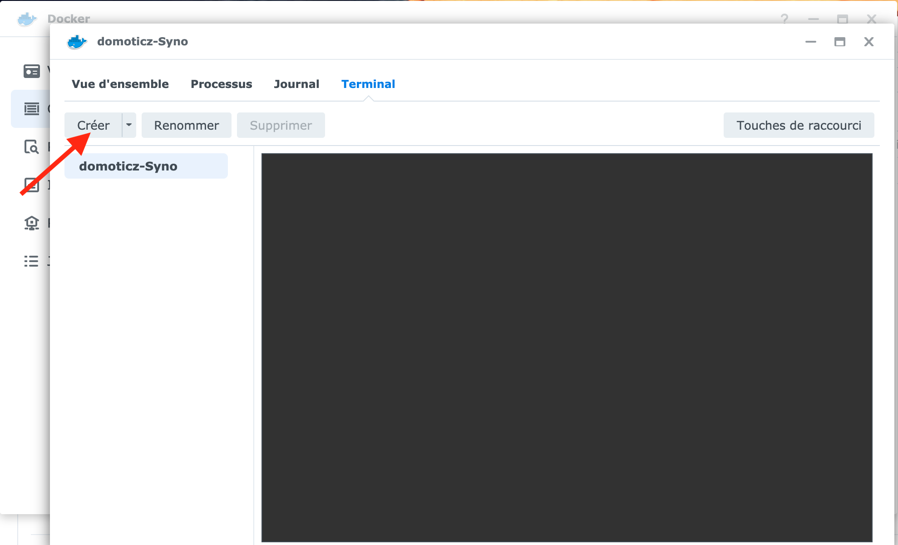
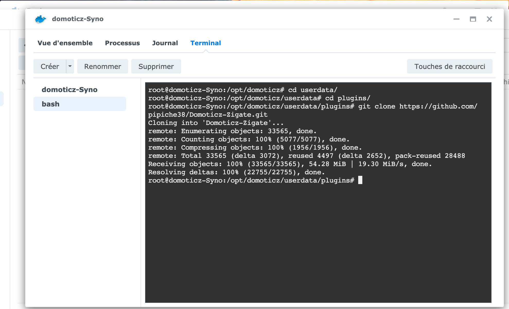
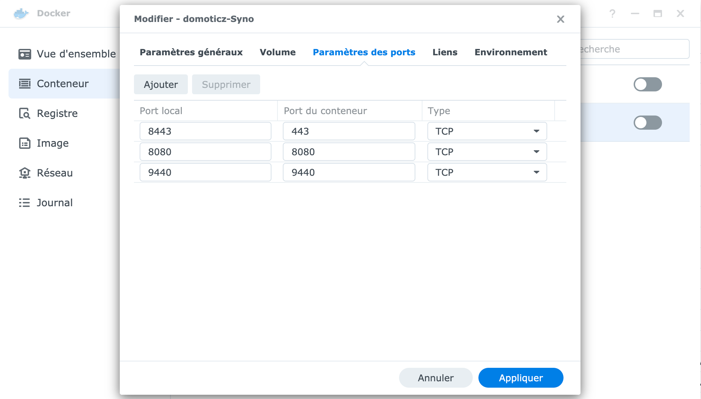
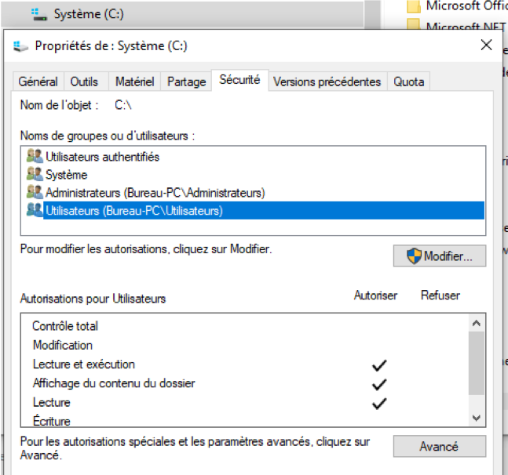
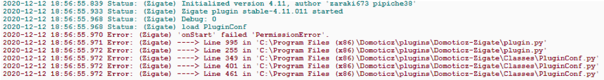
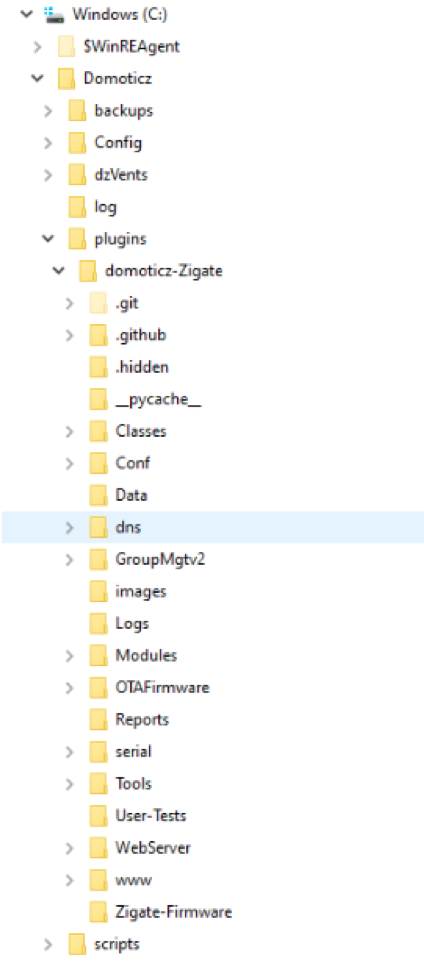

# Installation du plugin Domoticz-Zigbee

Quelque soit la méthode d'installation, le plugin nécessite DomoticZ version 3.87 ou supérieure et Python version 3.5 ou supérieur. Assurez-vous que le paquet __python3-dev__ est installé. Plus d'informations sur la page [DomoticZ Python plugin](https://www.domoticz.com/wiki/Using_Python_plugins).


Pour cette première étape, il existe différentes méthodes d'installation selon votre système d'exploitation :

* 1 - [Installation via Python Plugin Manager sous Linux](#1---installation-du-plugin-via-python-plugin-manager-sous-linux)
* 2 - [Installation manuelle sous Linux](#2---installation-manuelle-sous-linux)
* 3 - [Installation sur NAS Synology avec Jadahl](#3---installation-sur-nas-synology-avec-jadahl) Plus à jour > préférer Docker
* 4 - [Installation sur NAS Synology avec Docker](#4---installation-sur-nas-synology-avec-docker)
* 5 - [Installation sous Windows 10](#5---installation-sous-windows-10)
* 6 - [Installation d'une PiZigate (RPi3B+) sous Linux avec Raspbian](#6---installation-dune-pizigate-rpi3b-sous-linux-avec-raspbian)
* 7 - [Installation d'une PiZigate (RPi3B+) sous Linux avec Fedora 29](#7---installation-dune-pizigate-rpi3b-sous-linux-avec-fedora-29)


__Note :__ L'installation d'une PiZiGate est spécifique. Se reporter aux parties 6 ou 7.

__Info :__ Pour l'installation des autres modèles de ZiGates (USB, Wifi, Ethernet, etc...) sur Raspberry, se reporter aux parties 1 ou 2.


------------

## 1 - Installation du plugin via Python Plugin Manager sous Linux

__Cette procédure n'est pas encore mise à jour pour être compatible avec la version 6 du plugin.__

Cette méthode est uniquement valable pour les systèmes Linux. Elle n'est pas valable pour une installation de la PiZigate (voir les [installations d'une PiZigate](Plugin_Installation.md).

### 1.A - Prérequis

* DomoticZ version supérieur à 2020.1 (voir [Wiki DomoticZ](https://www.domoticz.com/wiki))
* Python version supérieur à 3.5 installé (voir [DomoticZ Python](https://www.domoticz.com/wiki/Using_Python_plugins))
* Le plugin Python Plugin Manager doit être installé (voir [pp-manager](https://github.com/ycahome/pp-manager))

### 1.B - Procédure

* Aller dans le plugin __Python Plugin Manager__ (pp-manager)
* Rechercher __ZiGate Plugin__ et ajouter le.

Le plugin ZiGate doit apparaître dans la liste des matériels.
Passer à l'[étape 2 Paramétrage du plugin](Plugin_Parametrage.md).

------------

## 2 - Installation manuelle sous Linux

Cette méthode est uniquement valable pour les systèmes Linux : Rapsberry, Debian, Ubuntu, etc. Il sera nécessaire de modifier les lignes de commandes en fonction de votre système.

__Important :__ Cette méthode d’installation n'est pas valable pour une installation de la PiZigate (voir les [installations d'une PiZigate](Plugin_Installation.md)).

### 2.A - Prérequis

* DomoticZ version supérieur à 2021.1 (voir [Wiki DomoticZ](https://www.domoticz.com/wiki))
* Python version supérieur à 3.7 installé (voir [DomoticZ Python](https://www.domoticz.com/wiki/Using_Python_plugins))
* Le paquet Git doit être installé (voir [Installation de Git](https://git-scm.com/book/fr/v2/D%C3%A9marrage-rapide-Installation-de-Git))

### 2.B - Procédure

* Ouvrir le terminal
* Aller dans le répertoire DomoticZ puis le répertoire __plugins__. La commande est normalement <code>cd domoticz/plugins/</code>
* Exécuter la commande : `git clone https://github.com/zigbeefordomoticz/Domoticz-Zigbee.git`
* Le répertoire __Domoticz-Zigbee__ sera créé dans le dossier plugins
* Aller dans le répertoire __Domoticz-Zigbee__. La commande est normalement <code>cd Domoticz-Zigbee/</code>
* Installer les paquets python nécessaire avec la commande : `sudo pip3 install voluptuous pycrypto aiosqlite crccheck pyusb attr attrs aiohttp pyserial-asyncio`
* Installer les librairies python manquantes avec la commande : `git submodule update --init --recursive`
* Rendre le fichier __plugin.py__ exécutable en lançant la commande : `sudo chmod +x plugin.py`
* Redémarrer DomoticZ.

Le plugin ZigBee for DomoticZ doit apparaître dans la liste des matériels (tout en bas).
Passer à l'[étape 2 Paramétrage du plugin](Plugin_Parametrage.md).


------------
## 3 - Installation sur NAS Synology avec Jadahl

__Cette procédure n'est pas encore mise à jour pour être compatible avec la version 6 du plugin.__

Cette méthode est uniquement valable pour les systèmes NAS Synology.

__Note :__ Jadahl a arrêté son développement en 2020. La dernière version disponible est DomoticZ Béta 2020.2 for DSM 6.2. Il n'est plus conseillé de l'utiliser pour de nouvelles utilisations puisqu'il n'y aura plus de mises à jour et ce système ne fonctionne plus sur DSM 7. Il est préconisé de passer sous Docker si votre NAS le permet.

Les informations concernant l’installation sur NAS Synology fonctionnent sous Jadahl ont été déplacées sur [cette page](Old_versions/Plugin_Installation_OLD.md).


------------
## 4 - Installation sur NAS Synology avec Docker

__Cette procédure n'est pas encore mise à jour pour être compatible avec la version 6 du plugin.__

### 4.A - Avant propos

Partie complètement réécrite par @SylvainPer utilisant l'image officielle Docker de DomoticZ. L'ancienne version est accessible sur [cette page](Old_versions/Plugin_Installation_OLD.md).

L'exemple est donné pour une installation Docker dans un NAS Synology. Elle est également valable pour Docker dans d'autres systèmes.

### 4.B - Prérequis

DomoticZ doit être installé dans un conteneur Docker __avec un dossier domoticz__.
Se référer à la page [Installer DomoticZ sur un NAS Synology avec Docker](Info_Installer-Domoticz-NAS-Synology-Docker.md) pour une explication détaillée de l'installation et du paramétrage de Docker nécessaire.

### 4.C - Procédure

Le chemin pour le répertoire d'installation du plugin est : `docker/domoticz/plugin`

* Créer un nouveau terminal :



* Dans le terminal, lancer les commandes :

```
cd userdata
cd plugins
git clone https://github.com/pipiche38/Domoticz-Zigate.git
```


* Stopper le Conteneur. Cliquer sur 'Modifier' et aller dans l'onglet 'Paramètres des ports'. Il faut ajouter le port d'accés au WebUI (par défaut 9440) :
 

* Lancer le Conteneur.

Le plugin ZiGate doit apparaître dans la liste des matériels.
Passer à l'[étape 2 Paramétrage du plugin](Plugin_Parametrage.md).


------------
## 5 - Installation sous Windows 10

__Cette procédure n'est pas encore mise à jour pour être compatible avec la version 6 du plugin.__

Cette méthode est uniquement valable pour les systèmes Windows 10.

### 5.1 - Avant-propos

La majeure partie du développement du plugin est réalisée sous Linux (Raspbian, Fedora) en s'appuyant sur du code Python pour permettre l'exécution sur plateforme Windows.

Néanmoins, installer l’ensemble DomoticZ et ZiGate sous Windows 10 n’est pas réellement plug and play.

On est très vite confronté à chercher des informations éparpillées sur le net, à lire des retours d’expérience dans de nombreux forums et tenter d’éviter les pièges sous Windows.

Après plusieurs tests et échecs, je vous fais part de mon expérience qui m’a permis en partie de comprendre et de solutionner les problèmes d’installation avec un peu de rigueur.

Un conseil : installer tous les logiciels en mode Administrateur ! (Clic droit dans Windows, exécuter en tant qu’administrateur). Sinon, vous risquez d’installer partiellement un logiciel et ne pas vous en rendre compte sur le coup.

### 5.2 - Procédure

#### 5.2.A - Installation de DomoticZ

Le premier conseil est d’installer DomoticZ (version stable par exemple) dans un répertoire autre que le classique Programmes (x86) par défaut. Sinon, il faudra jouer avec les droits utilisateurs. Si tel est le cas, pour modifier les droits, ouvrez l’explorateur Windows, faire clic-droit sur le disque C :, puis propriétés, onglet sécurité :




Attention, DomoticZ et ZiGate ont besoin d’écrire des fichiers dans des sous répertoires et un droit d’accès manquant pourra faire apparaître dans l’onglet  « Configuration/log » de  DomoticZ ce type de message :



Même en attribuant le maximum de droits autorisés (administrateur, utilisateur avec droits en écriture ...), il m’est arrivé d’obtenir ce message (peut être un oubli…).
Pour éviter tout problème, j’ai finalement choisi d’installer DomoticZ directement à la racine sous C:\Domoticz et depuis aucun problème.


#### 5.2.B - Installation de la ZiGate

Il est recommandé d’installer la ZiGate selon les instructions disponibles sur le site officiel : https://zigate.fr/documentation/tester-la-zigate-usb

Installer les pilotes (pour le convertisseur USB rouge, allez sur le site de siliconlabs et télécharger CP210x Universal Windows Driver )

Tester l’application TestGUI (vous pouvez télécharger le fichier zip en allant dans la rubrique code sur le site <https://github.com/fairecasoimeme/ZiGate> puis le dézipper dans un répertoire dédié).
Vous pouvez également utiliser un client Git pour Windows (voir 3.2 ci après)

L’application se situe dans un sous répertoire Tools et se nomme ZGWUI.exe

Vérifier que la ZiGate est correctement installée et fonctionnelle en effectuant les tests mentionnés sur le site de ZiGate

#### 5.2.C - Logiciels additionnels

Pour la suite, deux logiciels sont nécessaires et utiles pour réaliser une installation propre sous Windows.

##### 5.2.C.1 - Python

Installer une version de Python prenant en charge DomoticZ comme indiqué dans le Wiki: [Using Python plugins in DomoticZ](https://www.domoticz.com/wiki/Using_Python_plugins#Installing_Python_for_Windows)

Installer une version 32 bits pour Windows à partir du site Python.org (par exemple, 3.5.2 et 32 bits) : https://www.python.org/downloads/windows

Si la version est compatible avec DomoticZ, un message de statut dans l’onglet « Configuration/Log » de DomoticZ l’indiquera au démarrage:


Autrement, un message du type Python Failed apparaîtra

Pour avoir testé plusieurs versions avec échec et succès, j’ai finalement opté pour conserver la version 3.5.2 (mentionnée dans le wiki DomoticZ)  qui a fonctionné correctement et j’ai supprimé toutes les autres .

Il est possible cependant d’installer et de conserver plusieurs versions de python sur son ordinateur. Pour connaître la version active en cours, cliquer sur l’icône Démarrer Windows, puis entrer CMD dans la barre de recherche afin de lancer l’invite de commande (clic droit, exécuter en tant qu’administrateur). Enfin taper : `python --version`

Gérer plusieurs version python avec py sous Windows n’est pas forcément simple mais des explications sont disponibles à la fin du Wiki consacré à Python et DomoticZ [Using Python plugins in DomoticZ](https://www.domoticz.com/wiki/Using_Python_plugins#Installing_Python_for_Windows)

Il est fort possible que la librairie libpython utile à DomoticZ ne soit pas installée (vérifiez si un fichier du type libpython3.x existe dans le sous répertoire « libs » de python). S’il n’existe pas, effectuez la même opération avec la commande :  `py -m pip install libpython3.5`
Cela donne donc : C:\Program Files (x86)\Python35-32>py -m pip install libpython3.5

En fonction de la version x de Python installée, vous devez installer libpython3.x
Attendre que l’installation du package soit terminé (vous devez être connecté à Internet)

##### 5.2.C.2 - Git pour Windows

De nombreux packages de plugin sont disponibles sur GitHub pour DomoticZ. C’est le cas notamment pour la ZiGate.

Sous Windows, le plus simple pour gérer ce type de packages est de télécharger et d’installer  un client de téléchargement « git » en allant sur le site officiel : <https://gitforwindows.org/>

#### 5.2.D. - Installation du plugin ZiGate

La dernière étape consiste à installer le plugin de Pipiche pour gérer la ZiGate dans DomoticZ.

Cependant, le répertoire ou sont installés les plugins n’existe pas lors de l’installation de DomoticZ. Il faut donc le créer manuellement.

Pour cela, ouvrez l’explorateur Windows et allez dans le répertoire où est installé DomoticZ (pour mon cas,  C:\DomoticZ)
Clic droit sur DomoticZ, puis Nouveau Dossier que vous nommerez plugins
En exécutant une invite de commande CMD en mode administrateur, positionnez vous dans le répertoire plugins puis taper la ligne d’instruction : `git clone https://github.com/pipiche38/Domoticz-Zigate.git`

L’arborescence de la ZiGate est installée :



Le plugin ZiGate doit apparaître dans la liste des matériels.
Passer à l'[étape 2 Paramétrage du plugin](Plugin_Parametrage.md).

### 5.3 - Un PC Windows comme box domotique

Avec l’apparition des mini PC fanless sous Windows 10 pour une centaine d’euros, il est tentant de se constituer sa box à l’aide du logiciel DomoticZ et de la clé ZiGate USB avec protocole ZigBee .

Mais en cas de coupure de courant, une box domotique doit être en état de repartir. DomoticZ étant dans le groupe de démarrage, l’application se relance automatiquement.

Malheureusement, l’invite de Windows 10, en vous demandant d’introduire votre mot de passe, interrompt ce processus de lancement automatique.

Pour éviter ce désagrément (surtout lorsqu’on est absent du domicile), il est possible d’éviter d’entrer le mot de passe du compte courant à l’invite de Windows (l’inconvénient est un PC accessible à tous, à vous de choisir).

Pour cela, taper `netplwiz` dans l’invite de commande Windows et exécuter la commande

------------

## 6 - Installation d'une PiZigate (RPi3B+) sous Linux avec Raspbian

Cette méthode est uniquement valable pour la PiZigate installée sur Raspbian (rédaction par Pierre Gielen).

__Important :__ Cette méthode d’installation n'est pas valable pour une installation d'une ZiGate USB, Wifi ou Ethernet sur un Raspberry (voir les [installations sous Linux](Plugin_Installation.md)).


### 6.1 - Prérequis

* Assurez-vous d'avoir installé les dernières versions de Raspbian ainsi que python-dev

```
   sudo apt-get update
   sudo apt-get upgrade
   sudo apt-get install python3-dev
```

* Testez l'installation de wiringpi :

```
    gpio -v
    gpio readall
```

Si non, installer wiringpi : `sudo apt-get install wiringpi`

### 6.2 - Procédure

* Activer les port GPIO dans le fichier __rc.local__ pour qu'ils soient actifs après chaque redémarrage :
Mettre ces 5 lignes juste avant la ligne `exit 0`

```
    sudo nano /etc/rc.local
    gpio mode 0 out
    gpio mode 2 out
    gpio write 2 1
    gpio write 0 0
    gpio write 0 1
```

* Désactiver le Bluetooth en permanence en éditant le fichier __config.txt__ : `sudo nano /boot/config.txt`
Mettre cette ligne à la fin du fichier : `dtoverlay = pi3-disable-bt`

* Modifier le fichier __cmdline.txt__ : `sudo nano /boot/cmdline.txt`
Effacer le texte : console = serial0,115200
Sortez en sauvegardant les modifications

* Exécuter les commandes (en remplaçant <pi> par votre login)

```
    sudo systemctl disable hciuart
    sudo usermod -ag gpio <pi>
    sudo shutdown
```
Arrêter le Raspberry Pi : `sudo halt`

* Brancher la PiZigate sur les ports GPIO
* Redémarrer le Pi

* Mettre l'accessibilité de l'adaptateur série (serial adapter) à 'No' en utilisant raspi-config option P6 (Interfacing options / serial): `sudo raspi-config`

* Installer le plugin ZiGate comme pour une [Installation manuelle sous Linux](#2---installation-manuelle-sous-linux)

* Redémarrer le Pi

* Démarrer la PiZigate: `Tools/pi-zigate.sh run`

Le plugin ZiGate doit apparaître dans la liste des matériels.
Passer à l'[étape 2 Paramétrage du plugin](Parametrage.md).

### 6.3 - Mise à jour

Avant de faire une mise à jour du firmware de la PiZigate en flash mode, il faut modifier les GPIO :
```
0 gpio way out
2 gpio way out
gpio write 2 0
gpio write 0 0
gpio write 0 1
```

Redémarrer le Pi après la mise à jour du firmware. La configuration par défaut du rc.local sera appliquée.


------------
## 7 - Installation d'une PiZigate (RPi3B+) sous Linux avec Fedora 29

Cette méthode est uniquement valable pour la PiZigate installée sur Fedora 29.

__Important :__ Cette méthode d’installation n'est pas valable pour une installation d'une ZiGate USB, Wifi ou Ethernet sur un Raspberry (voir les [installations sous Linux](Plugin_Installation.md)).

Au départ, la PiZigate n'était fonctionnelle que sur Raspbian. Mais après plusieurs essais et quelques modifications, la PiZigate et DomoticZ sont complètement opérationnels sous Fedora 29.


### 7.1 - Prérequis

* Activer UART

  * Éditer le fichier `/boot/efi/config.txt`
    * S'assurer que les lignes suivantes ne sont pas commentées.
      * `enable_uart=1`
      * `dtoverlay = pi3-disable-bt`
      * reboot

  * Désactiver Getty on /dev/ttyS1
     * `systemctl stop serial-getty@ttyS1.service1`
     * `systemctl disable serial-getty@ttyS1.service`

* Vérifier qu'il n'y a plus de processus attaché à  /dev/ttyS1 : `lsof /dev/ttyS1` or `ps -ef | grep ttyS1`

* Vérifier les droits d'accès sur /dev/ttyS1 : `ls -l /dev/ttyS1`

* Éditer /etc/group et s'assurer que l'utilisateur exécutant DomoticZ appartient au groupe __tty__ : `sudo usermod -aG tty domoticz`

* S'assurer que __/dev/ttyS1__ est en lecture/écriture `sudo chmod 666 /dev/ttyS1`

### 7.2 - Procédure

* Activer les GPIO

  * Installer libgpiod et python3 RPi.GPIO : `sudo dnf install python3-RPi.GPIO libgpiod-utils`

  * Éditer __/etc/exlinux.conf__ et ajouter iomem=relaxed in the append statement

Voici un exemple de ce que vous devriez avoir :
```
     label Fedora (5.4.17-200.fc31.armv7hl) 31 (Thirty One)
    kernel /vmlinuz-5.4.17-200.fc31.armv7hl
    append ro root=UUID=2161061e-8612-4e18-a4e1-0e95aca6d2ff LANG=en_US.UTF-8 selinux=0 audit=0 rd.driver.blacklist=nouveau iomem=relaxed
    fdtdir /dtb-5.4.17-200.fc31.armv7hl/
    initrd /initramfs-5.4.17-200.fc31.armv7hl.img
```

* Installer le plugin ZiGate comme pour une [Installation manuelle sous Linux](#2---installation-manuelle-sous-linux)

* Utiliser l'outil pi-zigate-fedora.py disponible dans __Tools/Fedora__ pour basculer sur la PiZigate : `sudo python3 Tools/Fedora/pi-zigate-fedora.py run`

* Vérification

  * Un outil est disponible __Tools/Fedora__ pour tester la communication avec la PiZigate. Cet outil est basé sur l'outil PiZiGate_test et n'a pas d'autres fonctionnalités qu'un test de communication.

  * Recompiler l'outil `gcc -o PiZiGate_test-fedora PiZiGate_test-fedora.c`
  * Exccuter `./PiZiGate_test-fedora /dev/ttyS1`

```
   [domoticz@rasp Fedora]$ ./PiZiGate_test-fedora /dev/ttyS1
   Opening : /dev/ttyS1 ...
   + /dev/ttyS1 opened --> OK
   + Packet 01 02 10 10 02 10 02 10 10 03 sent --> OK
   + Packet received --> OK
   size : 37
   01 80 00 00 05 95 00 00 00 10 00 03
   01 80 10 00 05 8f 00 03 03 1a 00 03
```

Le plugin ZiGate doit apparaître dans la liste des matériels.
Passer à l'[étape 2 Paramétrage du plugin](Plugin_Parametrage.md).
