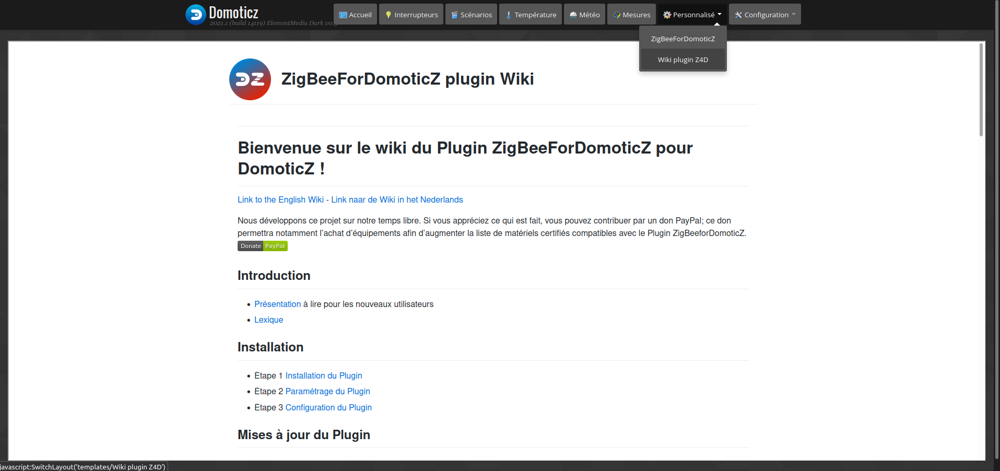
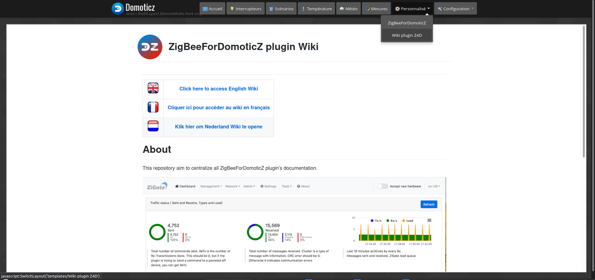

# Intégration du plugin dans DomoticZ

L'interface d'administration du plugin (WebUI) est accessible à l'adresse http://IP_DomoticZ:9400 (avec le port 9440 par défaut), mais il est également possible d'intégrer le WebUI directement dans DomoticZ et d'y accéder via un lien dans le Menu Personnalisé.


*Cette image est susceptible d'avoir évolué depuis l'écriture de cette documentation.*

## Ajout automatique du menu

Par défaut, ce menu est ajouté automatiquement au lancement du plugin et enlevé à l'arrêt du plugin.

Il faut vérifier que l'onglet Personnalisé est bien activé :

* Pour les versions de DomoticZ jusqu'à la 2022.2, aller dans Configuration / Paramètres / Onglet Système et vérifier la coche de l'onglet Personnalisé tout en bas.

* Pour les versions de DomoticZ depuis la 2023.1, aller dans Configuration / Users et vérifier que l'onglet Personnalisé est bien coché pour les utilisateurs souhaités.

Le nom du menu ajouté est le nom du plugin.


## Désactivation de l'ajout automatique du menu dans le WebUI

Il est possible de désactiver la création automatique du menu via le paramètre __Ajouter un lien vers le WebUI dans le Custom Menu de DomoticZ__ dans le menu Réglage.


## Ajouter manuel d'un menu pour le WebUI

1. Désactiver le Paramètres __Ajouter un lien vers le WebUI dans le Custom Menu de DomoticZ__ dans le menu Réglage

2. Aller dans le dossier __domoticz/www/templates__

3. Créer un fichier __ZigBeeForDomoticZ.html__ Le nom du fichier sera utiliser comme nom du menu.

4. Mettre la ligne suivante dans le fichier html :

```
<IFRAME SRC="http://IP_DomoticZ:9440/" height="800" width="100%"></IFRAME>
```

__Note :__ Ne pas mettre 127.0.0.1 ou localhost si vous utilisez DomoticZ depuis une autre machine. Mettre l'IP que vous utilisez pour vous connecter sur la machine hébergeant DomoticZ. 192.168.1.X par exemple.


## Bonus : Ajouter un menu pour le Wiki

Depuis la sortie de la version 6, le nouveau format du Wiki sous forme de page Web (WikiUI) est également intégrable dans DomoticZ comme le WebUI.


1. Aller dans le dossier __domoticz/www/templates__

2. Créer un fichier __Wiki plugin Z4D.html__ Le nom du fichier sera utiliser comme nom du menu.

3. Mettre la ligne suivante dans le fichier html :

```
<IFRAME SRC="https://zigbeefordomoticz.github.io/wiki/fr-fr" height="800" width="100%"></IFRAME>
```

Vous aurez accès à la page FR du wiki directement depuis DomoticZ :


*Cette image est susceptible d'avoir évolué depuis l'écriture de cette documentation.*

Merci à __waltervl__ de nous avoir partager cette [info](https://www.domoticz.com/forum/viewtopic.php?t=38114).
