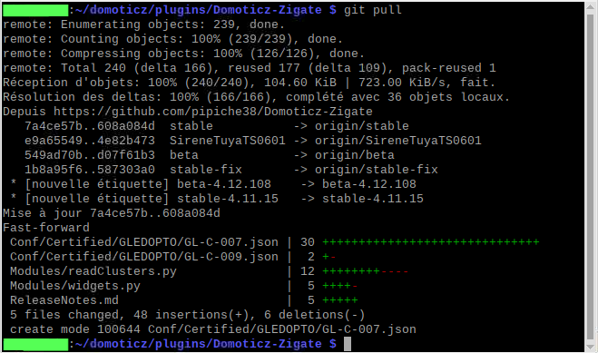

# Les mises à jour et les branches

## Mettre à jour le Plugin

Le Plugin est régulièrement mis à jour que ce soit pour de la correction de bug ou l'ajout de nouvelle fonctionnalités.


### Procédure

__ATTENTION:__ si vous n'etes pas encore en Version 6, merci de suivre cette procédure de  mise à jour vers la [version 6](Plugin_Version-6.md)

* Ouvrir un terminal et aller jusqu'au répertoire du Plugin ZigBeeForDomoticZ (généralement c'est '/home/pi/domoticz/plugins/Domoticz-Zigbee')

* Lancer la commande `git submodule update --init --recursive`

__Note :__ Depuis la version 6, le git pull n'est plus suffisant.

Les informations de mise à jour sont affichées comme dans l'exemple  ci-dessous :



* Exécuter ensuite : `sudo chmod +x plugin.py`

* Redémarrer DomoticZ


### En cas d'erreurs


Il peut y avoir des fichiers dont les droits ont changés. Dans ce cas, faire les commandes suivantes :

```
  git reset –-hard
  git pull --force
 ```

## Les branches de mise à jour


Le Plugin évolue en permanence suite à la correction de bug, l'amélioration du Plugin ou l'ajout de nouveaux objets. Afin d'éviter un maximum de bug, le code du Plugin est disponible sous différents canaux de mise à jour.

Au fur et à mesure des évolutions de DomoticZ, le Plugin se doit d'évoluer et, malheureusement, il n'est pas possible de conserver une compatibilité du Plugin avec toutes les versions antérieurs de DomoticZ. C'est pourquoi à partir de la version 5 (mai 2021), une branche __stable5__ est crée pour conserver la branche __stable__ compatible avec les anciennes versions.


Les différentes branches sont :

#### stable6 (créée en avril 2022)

C'est la branche par défaut actuelle.
C'est la version qui a ouvert le plugin aux coordinateurs TI CCXXXX, Sonoff, Elelabs, ZNP.

| Info  | Compatibilité  |
| :------------: |:---------------:|
| Coordinateurs | ZiGate V1 et V2<br>ELElabs<br>ZZH<br>Sonoff<br>TI CCXXXX |
| Compatibilité minimale | DomoticZ 2021.1 |
| Compatibilité maximale | Dernière version de DomoticZ |

__Note :__ Le passage à la stable6 nécessite une procédure particulière : voir la page [Migration vers version 6](Plugin_Version-6.md).


#### beta6 (créée en avril 2022)

La branche béta6 est le canal de développement. __Ne passez pas sur la branche beta6 sans y avoir été invité.__

Si vous êtes sur la branche __beta6__ (suite à l'ajout d'un nouveau matériel par exemple), vous pouvez repasser sur la branche __stable6__ à la prochaine mise à jour du canal __stable6__.

| Info  | Compatibilité  |
| :------------: |:---------------:|
| Coordinateurs | idem stable6 |
| Compatibilité minimale | DomoticZ 2021.1 |
| Compatibilité maximale | Dernière version de DomoticZ |


#### stable5 (créée en mai 2021)

C'est la version qui a ajouté la compatibilité avec la ZiGate+ (V2).

| Info  | Compatibilité  |
| :------------: |:---------------:|
| Modèles de ZiGate | V1 et V2 |
| Compatibilité minimale | DomoticZ 2020.1 |
| Compatibilité maximale | DomoticZ 2022.1 |

Cette version ne recevra plus de mise à jour.

__Note :__ Le passage à la stable5 nécessite un redémarrage de DomoticZ et de renseigner des nouveaux paramètres dans le [Paramétrage du plugin](Plugin_Parametrage.md) sinon, vous aurez une erreur de communication au lancement du Plugin.


#### stable

C'était la version par défaut jusqu'au moment de la sortie de la ZiGate V2.
Sa compatibilité s'arrête avec DomoticZ 2020.2.

| Info  | Compatibilité  |
| :------------: |:---------------:|
| Modèles de ZiGate | V1 |
| Compatibilité minimale | DomoticZ 4.XXX |
| Compatibilité maximale | DomoticZ 2020.2 |

Cette version ne recevra plus de mise à jour.


#### beta

La branche Béta est le canal de développement. __Ne passez pas sur la branche beta sans y avoir été invité.__

Si vous êtes sur la branche __beta__ (suite à l'ajout d'un nouveau matériel par exemple), vous pouvez repasser sur la branche __stableX__ à la prochaine mise à jour du canal __stableX__.

| Info  | Compatibilité  |
| :------------: |:---------------:|
| Modèles de ZiGate | V1 et V2 |
| Compatibilité minimale | DomoticZ 2020.1 |
| Compatibilité maximale | Dernière version de DomoticZ |

Cette version ne recevra plus de mise à jour.


#### stableX-fix

La branche stableX-fix (avec un numéro à la place du X) est l'anti-chambre de la branche stableX. En gros les bug-fix sont réalisées sur celle-ci avant d'être envoyer sur la branche stableX. Il n'y a pas de gestion de version sur cette branche !

__Ne passez pas sur la branche stableX-fix sans y avoir été invité.__

Si vous êtes sur la branche __stableX-fix__ (suite à l'ajout d'un nouveau matériel par exemple), vous pouvez repasser sur la branche __StableX__ à la prochaine mise à jour du canal __StableX__.


### Connaître sa branche


* Ouvrir un terminal et aller jusqu'au répertoire du Plugin ZigBeeForDomoticZ (généralement c'est '/home/pi/domoticz/plugins/Domoticz-Zigate')
* Lancer la commande `git status`


### Passer d'une branche à l'autre

Il est recommandé des faire une [sauvegarde](Plugin_Sauvegardes.md) avant de faire des modifications afin de pouvoir revenir en arrière en cas de problèmes.

* Ouvrir un terminal et aller jusqu'au répertoire du Plugin ZigBeeForDomoticZ (généralement c'est '/home/pi/domoticz/plugins/Domoticz-Zigate')

* Lancer la commande `git pull`

* Lancer la commande `git checkout stable6` pour aller sur le canal stable6
* Lancer la commande `git checkout beta6` pour aller sur le canal beta6
* Lancer la commande `git checkout stable5` pour aller sur le canal stable5 (obsolète)
* Lancer la commande `git checkout stable` pour aller sur le canal stable (obsolète)
* Lancer la commande `git checkout beta` pour aller sur le canal beta (obsolète)

__Attention aux compatibilités avec DomoticZ lors du changement de branche.__

[Poursuivre sur la mise à jour du Plugin](Readme.md#mises-%C3%A0-jour-du-plugin)


### Revenir à une version précédente

En cas de gros soucis avec une nouvelle version, il est possible de revenir en arrière en utilisant la commande `git checkout beta-5.2.XXX` en remplaçant __beta__ et __5.2.XXX__ par les valeurs souhaitées.
