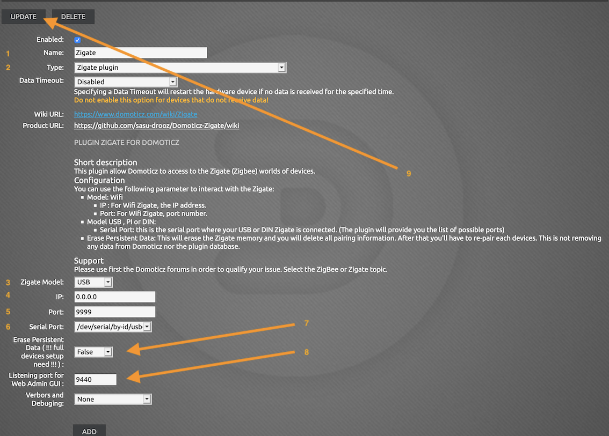

# Paramétrage du plugin

Cette étape est la deuxième du processus d'installation du plugin Zigate.

Vous devez donc avoir suivi et terminé l'[étape 1 Installation du plugin](Plugin_Installation.md)

## Le paramétrage

* Ouvrir __DomoticZ__ dans votre navigateur
* Aller dans le menu __Configuration__ puis __Matériel__

*Cette page est susceptible d'avoir évolué depuis l'écriture de cette documentation.*

| Id | Short Description    | Full Description |
| -- | -------------------- | ---------------- |
| 1  | Nom                  | Le nom donné à la Zigate. Si vous utiliser plusieurs Zigate, vous aurez besoin de plusieurs instances du matériel Zigate et le nom permettra de les identifier.
| 2  | Type                 | `Zigate plugin` à sélectionner dans la liste déroulante |
| 3  | Zigate Model         | Choisir entre les différents modèles de Zigate (USB, DIN, PI, Wifi) |
| 4  | IP                   | IP de la Zigate pour le modèle Wifi uniquement. Laisser 0.0.0.0 pour les autres modèles |
| 5  | Port                 | Port de la Zigate pour le modèle Wifi uniquement (défaut 9999). Laisser 9999 pour les autres modèles |
| 6  | Serial Port          | Serial Port sur lequel est branché la Zigate |
| 7  | Initialize ZiGate (Erase Memory) `Erase PDM` | Pour initialiser la Zigate avec les paramètres du plugin. A __activer obligatoirement__ lors de la configuration initiale (ou après un Erase EEPROMO). __ATTENTION:__ L'activation va effacer toutes des informations d'appairage de la Zigate. Pour activer, passer à True et redémarrer le plugin |
| 8  | Port for Web Admin| Port pour accéder à l'administration web du plugin (défaut 9440). A modifier en cas d'utilisation de plusieurs instances du plugin. |
| 9  | Verbors and Debuging | Sélection du niveau du log du plugin (Aucun par défaut) |

* Coché __Activé__ pour activer le plugin
* Cliquer sur __Ajouter__

La ligne avec le plugin Zigate est normalement apparue. Cliquer dessus.

* Mettre __Initialize ZiGate (Erase Memory)__ à __False__.
* Décoché __Activé__ pour désactiver le plugin
* Cliquer sur __Modifier__ (ne pas cliquer sur Ajouter car cela dupliquera le plugin)
* Recliquer sur la ligne du plugin Zigate
* Recoché __Activé__ pour réactiver le plugin
* Cliquer sur __Modifier__ pour relancer le plugin

Vérifier les logs que le plugin Zigate s'initialise correctement.

## Les widgets du plugin

A l'installation, le plugin créé 2 widgets dans l'onglet __Mesures__ de DomoticZ. 

### Widget Statut

Le widget s'appelle 'Zigate Status XX' avec XX correspondant au numéro de matériel du plugin Zigate. Il indiquera l'état du plugin. Le Log du widget permettra d'avoir l'historique des états du plugins.

Les différents états possibles sont :

| État | Couleur | Description |
| ---- | ------- | ----------- |
| Off | Rouge | Le plugin s'éteint ou il y a un problème de communication |
| Démarrage | Gris | Le plugin démarre |
| Prêt | Vert | Le plugin est en fonctionnement normal |
| Appairage | Ambre | Le plugin est en mode appairage |
| Saturation | Ambre | Le plugin sature : il peut y avoir des délais de transmissions rallongés |

### Widget Text

Liste non-exhaustive des notifications :

* Succès d'appairage
* Échec d'appairage
* Exclusion d'un dispositif
* Rapport de topologie réseau disponible
* Rapport d'interférences réseau disponible
* Problème réseau 
* Canal ZigBee

Un exemple de l'historique des notifications (en anglais)

Si tout semble fonctionner normalement, passer à l'[étape 3 Configuration du plugin](Plugin_Configuration.md)
