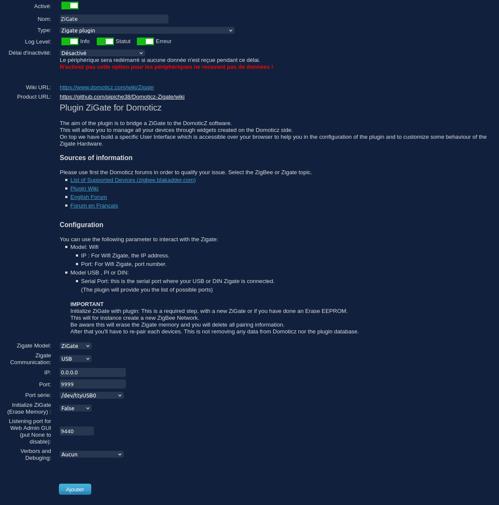

# Paramétrage du Plugin

Cette étape est la deuxième du processus d'installation du plugin ZigBeeForDomoticZ.

Vous devez donc avoir suivi et terminé l'[étape 1 Installation du Plugin](Plugin_Installation.md)

## Le paramétrage

* Ouvrir __DomoticZ__ dans votre navigateur

* Aller dans le menu __Configuration__ puis __Matériel__

* Pour ajouter le Plugin ZigBeeForDomoticZ, renseigner les informations suivantes :

| Paramètre    | Description | Information |
| ------------ | ------------------ | ----------- |
| __Nom__                  | Renseigner un Nom du coordinateur  | Si vous utiliser plusieurs coordinateur, vous aurez besoin de plusieurs instances du matériel ZigBeeForDomoticZ et le nom permettra de les identifier.  Il est conseillé de ne pas mettre d'espace ou de caractère spécial dans le nom du Plugin. Ce nom peut être utiliser dans une URL et un espace ou des caractères spéciaux peuvent générer des problèmes. |
| __Type__                 | Sélectionner `ZigBeeForDomoticZ plugin` | Si ZigBeeForDomoticZ plugin n’apparaît pas en bas de la liste, c'est que le Plugin n'est pas correctement installé.
| __Coordinator Model__         | Sélectionner le modèle de coordinateur | - ZiGate (modèle V1)  - ZiGate+ (modèle V2)  - Texas Instruments ZNP  - Silicon Labs EZSP|
| __Coordinator Communication__         | Sélectionner mode de communication | -  USB -  DIN - PI - TCPIP (wifi ou ethernet) - Aucun|
| __IP__                   | Renseigner l'IP du coordinateur | Pour le mode TCPIP uniquement Laisser 0.0.0.0 pour les autres modes |
| __Port__                 | Renseigner le Port du coordinateur (9999 par défaut)| Pour le mode TCPIP uniquement Laisser 9999 pour les autres modes |
| __Port série__           | Sélectionner le port USB sur lequel est branché le coordinateur | Penser à fixer le port de vos équipements usb [Méthode persistent USB](https://easydomoticz.com/mon-premier-peripherique-z-wave-2)|
| __Initialize Coordinator (Erase Memory)__ `Erase PDM` | Sélectionner True pour initialiser le coordinateur avec les paramètres du Plugin (False par défaut).  A __activer obligatoirement__ lors de la configuration initiale (ou après un Erase EEPROM). | __ATTENTION :__ L'activation va effacer toutes des informations d'appairage du coordinateur.  Redémarrer le Plugin pour lancer l'initialisation. Vérifier que le paramètre est à l'état False après le redémarrage. |
| __Port for Web Admin GUI__| Renseigner le port pour accéder à l'administration web du Plugin (9440 par défaut). | A modifier en cas d'utilisation de plusieurs instances du Plugin. |
| __Verbors and Debuging__ | Sélectionner le niveau du log du Plugin (Aucun par défaut) |

* Si c'est pour la création du Plugin, mettre Initialize Coordinator à __True__, sinon toujours laisser à __False__ (ce paramètre efface les informations de la ZiGate).

* Cliquer sur __Ajouter__.

La ligne correspondante à votre plugin ZigBeeForDomoticZ (avec le nom défini) est normalement apparue dans la liste des matériels.

* Cliquer sur la ligne de votre plugin ZigBeeForDomoticZ.

__ATTENTION :__ à partir de maintenant, il ne faut surtout plus cliquer sur le bouton __Ajouter__ en bas : cela aurait pour effet de dupliquer le plugin. Remontez toujours en haut des paramètres pour utiliser le bouton __Modifier__.

* Mettre __Initialize ZCoordinator (Erase Memory)__ à __False__.

* Décoché __Activé__ pour désactiver le plugin.

* Cliquer sur __Modifier__ (ne pas cliquer sur Ajouter car cela dupliquera le plugin).

* Recliquer sur la ligne du plugin ZigBeeForDomoticZ.

* Recocher __Activé__ pour réactiver le Plugin.

* Cliquer sur __Modifier__ pour relancer le Plugin.

Vérifier les logs que le plugin ZigBeeForDomoticZ s'initialise correctement.

*Cette image est susceptible d'avoir évolué depuis l'écriture de cette documentation.*

## Les widgets du Plugin

A l'installation, le Plugin créé 2 widgets dans l'onglet __Mesures__ de DomoticZ.

### Widget Statut

Le widget s'appelle 'ZigBee4DomoticZ Status XX' avec XX correspondant au numéro de matériel du plugin ZigBeeForDomoticZ. Il indiquera l'état du Plugin. Le Log du widget permettra d'avoir l'historique des états du Plugin.

Les différents états possibles sont :

| État | Couleur | Description |
| ---- | ------- | ----------- |
| Off | Rouge | Le Plugin s'éteint ou il y a un problème de communication |
| Démarrage | Gris | Le Plugin démarre |
| Prêt | Vert | Le Plugin est en fonctionnement normal |
| Appairage | Ambre | Le Plugin est en mode appairage |
| Saturation | Ambre | Le Plugin sature : il peut y avoir des délais de transmissions rallongés |

### Widget Texte

Liste non-exhaustive des notifications :

* Succès d'appairage
* Échec d'appairage
* Exclusion d'un objet
* Rapport de topologie réseau disponible
* Rapport d'interférences réseau disponible
* Problème réseau
* Canal ZigBee

Un exemple de l'historique des notifications (en anglais)

Si tout semble fonctionner normalement, passer à l'[étape 3 Configuration du Plugin](Plugin_Configuration.md)
