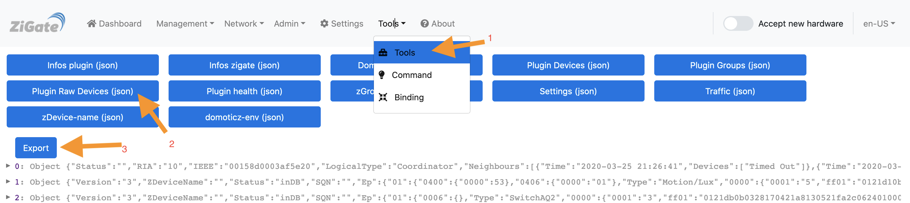

# Problèmes - L'appairage

Le plugin est développé pour pouvoir communiquer avec les dispositifs respectant les spécifications ZigBee. Par exemple, si le plugin essaye d'appairer un dispositif inconnu, il va essayer de créer des Widgets dans DomoticZ en se basant sur les fonctionnalités du dispositif.

## Introduction

L'appairage se réalise à deux niveaux :

1. Au niveau de la Zigate, où le dispositif rejoint le réseau ZigBee de la Zigate
2. Au niveau du Plugin, qui va essayer de trouver les fonctionnalités du dispositif comme :
  * Est-ce un routeur (alimenté sur secteur)
  * Est-ce un interrupteur
  * Est-ce un variateur d'intensité
  * Est-ce un variateur de couleur
  * Est-ce un volet
  * Etc ...

## Quels sont les problèmes rencontrés après un appairage ?

* Il n'y a pas de Widget dans DomoticZ
* Le Widget crée n'est pas correct : je peux changer l'intensité mais je n'ai pas de widget pour la couleur.

## Que faire ?  

A partir de la version 4.7 du plugin, il y a des outils permettant de partager les informations collectées pendant les processus d'appairage

* Aller dans la section [Outils > Outils](WebUI_Outils.md#outils)
* Cliquer sur le bouton __Liste des équipemenst Raw (json)__
* Cliquer sur le bouton __Exporter__

Un fichier export.json sera générer.

* Créer une [Issue sur Github](https://github.com/pipiche38/Domoticz-Zigate/issues/new?assignees=&labels=&template=Add_New_Hardware.md&title=) en indiquant les informations suivantes :

  * Marque de l’équipement
  * Modèle de l’équipement
  * Lien permettant de le commander
  * Branche du plugin, Version du plugin
  * Description du fonctionnement attendu, versus comportement observé
  * Le fichier export.json obtenu précédemment.
  * Logs lors de l'appairage et lors des manips de tests. L'idéal est d'utiliser la procédure [Un fichier de log pour DomoticZ](https://easydomoticz.com/un-fichier-log-pour-domoticz/). Vous pourrez ensuite attacher le fichier de log avec votre post.
  * Log correspondant au démarrage de DomoticZ (avec le démarrage du plugin Zigate) et les différents essais d'appairage que vous pouvez faire.
