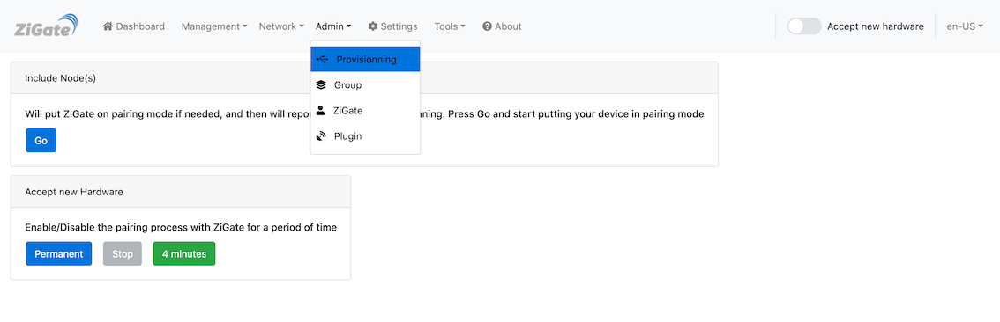
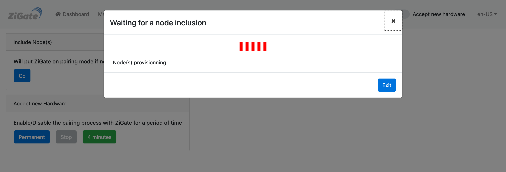
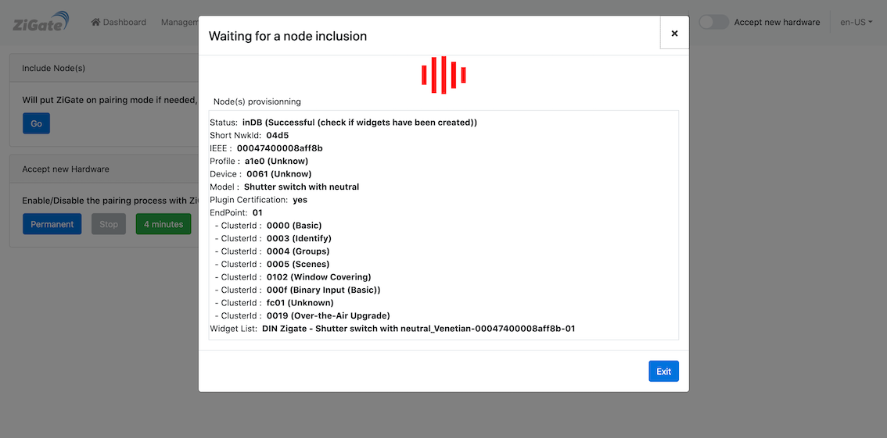

# Tutoriel - Appairer un dispositif ZigBee avec la ZiGate

## Introduction

Ce tutoriel explique comment ajouter un nouveau dispositif ZigBee dans DomoticZ.

## Méthodes

* Aller dans la section [Admin > Appairage](WebUI_Admin.md#appairage)

Il existe plusieurs méthodes :

* Appairage avec l'assistant
* Appairage sur une durée
* Appairage sur un routeur spécifique

------------------------------------------------
### 1. Appairage avec l'assistant

* Aller dans le module __Ajout de dispositif__ et cliquer sur __GO__ (le mode appairage sera actif pendant 4 minutes)

 La LED bleu de la ZiGate doit clignoter

* Faire un reset du dispositif pour le passer en mode appairage

 Lorsque l'appairage est effectué, les informations du dispositif apparaissent dans la fenêtre

Si rien ne se produit :

* Vérifier les logs de DomoticZ pour voir s'il n'y a pas d'erreurs
* Redémarrer le plugin et réessayer l'appairage

------------------------------------------------      
### 2. Appairage sur une durée

Cette méthode permettra de passer la ZiGate pendant une durée. Les informations d'appairage seront affichées dans la logs de DomoticZ.
*Conseil :* Filtre les logs afin de ne garder que les lignes concernant la ZiGate

* Aller dans le module __Ajout de dispositif__

* Cliquer le bouton __4 minutes__ ou __permanent__ pour choir la durée du mode appairage souhaitée

 La LED bleu de la ZiGate doit clignoter

 * Cliquer le bouton Stop pour arrêter le mode appairage

 Les résultats d'appairage ne seront visible que dans DomoticZ avec l'ajout de nouveaux dispositifs et les lignes de logs.

------------------------------------------------      
### 3. Appairage sur un routeur spécifique

Par défaut, la ZiGate va déterminer le meilleur chemin pour communiquer avec le dispositif. Il est cependant possible de spécifier un routeur sur lequel doit s'appairer le nouveau dispositif.

* Sélectionner le routeur désiré dans la liste

* Cliquer sur le bouton __4 minutes__ pour lancer le mode d'appairage

Le fonctionnement est identique au paragraphe précédent hormis que la ZiGate cherchera à appairer le nouveau dispositif sur le routeur choisi.
