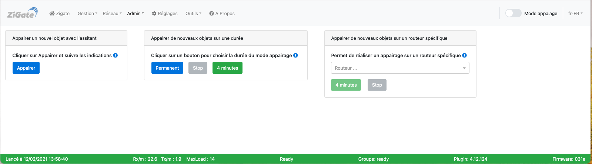

# Tutoriel - Appairer un objet ZigBee

 

## Introduction

Ce tutoriel explique comment ajouter un nouvel objet connecté ZigBee dans DomoticZ.

## Les limitations

Il y a deux limitations possible au nombre d'objet gérer par un coordinateur. C'est la première limite atteinte qui est bloquante.

### Les limitations des Coordinateurs

Les Coordinateurs ont une limite d'objets qu'elles peuvent gérer (voir les [les caractéristiques des coordinateurs](../en-eng/Coordinators.md#nombre-dobjet-limit%C3%A9))

### La limitation de DomoticZ

Chaque plugin python dans DomoticZ ne peut pas créer plus de 255 dispositifs (widgets possibles). Ceci est valable avec les version 2020 de DomoticZ. Nous espérons, un jour, que cette limite soit augmentée.

### Cas concret

Sur une ZiGate, il y a :

* 10 prises Ikea prenant chacune 1 dispositif (soit 10 en tout)
* 30 capteurs de température/hygrométrie/baromètre connectés directement sur le ZiGate prenant chacun 6 dispositifs (soit 180 en tout).

La ZiGate V1 autoriserait encore 30 capteurs de température passant les prises Ikea (routeurs). La somme des dispositifs serait alors de `10 + 180 + 180 = 370` c'est au-delà des 255 dispositifs acceptés par DomoticZ pour 1 plugin.
Dans ce cas, le nombre de capteur de température maxi en passant les prises Ikea (routeurs) serait de 10. Le nombre de dispositifs serait alors de 254 pour le plugin.

## Principe

Un réseau ZigBee est un réseau crypté qui permet de sécuriser les communications. Pour appairer un objet, on ouvre le réseau afin d'échanger avec le nouvel entrant et lui transmettre les informations de cryptage afin de pouvoir communiquer une fois le réseau refermé.

## Fonctionnement avec DomoticZ

Le plugin est autonome pour autoriser un appairage et créer les dispositifs dans DomoticZ. Il n'y a pas d'action à faire du coté de DomoticZ. Une fois l'appairage réalisé, il faut se rendre dans __DomoticZ__, menu __Configuration/Dispositifs__ , retrouver les nouveaux dispositifs créés (les derniers...) et générer les Widgets correspondants souhaités.

Il est possible de créer les widgets automatiquement en même temps que les dispositifs : il faut activer __Accepter de nouveau dispositifs pendant 5 minutes__ dans les paramètres Système de DomoticZ puis suivre une des méthodes d'appairage ci-dessous.

## Conseils d'appairage

Il est recommandé :

* D'appairer les objets les un après les autres en relançant une procédure d'appairage entre chaque objets.
* D'appairer les objets à leur emplacement d'utilisation.
* D'appairer les objets en commençant par les routeurs.
* D'appairer les routeurs en commençant par celui le plus proche de la ZiGate et en s'éloignant au fur et à mesure.

Plus de conseils sur la page : [Construire un réseau ZigBee](Tuto_Construire-un-reseau-ZigBee.md)

## Méthodes

Il est recommandé de commencer par appairer les objets de type routeurs afin de créer un réseau maillé avant d'associer les objets terminaux.

* Aller dans la section [Admin > Appairage](WebUI_Admin.md#appairage)

*Cette image est susceptible d'avoir évolué depuis l'écriture de cette documentation.*

Il existe plusieurs méthodes :

* Appairage avec l'assistant
* Appairage sur une durée
* Appairage sur un routeur spécifique

**Note :** Vérifier qu'il n'y a pas de particularités pour l'appairage de votre objet. Voir la liste des [Objets avec des particularités](Home.md#particularit%C3%A9s-de-certains-objets).

------------------------------------------------
### 1. Appairage avec le suivi

* Aller dans le module __Appairer un objet avec l'assistant__ et cliquer sur __Appairer__ (le mode appairage sera actif pendant 4 minutes)

 La LED bleu de la ZiGate doit clignoter. Sur le autres coordinateurs, la led peut s’allumer ou changer de couleur.

* Faire un Reset de l'objet pour le passer en mode appairage. *Se référer à la documentation de l'objet si nécessaire.*

 Lorsque l'appairage est effectué, les informations de l'objet apparaissent dans la fenêtre de l'assistant.

**Note :** Lors d'un ré-appairage d'un objet qui était déjà présent dans le réseau, l'assistant n'indique pas sa nouvelle inclusion. Il faut regarder les logs de DomoticZ pour voir que l'objet est revenu dans le réseau.

Si rien ne se produit :

* Vérifier les logs de DomoticZ pour voir s'il n'y a pas d'erreurs.
* Redémarrer le plugin et réessayer l'appairage.

------------------------------------------------      
### 2. Appairage sur une durée

Cette méthode permettra de passer le coordinateur en mode appairage pendant une durée. Les informations d'appairage seront affichées dans la logs de DomoticZ.
*Conseil :* Filtrer les logs afin de ne garder que les lignes concernant le plugin.

* Aller dans le module __Appairage sur une durée__.

* Cliquer le bouton __4 minutes__ ou __permanent__ pour choisir la durée du mode appairage souhaitée.

 La LED bleu de la ZiGate doit clignoter. Sur le autres coordinateurs, la led peut s’allumer ou changer de couleur.

 * Cliquer le bouton __Stop__ pour arrêter le mode appairage.

 Les résultats d'appairage ne seront visible que dans DomoticZ avec l'ajout de nouveaux dispositifs et les lignes de logs.

------------------------------------------------      
### 3. Appairage sur un routeur spécifique

Par défaut, le coordinateur va déterminer le meilleur chemin pour communiquer avec les objets. Il est cependant possible de spécifier un routeur sur lequel doit s'appairer le nouvel objet.

* Aller dans le module __Appairage sur un routeur spécifique__.

* Sélectionner le routeur désiré dans la liste.

* Cliquer sur le bouton __4 minutes__ pour lancer le mode d'appairage.

Le fonctionnement est identique au paragraphe précédent hormis que le coordinateur cherchera à appairer le nouvel objet sur le routeur choisi.

## Gestion des Dispositifs

Lors de l'appairage, le plugin créé des dispositifs dans DomoticZ correspondant aux différents clusters d'un objet. Ces dispositifs peuvent être supprimés dans DomoticZ pour s'éloigner de la limite de 255 des plugins DomoticZ, mais __ATTENTION :__ un dispositif supprimé ne pourra pas être récupérer sans un reset complet de l'objet
Prenons l'exemple d'un capteur de température Aqara avec 5 dispositifs : Température, Hygrométrie, Pression, Température + Hygrométrie et Température + Hygrométrie + Pression. On décide de ne conserver que les deux premiers et on supprime les 3 autres. Il nous reste Température et Hygrométrie.
Quelques temps plus tard, on souhaite retrouver le dispositif Pression.

Deux possibilités :

* Faire un reset complet de l'objet en supprimant les deux derniers dispositifs (l'objet sera ainsi supprimé du plugin) et refaire un appairage pour recréer les 5 dispositifs.
__Cette possibilité fait perdre l'historique des anciens dispositifs__.

* Utiliser la fonction __Re-création des dispositifs DomoticZ__

Cette fonction disponible dans la section [Admin > Appairage](WebUI_Admin.md#appairage) va créer à nouveau tous les dispositifs d'un objet.
Dans l'exemple précédent avec le capteur Aqara, il y aura  7 dispositifs : les 2 anciens Température et Hygrométrie et les 5 recréés Température, Hygrométrie, Pression, Température + Hygrométrie et Température + Hygrométrie + Pression. __Il y a donc des doublons__. C'est à vous, depuis DomoticZ, de gérer ses doublons en supprimant les dispositifs que vous ne souhaitez pas conserver.

__ATTENTION :__ La re-création de dispositif peut très vite vous faire arriver à la limite de 255 dispositifs par plugin.

## Reset d'un objet

Si un objet en mis dans le mode Reset, celui-ci sera réinitialisé au prochain appairage : tout sera fait comme si c'était le tout premier appairage hormis pour les dispositifs qui sont conservés.
