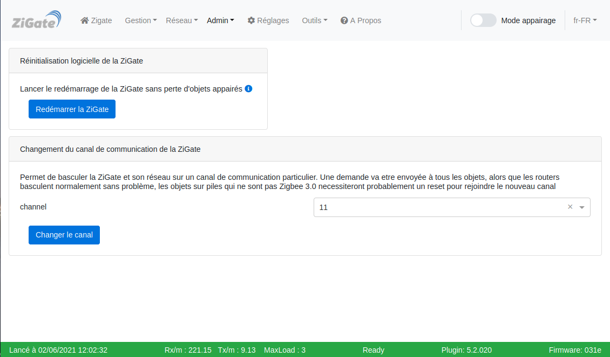
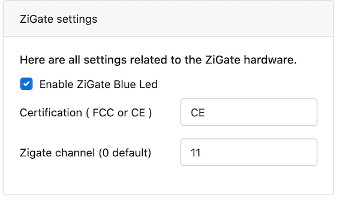
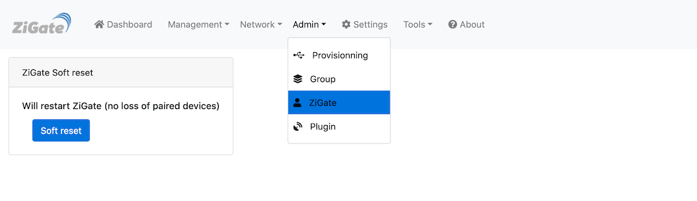
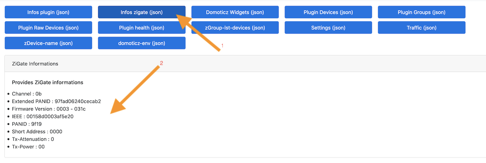

# Tutoriel - Changer le canal ZigBee du coordinateur

 

## Introduction

Ce tutoriel explique comment changer le canal ZigBee du réseau diffusé par le coordinateur.

Lors de son initialisation, le coordinateur va par défaut rechercher le meilleur canal possible en calculant les niveaux d'interférences.

Il est cependant possible de fixer le canal pour :
* Éviter des interférences avec les réseaux Wifi (voir [Interférences entre Wifi et ZigBee : explications](Info_ZigBee-et-Wifi.md).
* Utiliser des objets qui utilisent un canal spécifique :
  * Konke utilise le canal 15
  * Livolo utilise le canal 26
  * Legrand utilise le canal 11

## Méthode 1 : via l'assistant

* Allez dans la section [Admin > Zigate](WebUI_Admin.md#zigate).
* Sélectionner le nouveau canal dans la partie **Changement du canal de communication du coordinateur**.
* Cliquer sur __Changer le canal__.

Le coordinateur envoi un message à tous les objets du réseau pour les informer du changement et leur demander de changer eux aussi. Cela fonctionne très bien pour la plus part des routers (hormis les Legrand qui ne sont pas à jour et qui ne fonctionnent que sur le canal 11). Pour ce qui est des objets sur piles c'est une autre histoire, seuls ceux qui sont ZigBee 3.0 y arriverons ; les Xiaomi, Lumi, Aqara, il faut oublier : il faudra faire un ré-appairage des objets.

Il faut patienter quelques minutes le temps que les changements soient effectués.

## Méthode 2 : manuelle (ancienne méthode)

#### Définition du canal

* Aller dans la section [Réglages > Réglage de la Zigate](WebUI_Reglages.md#r%C3%A9glages-de-la-zigate).
* Activer les paramètres avancés.
* Indiquer le canal souhaité.

#### Redémarrer la ZiGate pour appliquer les changements

* Allez dans la section [Admin > Zigate](WebUI_Admin.md#zigate).
* Cliquer sur __Redémarrage logiciel__.

## Vérifier le canal du coordinateur

* Aller dans [Outils > Outils](WebUI_Outils.md#outils).
* Cliquer sur le bouton __Infos zigate (json)__.

Le canal ZigBee est indiqué en Héxadécimal : `0x0b = 11`.
