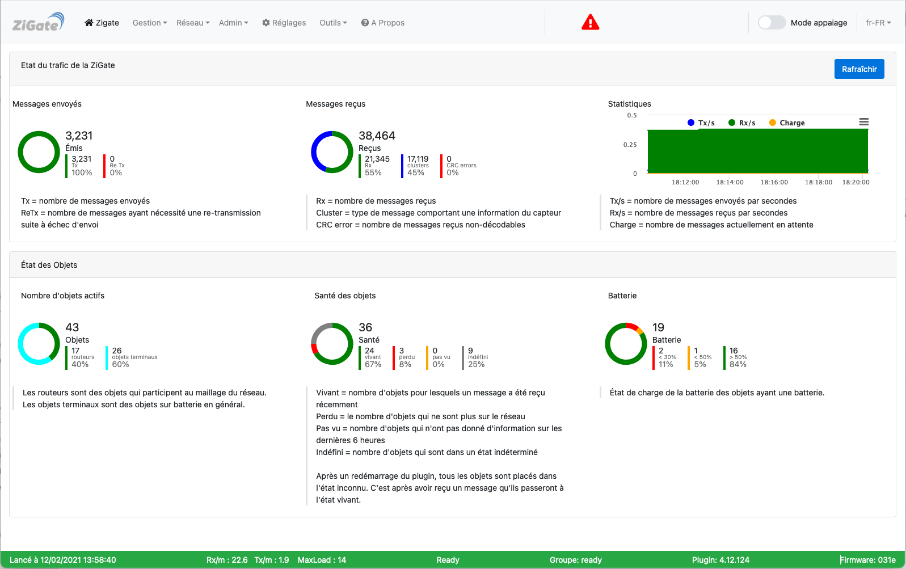

# Tutoriel - Gérer les erreurs du plugin

## Introduction

Ce tutoriel explique comment gérer les erreur plugin ZigBeeForDomoticZ.

## Présentation

Le plugin dispose d'une section permettant la visualisation des erreurs :  [Outils > Erreur(s)](WebUI_Outils.md#erreur)

## Visualisation sur l'interface web

Lorsqu'il y a des erreurs, un petit triangle rouge appairait dans le bandeau en haut de l'interface web.

Un clic sur le triangle permet d'aller sur la page [Outils > Erreur(s)](WebUI_Outils.md#erreur).
