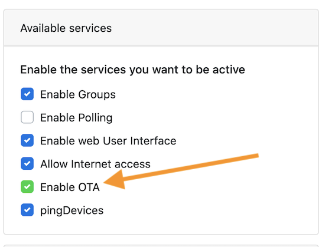

# Tutoriel - Mettre à jour le firmware d'un objet

Ce tutoriel explique comment mettre à jour le firmware (le logiciel interne) d'un objet ZigBee avec la ZiGate.

## Avant propos

Le plugin est capable d'envoyer une mise à jour de firmware d'un objet à condition que celui-ci respecte le protocole ZigBee Over-The-Air (OTA).
Certains fabricants autorisent l’accès au firmware de leurs objets autorisant ainsi la mise à jour du firmware, d'autres ne le font pas.
Le plugin ne fournit pas les firmware : Il est donc de votre responsabilité de les récupérer auprès des fabricants.

_Il n'est donc pas possible de mettre à jour le firmware de tous les objets connectés.__

## Liste de fabricant offrant la possibilité de mettre à jour leurs firmwares

| Fabricant    | Dossier contenant les firmwares          |
| ------------ | ---------------------------------------- |
| IKEA TRADFRI | Domoticz-Zigate/OTAFirmware/IKEA-TRADFRI |
| LEDVANCE     | Domoticz-Zigate/OTAFirmware/LEDVANCE     |
| LEGRAND      | Domoticz-Zigate/OTAFirmware/LEGRAND      |
| Philips Hue  | Domoticz-Zigate/OTAFirmware/PHILIPS      |

Chaque dossier de fabricant contient un fichier README.md qui décrit ou trouver le firmware.

## Méthodes

### Récupérer les firmwares

### Ikea Tradfri

Le répertoire d'outillage du plugin contient un script permettant le téléchargement, depuis le site web d'Ikea, de tous les firmwares.

* Aller dans le dossier du firmware d'Ikea : `cd Domoticz-Zigate\OTAFirmware\IKEA-TRADFRI`

* Lancer le script pour télécharger le firmwares : `../../Tools/ikea-ota-download.py`

* Ne conserver que les firmwares des objets à mettre à jour (supprimer les autres)

### Activation de la fonction OTA

A faire pour les versions de plugin inférieure à 4.11.015. En version 4.11.015 ou supérieure l'upgrade OTA est actif.

Dans le menu Réglages de la Web Admin, Activer l'option **Enable OTA**

   

Lorsque cette option (OTAupgrade) est activée, procéder au redémarrage du plugin. Le plugin vérifiera lors chaque objet et procédera à l'upgrade de firmware si c'est nécessaire.

**A Noter :** Une temporisation d'1 heure est appliquée avant de démarrer le processus de mise à jour.

## Références
 * https://github.com/dresden-elektronik/deconz-rest-plugin/wiki/OTA-Image-Types---Firmware-versions
