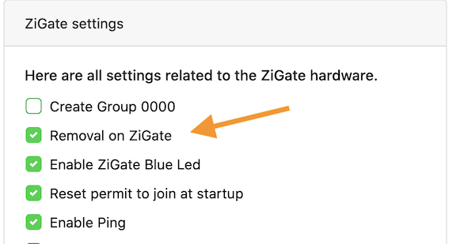

# Tutoriel - Supprimer un dispositif appairé avec la Zigate

## Introduction

Ce tutoriel explique comment supprimer un dispositif appairé. 
Ce dispositif est donc connu par :
* La Zigate
* Le plugin
* DomoticZ (avec un ou plusieurs widgets associés au dispositif)

A la fin de ce tutoriel, il faudra s'assurer que le dispositif a été retiré de ces 3 emplacements.

### Prérequis

Par défaut, le plugin est configuré pour __ne pas envoyer__ de suppression à la Zigate. Pour activer cette fonction, il faut activer 'Suppression de la Zigate' dans [Réglage / Réglages de la Zigate](WebUI_Reglages.md#réglages-de-la-zigate)

### Avertissement

__Toutes suppression entraînera la pertes de toutes les données du dispositif.__

## Méthode

Il existe plusieurs méthodes en fonction du type de dispositif :

* [Les dispositifs terminaux](#supprimer-les-dispositifs-terminaux) (sur batterie)
* [Les routeurs](#supprimer-les-routeurs) (sur secteur)

### Supprimer les dispositifs terminaux

Il n'y a pas de suppression automatique : il faut le faire manuellement

* S'assurer que le Plugin n'est pas en mode Appairage (voir [Tuto_Appairage](Tuto_Appairage-dispositif.md) : le bouton "Accepter de nouveaux dispositifs" doit être éteint, la LED bleue de la Zigate ne doit pas clignoter.
* Faire un reset sur le dispositif (comme pour l'appairer)

Un message similaire à celui-ci devrait apparaître dans les logs de DomoticZ :

`Status: (DIN-ZiGate)  (d009/00158d0002722c67) send a Leave indication and will be outside of the network. LQI: 0`

* Supprimer tous les Widgets de DomoticZ

### Supprimer les routeurs

* S'assurer que le réglage 'Suppression de la Zigate' (voir [Réglage / Réglages de la Zigate](WebUI_Reglages.md#réglages-de-la-zigate)) est activé
* Supprimer tous les widgets du dispositif dans DomoticZ

Généralement lorsque le dernier Widget est supprimé, le Plugin va automatiquement envoyé une demande de Reset au dispositif.

Un message similaire à celui-ci devrait apparaître dans les logs de DomoticZ :

`Status: (DIN-ZiGate)  (d009/00158d0002722c67) send a Leave indication and will be outside of the network. LQI: 0`

Si vous ne voyez pas de message similaire, il faut appliquer la procédure pour [Supprimer les dispositifs terminaux](#supprimer-les-dispositifs-terminaux).
