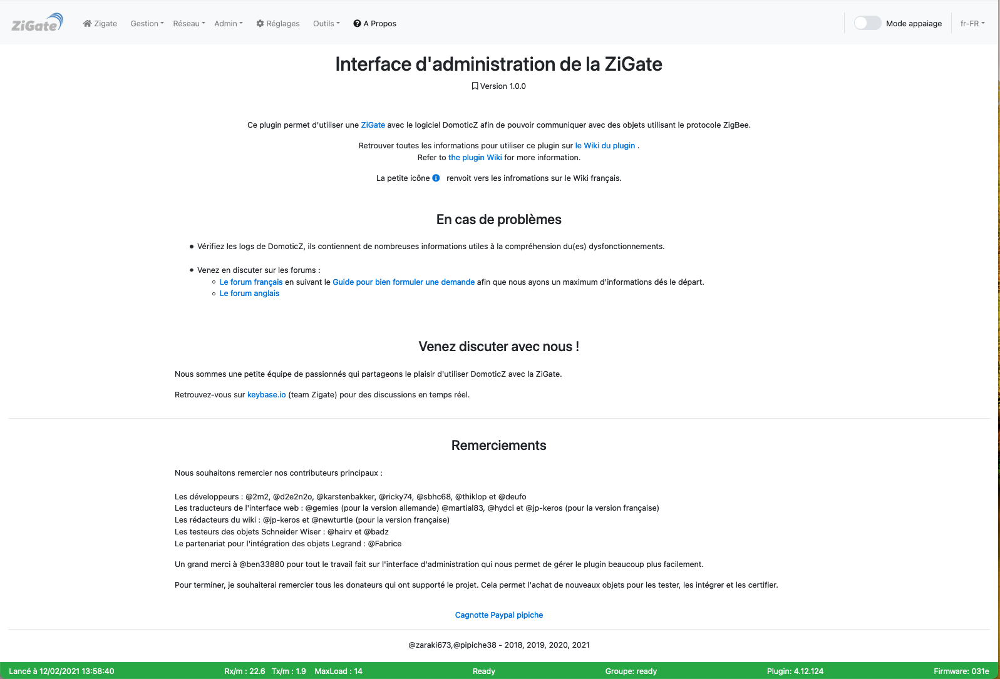

# L'interface Web - La page A propos

Pour accéder à l'interface d'administration du plugin, voir l'étape 3 [Configuration du plugin](Plugin_Configuration.md).

Voici la page __A propos__ de l'interface Web du plugin :

*Cette page est susceptible d'avoir évolué depuis l'écriture de cette documentation.*

### Composition

Cette page regroupe des informations génériques sur le plugin :
* La documentation
* Que faire en cas de problèmes
* L'équipe : développeurs, testeurs, traducteurs, rédacteurs

Voir les autres pages de l'[interface Web du plugin](Home.md#linterface-web-du-plugin).
