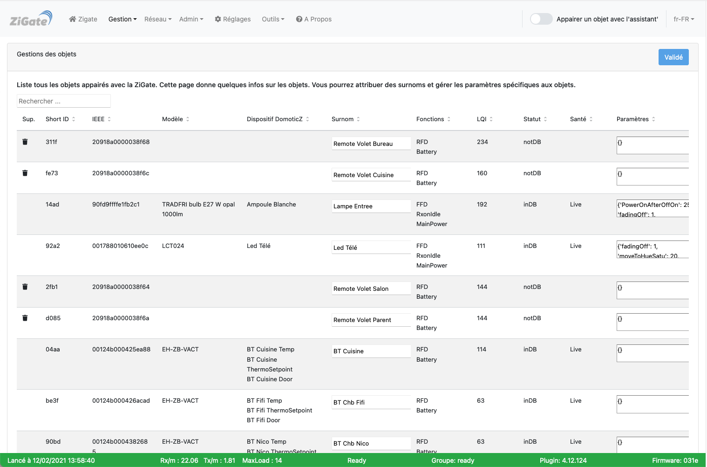
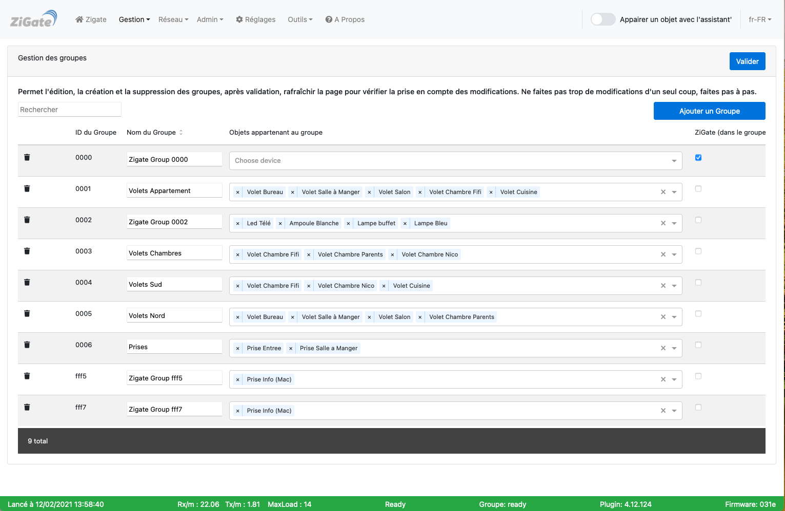

# L'interface Web - La section Gestion

Pour accéder à l'interface d'administration du plugin, voir l'étape 3 [Configuration du plugin](Plugin_Configuration.md).

La section __Gestion__ comporte les pages :

* [Gestion des objets](#gestion-des-objets)
* [Gestion des groupes](#gestion-des-groupes)

------------------------------------------------
## Gestion des objetss

Voici la page __Gestion des objets__ de l'interface Web du plugin :

*Cette page est susceptible d'avoir évolué depuis l'écriture de cette documentation.*

### Utilisation

Cette page permet de lister tous les objets appairés avec le plugin.

Elle permet :

* D'assigner des surnoms aux objets pour les identifier plus facilement dans l'interface web.
* D'assigner des paramètres aux objets indépendamment les uns des autres.
* De visualiser les informations suivantes pour chaque objet :
  * Le ShortId (l'adresse IP du réseau ZigBee) et l'IEEE (l'adresse Mac Address du ZigBee).
  * Le Modèle de l'objet (c'est le type de composant remonté par l'objet lors de son appairage).
  * Le(s) nom(s) du(des) dispositif(s) DomoticZ attaché(s) à l'objet.
  * Le surnom donné au sein de cette interface (**Astuce** : donner un surnom identique au nom du dispositif DomoticZ).
  * Les fonctionnalités sur le réseau offertes par l'objet et son mode d'alimentation.
  * L'info LQI : cette valeur indique la qualité de la transmission (0 pas de transmission, 255 transmission d'excellente qualité).
  * Le status : inDB (objet connu dans la ZiGate **et au moins** un dispositif dans DomoticZ).
  * La Santé de l'objet (présent sur le réseau ZigBee ou pas).

------------------------------------------------
## Gestion des groupes

Voici la page __Gestion des groupes__ de l'interface Web du plugin :

*Cette page est susceptible d'avoir évolué depuis l'écriture de cette documentation.*

Le groupe est vu dans DomoticZ comme un unique widget de type Switch et ce indépendamment du nombre de d'objet composant le groupe. L'action sur le switch (DomoticZ) sera alors répercutée simultanément sur tous des objets du groupe.

### Utilisation

Cette page permet de lister les groupes de d'objets gérés par le plugin.

------------------------------------------------
Voir les autres pages de l'[interface Web du plugin](Home.md#linterface-web-du-plugin).
