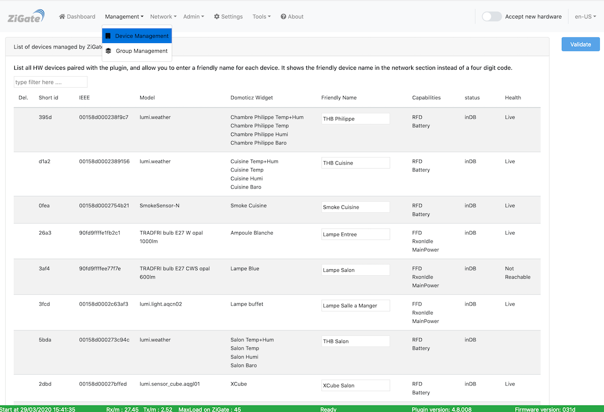

# L'interface Web - La section Management

Pour accéder à l'interface d'administration du plugin, voir l'étape 3 [Configuration du plugin](Plugin_Configuration.md).

La section __Management__ comporte les pages :

* [Gestion des dispositifs](#gestion-des-dispositifs)
* [Gestion des groupes](#gestion-des-groupes)

------------------------------------------------
## Gestion des dispositifs

Voici la page __Gestion des dispositifs__ de l'interface Web du plugin : 

*Cette page est susceptible d'avoir évolué depuis l'écriture de cette documentation.*

### Utilisation

Cette page permet de lister tous les dispositifs appairés avec le plugin. 

Elle permet :

* D'assigner des surnoms aux dispositifs pour les identifier plus facilement dans l'interface web.
* D'assigner des paramètres aux dispositifs indépendamment les uns des autres.
* De visualiser les informations suivantes pour chaque dispositif :
  * Le ShortId (l'adresse IP du réseau ZigBee) et l'IEEE (l'adesse Mac Address du ZigBee)
  * Le Modèle du dispositif (c'est le type de composant remonté par le dispositif lors de son appairage)
  * Le(s) nom(s) du(des) Widget(s) DomoticZ attaché(s) au dispositif
  * Le surnom donné au sein de cette interface (**Astuce** : donner un surnom identique au nom du widget Domoticz)
  * Les fonctionnalités sur le réseau offertes par le dispositif et son mode d'alimentation : 
  * L'info LQI : cette valeur indique la qualité de la transmission (0 pas de transmission, 255 transmission d'excellente qualité)
  * Le status : inDB (dispositif connu dans la Zigate **et au moins** un widget dans DomoticZ)
  * La Santé du dispositif (present sur le réseau ZigBee ou pas)

------------------------------------------------
## Gestion des groupes

Voici la page __Gestion des groupes__ de l'interface Web du plugin : 

*Cette page est susceptible d'avoir évolué depuis l'écriture de cette documentation.*

Le groupe est vu dans DomoticZ comme un unique widget de type Switch et ce indépendament du nombre de dispositifs composant le groupe. L'action sur le switch (DomoticZ) sera alors repercutée simultanement sur tous les dispositifs du groupe.

### Utilisation

Cette page permet de lister les groupes de dispositifs gérés par le plugin.

------------------------------------------------
Voir les autres pages de l'[interface Web du plugin](Home.md#linterface-web-du-plugin)
