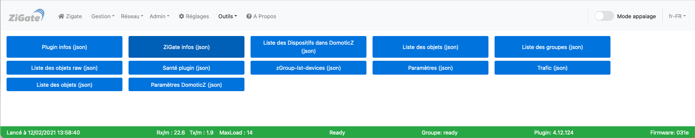
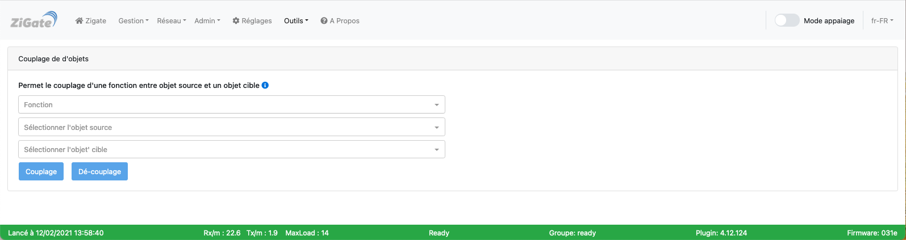
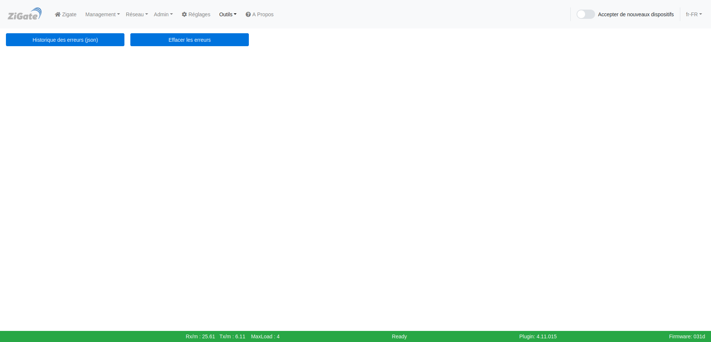

# L'interface Web - La section Outils

Pour accéder à l'interface d'administration du plugin, voir l'étape 3 [Configuration du plugin](Plugin_Configuration.md).

La section __Outils__ comporte les pages :

* [Outils](#outils)
* [Commande](#commande)
* [Couplage](#couplage)
* [Debug](#debug)
* [Erreur](#erreur)

------------------------------------------------
## Outils

Voici la page __Outils__ de l'interface Web du plugin :

*Cette page est susceptible d'avoir évolué depuis l'écriture de cette documentation.*

### Utilisation

Cette page permet d'exécuter les différents outils disponibles dans le plugin.

### Liste des outils

| Outils  | Outils   | Outils   | Outils   |
| :-----: |:-------:|:-------:|:-------:|
| [Plugin infos (json)](#plugin-infos-json) | [ZiGate infos (json)](#zigate-infos-json) | [Liste des Widgets DomoticZ (json)](#liste-des-widgets-domoticz-json) | [Liste des équipements (json)](#liste-des-%C3%A9quipements-json) |
| [Liste des groupes (json)](#liste-des-groupes-json) | [Liste des équipements raw (json)](#liste-des-%C3%A9quipements-raw-json) | [Santé plugin (json)](#sant%C3%A9-plugin-json) | [zGroup-1st-devices (json)](#zgroup-1st-devices-json) |
| [Paramètres (json)](#param%C3%A8tres-json) | [Trafic (json)](#trafic-json) | [Liste des dispositifs (json)](#liste-des-dispositifs-json) | [Paramètres DomoticZ (json)](#param%C3%A8tres-domoticz-json) |

#### Plugin infos (json)

Cet outil donne toutes les informations sur le plugin.

#### ZiGate infos (json)

Cet outil donne toutes les informations sur la ZiGate

#### Liste des Widgets DomoticZ (json)

Cet outil liste tous les Widgets dans DomoticZ qui sont liés au plugin ZiGate.

#### Liste des équipements (json)

Cet outil liste tous les équipements appairés à la ZiGate et indique leurs paramètres.

#### Liste des groupes (json)

Cet outil liste les groupes créé dans le plugin ZiGate.

#### Liste des équipements raw (json)

Cet outil liste tous les équipements appairés à la ZiGate et indique leurs paramètres. ???

#### Santé plugin (json)

Cet outil donne les informations sur le fonctionnement du plugin.

#### zGroup-1st-devices (json)

Cet outil liste les routeurs du réseau de la ZiGate.

#### Paramètres (json)

Cet outil ???

#### Trafic (json)

Cet outil donne toutes les informations sur le trafic réseau au niveau de la ZiGate.

#### Liste des dispositifs (json)

Cet outil liste tous les dispositifs. ???

#### Paramètres DomoticZ (json)

Cet outil affiche les paramètres de DomoticZ. ???

------------------------------------------------
## Commande

Voici la page __Commande__ de l'interface Web du plugin :

*Cette page est susceptible d'avoir évolué depuis l'écriture de cette documentation.*

### Utilisation

Cette page permet d'exécuter des commandes sur les dispositifs sans passer par DomoticZ.

------------------------------------------------
## Couplage

Voici la page __Couplage__ de l'interface Web du plugin :

*Cette page est susceptible d'avoir évolué depuis l'écriture de cette documentation.*

### Utilisation

Cette page permet d'exécuter de coupler des dispositifs.

Voir le tutoriel [Coupler deux dispositifs entre eux](Tuto_Coupler-deux-dispositifs.md)

------------------------------------------------
## Debug

Voici la page __Debug__ de l'interface Web du plugin :

*Cette page est susceptible d'avoir évolué depuis l'écriture de cette documentation.*

### Utilisation

Cette page permet d'accéder aux paramètres de débogage et de journalisation.

Voir la page d'[aide au débogage](Probleme_Aide-Debogage.md)

------------------------------------------------
## Erreur

Voici la page __Erreur__ de l'interface Web du plugin :

*Cette page est susceptible d'avoir évolué depuis l'écriture de cette documentation.*

### Utilisation

Cette page permet de visualiser les erreurs du plugin.

------------------------------------------------
Voir les autres pages de l'[interface Web du plugin](Home.md#linterface-web-du-plugin)
