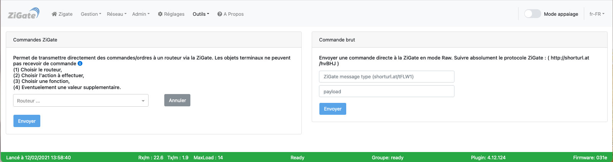
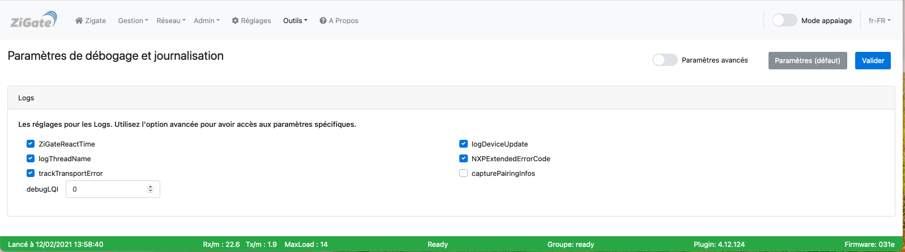
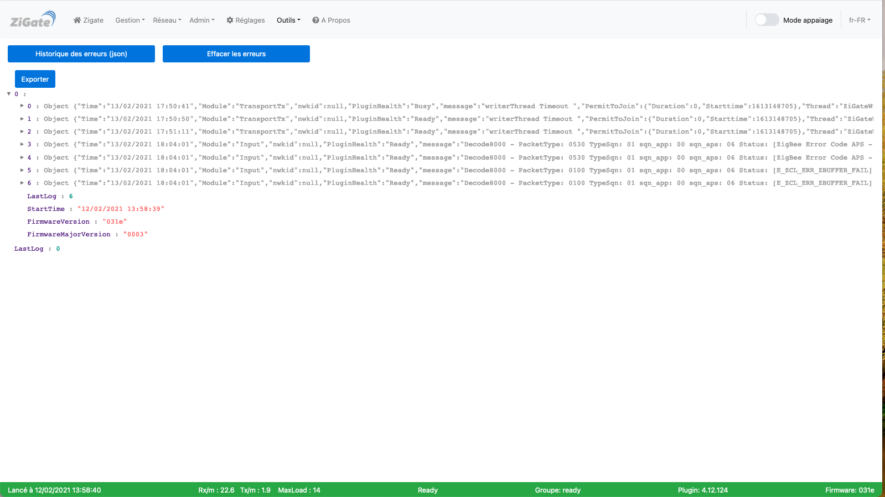

# L'interface Web - La section Outils

Pour accéder à l'interface d'administration du plugin, voir l'étape 3 [Configuration du plugin](Plugin_Configuration.md).

La section __Outils__ comporte les pages :

* [Outils](#outils)
* [Commande](#commande)
* [Couplage](#couplage)
* [Debogage](#debogage)
* [Erreur](#erreur)

------------------------------------------------
## Outils

Voici la page __Outils__ de l'interface Web du plugin :

*Cette image est susceptible d'avoir évolué depuis l'écriture de cette documentation.*

### Utilisation

Cette page permet d'exécuter les différents outils disponibles dans le plugin à utiliser pour des fins de débogage ou de développement.

Voir le tutoriel [Utiliser les outils](Tuto_Utiliser-les-outils.md).

------------------------------------------------
## Commande

Voici la page __Commande__ de l'interface Web du plugin :

*Cette image est susceptible d'avoir évolué depuis l'écriture de cette documentation.*

### Utilisation

Cette page permet d'exécuter des commandes sur les objets sans passer par DomoticZ.

------------------------------------------------
## Couplage

Voici la page __Couplage__ de l'interface Web du plugin :

*Cette image est susceptible d'avoir évolué depuis l'écriture de cette documentation.*

### Utilisation

Cette page permet d'exécuter de coupler des objets.

Voir le tutoriel [Coupler deux objets entre eux](Tuto_Coupler-deux-objets.md).

------------------------------------------------
## Debogage

Voici la page __Debogage__ de l'interface Web du plugin :

*Cette image est susceptible d'avoir évolué depuis l'écriture de cette documentation.*

### Utilisation

Cette page permet d'accéder aux paramètres de débogage et de journalisation.

Voir la page d'[aide au débogage](Probleme_Aide-Debogage.md).

------------------------------------------------
## Erreur

Voici la page __Erreur__ de l'interface Web du plugin :

*Cette image est susceptible d'avoir évolué depuis l'écriture de cette documentation.*

### Utilisation

Cette page permet de visualiser les erreurs du plugin.

Voir la page pour [gérer les erreurs du plugin](Tuto_Gerer-erreurs-plugin.md).

------------------------------------------------
Voir les autres pages de l'[interface Web du plugin](Home.md#linterface-web-du-plugin).
