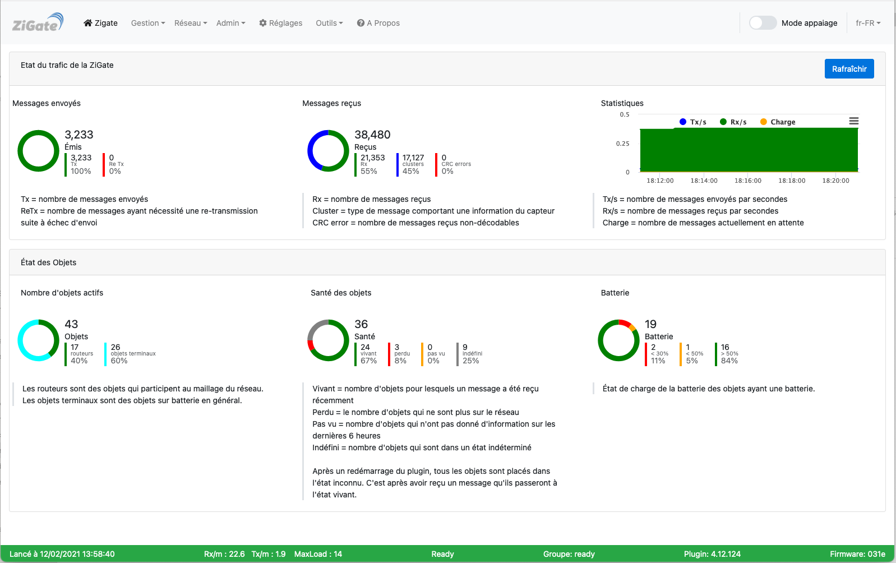

# L'interface Web - Présentation générale

 

Pour accéder à l'interface d'administration du plugin, voir l'étape 3 [Configuration du plugin](Plugin_Configuration.md).

Voici la présentation générale de l'interface Web du plugin :

*Cette image est susceptible d'avoir évolué depuis l'écriture de cette documentation.*

### Composition

#### L'entête

Elle contient de gauche à droite :
* les différents liens vers les pages
* le bouton pour passer le coordinateur en mode Appairage
* le bouton de choix de la langue

#### Le corps de la page

Les différentes pages du plugin s'afficheront ici.

#### Le pied de page

Il contient de gauche à droite :
* La date et l'heure du démarrage du plugin ZigBeeForDomoticZ.
* Les valeurs Rx/m, Tx/m et MaxLoad indiquant la charge du coordinateur.
* L'état du plugin, normalement il est indiqué __Ready__.
* La version du plugin. L'écriture en rouge indique qu'une mise à jour est disponible (valable uniquement pour les branches Stable et Béta).
* Le firmware du coordinateur. L'écriture en rouge indique qu'une mise à jour est disponible.

##### La couleur du pied de page

Le bandeau est vert si le plugin fonctionne normalement.
Le bandeau est bleu lorsque le plugin est en train de démarrer.
Le bandeau rouge indique un problème de connexion avec le coordinateur.
Le bandeau jaune indique l'appairage d'un dispositif ou que le coordinateur est chargé. C'est une alerte indiquant qu'il peut y avoir un peu de latence sur les commandes.

------------------------------------------------
Voir les pages de l'[interface Web du plugin](Home.md#linterface-web-du-plugin).
